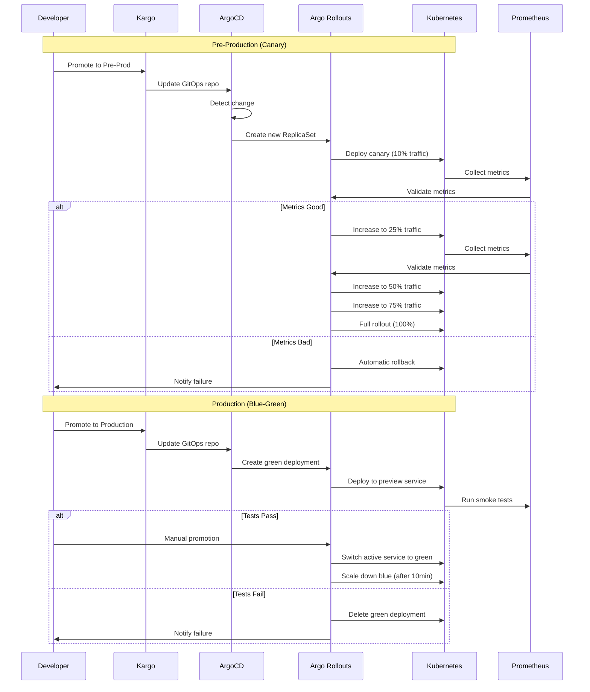

# ArgoCD & Argo Rollouts Configurations

## Directory Structure
```
argocd/
├── projects/
│   └── myapp-project.yaml
├── applications/
│   ├── app-of-apps.yaml
│   ├── user-service-dev.yaml
│   ├── user-service-staging.yaml
│   ├── user-service-uat.yaml
│   ├── user-service-preprod.yaml
│   └── user-service-production.yaml
└── rollouts/
    ├── canary-rollout.yaml
    └── bluegreen-rollout.yaml
```

---

## 1. ArgoCD Project

```yaml
# argocd/projects/myapp-project.yaml
apiVersion: argoproj.io/v1alpha1
kind: AppProject
metadata:
  name: myapp
  namespace: argocd
spec:
  description: Main application project
  
  # Allowed source repositories
  sourceRepos:
    - 'https://github.com/yourorg/gitops-config.git'
    - 'harbor.yourdomain.com/*'
  
  # Allowed destination clusters and namespaces
  destinations:
    - namespace: 'dev'
      server: https://kubernetes.default.svc
    - namespace: 'staging'
      server: https://kubernetes.default.svc
    - namespace: 'uat'
      server: https://kubernetes.default.svc
    - namespace: 'pr-*'
      server: https://kubernetes.default.svc
    - namespace: 'preprod'
      server: https://production-cluster-api-url
    - namespace: 'production'
      server: https://production-cluster-api-url
    - namespace: 'sandbox'
      server: https://production-cluster-api-url
  
  # Cluster resource whitelist
  clusterResourceWhitelist:
    - group: ''
      kind: Namespace
    - group: 'rbac.authorization.k8s.io'
      kind: ClusterRole
    - group: 'rbac.authorization.k8s.io'
      kind: ClusterRoleBinding
  
  # Namespace resource whitelist
  namespaceResourceWhitelist:
    - group: '*'
      kind: '*'
  
  # Orphaned resources (don't delete on ArgoCD app deletion)
  orphanedResources:
    warn: true
```

---

## 2. App of Apps Pattern

```yaml
# argocd/applications/app-of-apps.yaml
apiVersion: argoproj.io/v1alpha1
kind: Application
metadata:
  name: app-of-apps
  namespace: argocd
spec:
  project: myapp
  
  source:
    repoURL: https://github.com/yourorg/gitops-config.git
    targetRevision: main
    path: argocd/applications
  
  destination:
    server: https://kubernetes.default.svc
    namespace: argocd
  
  syncPolicy:
    automated:
      prune: true
      selfHeal: true
      allowEmpty: false
    syncOptions:
      - CreateNamespace=true
    retry:
      limit: 5
      backoff:
        duration: 5s
        factor: 2
        maxDuration: 3m
```

---

## 3. Application Configurations by Environment

### Development Environment

```yaml
# argocd/applications/user-service-dev.yaml
apiVersion: argoproj.io/v1alpha1
kind: Application
metadata:
  name: user-service-dev
  namespace: argocd
  labels:
    environment: dev
    service: user-service
spec:
  project: myapp
  
  source:
    repoURL: https://github.com/yourorg/gitops-config.git
    targetRevision: main
    path: overlays/dev/user-service
  
  destination:
    server: https://kubernetes.default.svc
    namespace: dev
  
  syncPolicy:
    automated:
      prune: true
      selfHeal: true
      allowEmpty: false
    syncOptions:
      - CreateNamespace=true
      - PruneLast=true
    retry:
      limit: 5
      backoff:
        duration: 5s
        factor: 2
        maxDuration: 3m
  
  # No special deployment strategy for dev - use standard Deployment
  ignoreDifferences:
    - group: apps
      kind: Deployment
      jsonPointers:
        - /spec/replicas  # Ignore HPA-managed replicas
```

### Staging Environment

```yaml
# argocd/applications/user-service-staging.yaml
apiVersion: argoproj.io/v1alpha1
kind: Application
metadata:
  name: user-service-staging
  namespace: argocd
  labels:
    environment: staging
    service: user-service
spec:
  project: myapp
  
  source:
    repoURL: https://github.com/yourorg/gitops-config.git
    targetRevision: main
    path: overlays/staging/user-service
  
  destination:
    server: https://kubernetes.default.svc
    namespace: staging
  
  syncPolicy:
    automated:
      prune: true
      selfHeal: true
      allowEmpty: false
    syncOptions:
      - CreateNamespace=true
      - PruneLast=true
    retry:
      limit: 5
      backoff:
        duration: 5s
        factor: 2
        maxDuration: 3m
  
  # Use rolling update for staging
  ignoreDifferences:
    - group: apps
      kind: Deployment
      jsonPointers:
        - /spec/replicas
```

### UAT Environment

```yaml
# argocd/applications/user-service-uat.yaml
apiVersion: argoproj.io/v1alpha1
kind: Application
metadata:
  name: user-service-uat
  namespace: argocd
  labels:
    environment: uat
    service: user-service
spec:
  project: myapp
  
  source:
    repoURL: https://github.com/yourorg/gitops-config.git
    targetRevision: main
    path: overlays/uat/user-service
  
  destination:
    server: https://kubernetes.default.svc
    namespace: uat
  
  syncPolicy:
    automated:
      prune: true
      selfHeal: false  # Manual sync for UAT
      allowEmpty: false
    syncOptions:
      - CreateNamespace=true
      - PruneLast=true
```

### Pre-Production Environment (Canary)

```yaml
# argocd/applications/user-service-preprod.yaml
apiVersion: argoproj.io/v1alpha1
kind: Application
metadata:
  name: user-service-preprod
  namespace: argocd
  labels:
    environment: preprod
    service: user-service
  annotations:
    notifications.argoproj.io/subscribe.on-sync-succeeded.slack: myapp-deployments
spec:
  project: myapp
  
  source:
    repoURL: https://github.com/yourorg/gitops-config.git
    targetRevision: main
    path: overlays/preprod/user-service
  
  destination:
    server: https://production-cluster-api-url
    namespace: preprod
  
  syncPolicy:
    automated:
      prune: true
      selfHeal: false  # Manual sync for pre-prod
      allowEmpty: false
    syncOptions:
      - CreateNamespace=true
      - PruneLast=true
  
  # Uses Argo Rollouts with Canary strategy
  ignoreDifferences:
    - group: argoproj.io
      kind: Rollout
      jsonPointers:
        - /spec/replicas
```

### Production Environment (Blue-Green)

```yaml
# argocd/applications/user-service-production.yaml
apiVersion: argoproj.io/v1alpha1
kind: Application
metadata:
  name: user-service-production
  namespace: argocd
  labels:
    environment: production
    service: user-service
  annotations:
    notifications.argoproj.io/subscribe.on-sync-succeeded.slack: production-alerts
    notifications.argoproj.io/subscribe.on-sync-failed.slack: production-alerts
spec:
  project: myapp
  
  source:
    repoURL: https://github.com/yourorg/gitops-config.git
    targetRevision: main
    path: overlays/production/user-service
  
  destination:
    server: https://production-cluster-api-url
    namespace: production
  
  syncPolicy:
    automated:
      prune: true
      selfHeal: false  # Absolutely NO auto-heal in production
      allowEmpty: false
    syncOptions:
      - CreateNamespace=true
      - PruneLast=true
  
  # Uses Argo Rollouts with Blue-Green strategy
  ignoreDifferences:
    - group: argoproj.io
      kind: Rollout
      jsonPointers:
        - /spec/replicas
```

---

## 4. Argo Rollouts - Canary Deployment (Pre-Prod)

```yaml
# overlays/preprod/user-service/rollout.yaml
apiVersion: argoproj.io/v1alpha1
kind: Rollout
metadata:
  name: user-service
  namespace: preprod
spec:
  replicas: 10
  
  revisionHistoryLimit: 5
  
  selector:
    matchLabels:
      app: user-service
      environment: preprod
  
  template:
    metadata:
      labels:
        app: user-service
        environment: preprod
    spec:
      containers:
        - name: user-service
          image: harbor.yourdomain.com/services/user-service:v1.2.3-beta.1
          ports:
            - containerPort: 3000
              name: http
          env:
            - name: ENVIRONMENT
              value: "preprod"
          resources:
            requests:
              cpu: 100m
              memory: 256Mi
            limits:
              cpu: 500m
              memory: 512Mi
          livenessProbe:
            httpGet:
              path: /health
              port: 3000
            initialDelaySeconds: 30
            periodSeconds: 10
          readinessProbe:
            httpGet:
              path: /ready
              port: 3000
            initialDelaySeconds: 5
            periodSeconds: 5
  
  # Canary Strategy
  strategy:
    canary:
      # Traffic management via Service Mesh or Ingress
      canaryService: user-service-canary
      stableService: user-service-stable
      
      # Progressive traffic shift
      steps:
        # Step 1: 10% traffic to canary
        - setWeight: 10
        - pause:
            duration: 5m
        
        # Step 2: 25% traffic to canary
        - setWeight: 25
        - pause:
            duration: 10m
        
        # Step 3: 50% traffic to canary
        - setWeight: 50
        - pause:
            duration: 10m
        
        # Step 4: 75% traffic to canary
        - setWeight: 75
        - pause:
            duration: 10m
        
        # Step 5: 100% traffic to canary (full rollout)
        - setWeight: 100
      
      # Analysis during canary
      analysis:
        templates:
          - templateName: canary-metrics
        startingStep: 1  # Start analysis from first pause
        args:
          - name: service-name
            value: user-service
      
      # Automatic rollback on failed analysis
      abortScaleDownDelaySeconds: 30
      
      # Traffic routing (using Istio as example)
      trafficRouting:
        istio:
          virtualService:
            name: user-service-vsvc
            routes:
              - primary
---
# Stable Service
apiVersion: v1
kind: Service
metadata:
  name: user-service-stable
  namespace: preprod
spec:
  selector:
    app: user-service
    environment: preprod
  ports:
    - port: 80
      targetPort: 3000
      name: http
---
# Canary Service
apiVersion: v1
kind: Service
metadata:
  name: user-service-canary
  namespace: preprod
spec:
  selector:
    app: user-service
    environment: preprod
  ports:
    - port: 80
      targetPort: 3000
      name: http
```

---

## 5. Argo Rollouts - Blue-Green Deployment (Production)

```yaml
# overlays/production/user-service/rollout.yaml
apiVersion: argoproj.io/v1alpha1
kind: Rollout
metadata:
  name: user-service
  namespace: production
spec:
  replicas: 20
  
  revisionHistoryLimit: 10
  
  selector:
    matchLabels:
      app: user-service
      environment: production
  
  template:
    metadata:
      labels:
        app: user-service
        environment: production
    spec:
      containers:
        - name: user-service
          image: harbor.yourdomain.com/services/user-service:v1.2.3
          ports:
            - containerPort: 3000
              name: http
          env:
            - name: ENVIRONMENT
              value: "production"
          resources:
            requests:
              cpu: 200m
              memory: 512Mi
            limits:
              cpu: 1000m
              memory: 1Gi
          livenessProbe:
            httpGet:
              path: /health
              port: 3000
            initialDelaySeconds: 30
            periodSeconds: 10
          readinessProbe:
            httpGet:
              path: /ready
              port: 3000
            initialDelaySeconds: 5
            periodSeconds: 5
  
  # Blue-Green Strategy
  strategy:
    blueGreen:
      # Active and preview services
      activeService: user-service
      previewService: user-service-preview
      
      # Automatically promote after verification
      autoPromotionEnabled: false  # Manual promotion for production
      
      # Time to wait before scaling down old version
      scaleDownDelaySeconds: 600  # 10 minutes
      
      # Anti-affinity for blue/green pods
      antiAffinity:
        requiredDuringSchedulingIgnoredDuringExecution: {}
      
      # Pre-promotion analysis
      prePromotionAnalysis:
        templates:
          - templateName: bluegreen-verification
        args:
          - name: service-name
            value: user-service
      
      # Post-promotion analysis
      postPromotionAnalysis:
        templates:
          - templateName: smoke-tests
        args:
          - name: service-name
            value: user-service
---
# Active Service (receives production traffic)
apiVersion: v1
kind: Service
metadata:
  name: user-service
  namespace: production
spec:
  selector:
    app: user-service
    environment: production
  ports:
    - port: 80
      targetPort: 3000
      name: http
  type: LoadBalancer
---
# Preview Service (green environment for testing)
apiVersion: v1
kind: Service
metadata:
  name: user-service-preview
  namespace: production
spec:
  selector:
    app: user-service
    environment: production
  ports:
    - port: 80
      targetPort: 3000
      name: http
```

---

## 6. AnalysisTemplates for Rollouts

### Canary Metrics Analysis

```yaml
# argocd/rollouts/canary-analysis.yaml
apiVersion: argoproj.io/v1alpha1
kind: AnalysisTemplate
metadata:
  name: canary-metrics
  namespace: preprod
spec:
  args:
    - name: service-name
  
  metrics:
    # Metric 1: Error Rate
    - name: error-rate
      interval: 1m
      successCondition: result < 0.05  # Less than 5% errors
      failureLimit: 3
      provider:
        prometheus:
          address: http://prometheus.monitoring.svc:9090
          query: |
            sum(rate(
              http_requests_total{
                job="{{ args.service-name }}",
                status=~"5.."
              }[2m]
            )) / 
            sum(rate(
              http_requests_total{
                job="{{ args.service-name }}"
              }[2m]
            ))
    
    # Metric 2: P95 Latency
    - name: latency-p95
      interval: 1m
      successCondition: result < 500  # Less than 500ms
      failureLimit: 3
      provider:
        prometheus:
          address: http://prometheus.monitoring.svc:9090
          query: |
            histogram_quantile(0.95, 
              sum(rate(
                http_request_duration_seconds_bucket{
                  job="{{ args.service-name }}"
                }[2m]
              )) by (le)
            ) * 1000
    
    # Metric 3: CPU Usage
    - name: cpu-usage
      interval: 1m
      successCondition: result < 80  # Less than 80%
      failureLimit: 3
      provider:
        prometheus:
          address: http://prometheus.monitoring.svc:9090
          query: |
            sum(rate(
              container_cpu_usage_seconds_total{
                pod=~"user-service-.*"
              }[2m]
            )) by (pod) * 100
    
    # Metric 4: Memory Usage
    - name: memory-usage
      interval: 1m
      successCondition: result < 85  # Less than 85%
      failureLimit: 3
      provider:
        prometheus:
          address: http://prometheus.monitoring.svc:9090
          query: |
            sum(container_memory_working_set_bytes{
              pod=~"user-service-.*"
            }) / 
            sum(container_spec_memory_limit_bytes{
              pod=~"user-service-.*"
            }) * 100
```

### Blue-Green Verification

```yaml
# argocd/rollouts/bluegreen-analysis.yaml
apiVersion: argoproj.io/v1alpha1
kind: AnalysisTemplate
metadata:
  name: bluegreen-verification
  namespace: production
spec:
  args:
    - name: service-name
  
  metrics:
    # Metric 1: Health Check
    - name: health-check
      count: 5
      interval: 30s
      successCondition: result.statusCode == 200
      provider:
        web:
          url: "http://{{ args.service-name }}-preview.production.svc/health"
          method: GET
          headers:
            - key: Content-Type
              value: application/json
    
    # Metric 2: Smoke Tests
    - name: smoke-tests
      provider:
        job:
          spec:
            backoffLimit: 1
            template:
              spec:
                containers:
                  - name: smoke-tests
                    image: harbor.yourdomain.com/testing/smoke-tests:latest
                    env:
                      - name: SERVICE_URL
                        value: "http://{{ args.service-name }}-preview.production.svc"
                    command:
                      - npm
                      - run
                      - test:smoke
                restartPolicy: Never
    
    # Metric 3: Database Connectivity
    - name: db-connectivity
      count: 3
      interval: 10s
      successCondition: result == "success"
      provider:
        web:
          url: "http://{{ args.service-name }}-preview.production.svc/health/db"
          method: GET
          jsonPath: "{$.status}"
```

---

## 7. Preview Environment (PR Deployments)

```yaml
# Template for PR preview applications (created by Tekton)
apiVersion: argoproj.io/v1alpha1
kind: Application
metadata:
  name: user-service-pr-{{ PR_NUMBER }}
  namespace: argocd
  labels:
    environment: preview
    service: user-service
    pr-number: "{{ PR_NUMBER }}"
  annotations:
    # Auto-cleanup after 7 days
    cleanup.argoproj.io/ttl: "168h"
spec:
  project: myapp
  
  source:
    repoURL: https://github.com/yourorg/gitops-config.git
    targetRevision: pr-{{ PR_NUMBER }}
    path: overlays/preview/user-service
  
  destination:
    server: https://kubernetes.default.svc
    namespace: pr-{{ PR_NUMBER }}
  
  syncPolicy:
    automated:
      prune: true
      selfHeal: true
      allowEmpty: false
    syncOptions:
      - CreateNamespace=true
```

---

## 8. Rollout Dashboard & CLI

### Install Argo Rollouts Dashboard

```bash
kubectl create namespace argo-rollouts
kubectl apply -n argo-rollouts -f https://github.com/argoproj/argo-rollouts/releases/latest/download/dashboard-install.yaml

# Port forward to access dashboard
kubectl port-forward -n argo-rollouts svc/argo-rollouts-dashboard 3100:3100
```

### Rollout CLI Commands

```bash
# Install kubectl plugin
curl -LO https://github.com/argoproj/argo-rollouts/releases/latest/download/kubectl-argo-rollouts-linux-amd64
chmod +x kubectl-argo-rollouts-linux-amd64
sudo mv kubectl-argo-rollouts-linux-amd64 /usr/local/bin/kubectl-argo-rollouts

# Watch rollout status
kubectl argo rollouts get rollout user-service -n preprod --watch

# Promote canary manually
kubectl argo rollouts promote user-service -n preprod

# Abort rollout
kubectl argo rollouts abort user-service -n preprod

# Restart rollout
kubectl argo rollouts restart user-service -n preprod

# View rollout history
kubectl argo rollouts history user-service -n preprod
```

---

## 9. Ingress Configuration by Environment

```yaml
# Development
apiVersion: networking.k8s.io/v1
kind: Ingress
metadata:
  name: user-service
  namespace: dev
  annotations:
    cert-manager.io/cluster-issuer: "letsencrypt-prod"
spec:
  ingressClassName: nginx
  tls:
    - hosts:
        - user-service.dev.yourdomain.com
      secretName: user-service-dev-tls
  rules:
    - host: user-service.dev.yourdomain.com
      http:
        paths:
          - path: /
            pathType: Prefix
            backend:
              service:
                name: user-service
                port:
                  number: 80
---
# Preview (PR)
apiVersion: networking.k8s.io/v1
kind: Ingress
metadata:
  name: user-service
  namespace: pr-{{ PR_NUMBER }}
  annotations:
    cert-manager.io/cluster-issuer: "letsencrypt-prod"
spec:
  ingressClassName: nginx
  tls:
    - hosts:
        - pr-{{ PR_NUMBER }}-user-service.preview.yourdomain.com
      secretName: user-service-pr-{{ PR_NUMBER }}-tls
  rules:
    - host: pr-{{ PR_NUMBER }}-user-service.preview.yourdomain.com
      http:
        paths:
          - path: /
            pathType: Prefix
            backend:
              service:
                name: user-service
                port:
                  number: 80
---
# Production (Blue-Green)
apiVersion: networking.k8s.io/v1
kind: Ingress
metadata:
  name: user-service
  namespace: production
  annotations:
    cert-manager.io/cluster-issuer: "letsencrypt-prod"
spec:
  ingressClassName: nginx
  tls:
    - hosts:
        - user-service.yourdomain.com
      secretName: user-service-prod-tls
  rules:
    - host: user-service.yourdomain.com
      http:
        paths:
          - path: /
            pathType: Prefix
            backend:
              service:
                name: user-service  # Active service
                port:
                  number: 80
---
# Production Preview (Green)
apiVersion: networking.k8s.io/v1
kind: Ingress
metadata:
  name: user-service-preview
  namespace: production
  annotations:
    cert-manager.io/cluster-issuer: "letsencrypt-prod"
spec:
  ingressClassName: nginx
  tls:
    - hosts:
        - user-service-preview.yourdomain.com
      secretName: user-service-preview-tls
  rules:
    - host: user-service-preview.yourdomain.com
      http:
        paths:
          - path: /
            pathType: Prefix
            backend:
              service:
                name: user-service-preview  # Preview service
                port:
                  number: 80
```

---

## 10. Complete Deployment Flow Diagram



---

## Summary

This ArgoCD + Argo Rollouts setup provides:

✅ **Environment-specific strategies**: Standard deployments for dev/staging, canary for pre-prod, blue-green for production  
✅ **Automated rollbacks**: Based on Prometheus metrics  
✅ **Progressive traffic shifting**: 10% → 25% → 50% → 75% → 100%  
✅ **Zero-downtime deployments**: Blue-green ensures no downtime  
✅ **Preview environments**: Every PR gets its own environment  
✅ **Manual gates**: Production requires explicit promotion  
✅ **Observability**: Prometheus integration for metrics-based validation  
✅ **GitOps**: Fully declarative, version-controlled deployments
