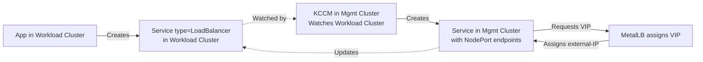

# ClusterAPI + KubeVirt Multi-Cluster Architecture
## Kubernetes Cluster as a Service on Baremetal

## Overview

This architecture uses **ClusterAPI (CAPI) with the KubeVirt infrastructure provider** to create fully isolated Kubernetes clusters (workload clusters) running as VMs on a baremetal management cluster. This approach is based on the proven pattern used by projects like SUSE Harvester.

**Key Components:**
- **Management Cluster**: Baremetal Kubernetes cluster running on physical servers
- **ClusterAPI**: Manages lifecycle of workload clusters declaratively
- **KubeVirt Provider**: CAPI infrastructure provider that creates VMs for workload clusters
- **KCCM**: KubeVirt Cloud Controller Manager for LoadBalancer services in workload clusters
- **Kube-OVN CNI**: Enables live migration of VMs with persistent pod IPs
- **Workload Clusters**: Fully isolated K8s clusters running in KubeVirt VMs
- **Shared Services**: PostgreSQL, Kafka, Redis in management cluster, accessed from workload clusters

---

## Architecture Diagram

```mermaid
graph TB
    subgraph "Baremetal Servers - Management Cluster"
        subgraph "Control Plane"
            MGMT_MASTER[Management K8s<br/>Control Plane]
        end

        subgraph "CNI & Networking"
            KUBEOVN[Kube-OVN CNI<br/>Live Migration Support]
            METALLB[MetalLB<br/>LoadBalancer Provider]
        end

        subgraph "ClusterAPI Stack"
            CAPI[ClusterAPI Controller]
            CAPKV[KubeVirt Provider]
            KUBEVIRT[KubeVirt Operator]
            CDI[Containerized Data Importer]
            KCCM_DEV[KCCM - Dev Cluster]
            KCCM_STAGING[KCCM - Staging Cluster]
            KCCM_PROD[KCCM - Production Cluster]
        end

        subgraph "Platform Services"
            ARGOCD[ArgoCD<br/>GitOps Engine]
            KARGO[Kargo<br/>Progressive Delivery]
            TEKTON[Tekton<br/>CI Pipeline]
            HARBOR[Harbor Registry]
            VAULT[Vault<br/>Secret Management]
            KC[Keycloak<br/>SSO/OIDC]
            CROSSPLANE[Crossplane<br/>Infrastructure Provider]
            BACKSTAGE[Backstage<br/>Developer Portal]
        end

        subgraph "Shared Infrastructure"
            POSTGRES[(PostgreSQL<br/>Multi-tenant)]
            KAFKA[Kafka Cluster]
            REDIS[Redis Cluster]
            TEMPORAL[Temporal]
            NFS[NFS Storage<br/>VM Disks]
        end

        subgraph "Workload Clusters - VMs"
            subgraph "Dev Cluster (ClusterAPI-managed)"
                DEV_CP[Dev Control Plane<br/>VM]
                DEV_W1[Dev Worker 1<br/>VM]
                DEV_W2[Dev Worker 2<br/>VM]
                DEV_CNI[Cilium CNI]
                DEV_APPS[Business Apps<br/>user-service, payment-service]
            end

            subgraph "Staging Cluster (ClusterAPI-managed)"
                STAGING_CP[Staging Control Plane<br/>VM]
                STAGING_W[Staging Workers<br/>VMs]
                STAGING_CNI[Cilium CNI]
                STAGING_APPS[Business Apps]
            end

            subgraph "Production Cluster (ClusterAPI-managed)"
                PROD_CP1[Prod Control Plane 1<br/>VM]
                PROD_CP2[Prod Control Plane 2<br/>VM]
                PROD_CP3[Prod Control Plane 3<br/>VM]
                PROD_W[Production Workers<br/>VMs]
                PROD_CNI[Cilium CNI]
                PROD_APPS[Business Apps]
            end
        end
    end

    subgraph "GitOps Repositories"
        CLUSTER_REPO[Cluster Definitions<br/>ClusterAPI manifests]
        APP_REPO[Application Manifests<br/>Kustomize overlays]
        INFRA_REPO[Infrastructure Claims<br/>Crossplane]
    end

    %% ClusterAPI Flow
    CLUSTER_REPO -->|GitOps| ARGOCD
    ARGOCD -->|Deploy Cluster| CAPI
    CAPI -->|Create VMs| CAPKV
    CAPKV -->|Provision| KUBEVIRT
    KUBEVIRT -->|Create VM Pods| KUBEOVN

    %% Workload Cluster Provisioning
    CAPI -->|Provision| DEV_CP
    CAPI -->|Provision| DEV_W1
    CAPI -->|Provision| DEV_W2
    CAPI -->|Provision| STAGING_CP
    CAPI -->|Provision| STAGING_W
    CAPI -->|Provision| PROD_CP1
    CAPI -->|Provision| PROD_CP2
    CAPI -->|Provision| PROD_CP3
    CAPI -->|Provision| PROD_W

    %% CNI Installation
    ARGOCD -->|Install CNI| DEV_CNI
    ARGOCD -->|Install CNI| STAGING_CNI
    ARGOCD -->|Install CNI| PROD_CNI

    %% KCCM Watches Workload Clusters
    KCCM_DEV -.->|Watch Services| DEV_APPS
    KCCM_DEV -->|Create LB Service| METALLB
    KCCM_STAGING -.->|Watch Services| STAGING_APPS
    KCCM_STAGING -->|Create LB Service| METALLB
    KCCM_PROD -.->|Watch Services| PROD_APPS
    KCCM_PROD -->|Create LB Service| METALLB

    %% App Deployment
    APP_REPO -->|Watch| KARGO
    KARGO -->|Promote| ARGOCD
    ARGOCD -->|Deploy Apps| DEV_APPS
    ARGOCD -->|Deploy Apps| STAGING_APPS
    ARGOCD -->|Deploy Apps| PROD_APPS

    %% VM Storage
    KUBEVIRT -->|Persistent Disks| NFS
    CDI -->|Hydrate from OCI| NFS

    %% Workload Apps Access Shared Services
    DEV_APPS -.->|Access| POSTGRES
    DEV_APPS -.->|Access| KAFKA
    DEV_APPS -.->|Access| REDIS
    STAGING_APPS -.->|Access| POSTGRES
    PROD_APPS -.->|Access| POSTGRES

    %% Secret Management
    VAULT -->|Sync Secrets| DEV_APPS
    VAULT -->|Sync Secrets| STAGING_APPS
    VAULT -->|Sync Secrets| PROD_APPS

    %% Infrastructure Provisioning
    INFRA_REPO -->|Crossplane Claims| CROSSPLANE
    CROSSPLANE -->|Provision DB| POSTGRES
    CROSSPLANE -->|Store Creds| VAULT

    %% Developer Portal
    BACKSTAGE -->|Provision Cluster| CAPI
    BACKSTAGE -->|View Clusters| ARGOCD
    BACKSTAGE -->|Authenticate| KC

    style DEV_CP fill:#e3f2fd
    style DEV_W1 fill:#e3f2fd
    style DEV_W2 fill:#e3f2fd
    style STAGING_CP fill:#fff3e0
    style STAGING_W fill:#fff3e0
    style PROD_CP1 fill:#c8e6c9
    style PROD_CP2 fill:#c8e6c9
    style PROD_CP3 fill:#c8e6c9
    style PROD_W fill:#c8e6c9
    style CAPI fill:#ff6600
    style VAULT fill:#000000,color:#ffffff
    style KC fill:#008aaa
    style BACKSTAGE fill:#9d4edd
```



---

## 1. Management Cluster Setup

### 1.1 Prerequisites

```bash
# Baremetal servers with KVM support
# Minimum 3 servers for HA
# Recommended: 32+ CPU cores, 128GB+ RAM per server

# Network ranges
WORKER_NODE_SEGMENT="192.168.0.0/24"
METALLB_RANGE="192.168.0.225-192.168.0.250"
MGMT_POD_CIDR="10.244.0.0/16"
MGMT_SERVICE_CIDR="10.96.0.0/12"

# Workload cluster defaults (reusable across clusters)
WORKLOAD_POD_CIDR="10.243.0.0/16"
WORKLOAD_SERVICE_CIDR="10.95.0.0/16"
```

### 1.2 Install Kube-OVN CNI (Live Migration Support)

```bash
#!/bin/bash
# Install Kube-OVN on management cluster

wget https://raw.githubusercontent.com/kubeovn/kube-ovn/refs/tags/v1.13.13/dist/images/install.sh

# Edit the script to match your network
sed -i 's/POD_CIDR=.*/POD_CIDR="10.244.0.0\/16"/' install.sh
sed -i 's/POD_GATEWAY=.*/POD_GATEWAY="10.244.0.1"/' install.sh
sed -i 's/SVC_CIDR=.*/SVC_CIDR="10.96.0.0\/12"/' install.sh

bash install.sh

# Verify subnets
kubectl get subnet
# NAME          PROVIDER   VPC           PROTOCOL   CIDR            PRIVATE   NAT     DEFAULT
# ovn-default   ovn        ovn-cluster   IPv4       10.244.0.0/16   false     true    true
```

**Why Kube-OVN?**
- Supports live migration of VMs with persistent pod IPs
- No need for Multus/MacVLAN
- VM can be in bridge mode and still migrate
- Essential for zero-downtime maintenance

### 1.3 Install MetalLB (LoadBalancer Provider)

```bash
kubectl apply -f https://raw.githubusercontent.com/metallb/metallb/v0.15.2/config/manifests/metallb-native.yaml

cat <<EOF | kubectl apply -f -
apiVersion: metallb.io/v1beta1
kind: IPAddressPool
metadata:
  name: default
  namespace: metallb-system
spec:
  addresses:
    - 192.168.0.225-192.168.0.250
---
apiVersion: metallb.io/v1beta1
kind: L2Advertisement
metadata:
  name: default
  namespace: metallb-system
spec:
  ipAddressPools:
    - default
EOF

kubectl get ipaddresspool -n metallb-system
```

**Why MetalLB?**
- Exposes workload cluster K8s API services with LoadBalancer VIPs
- KCCM uses MetalLB to provision LoadBalancer services for apps in workload clusters
- Simple Layer 2 mode for lab/homelab (Layer 3 BGP recommended for production)

### 1.4 Install KubeVirt and CDI

```bash
# Install KubeVirt
export KUBEVIRT_VERSION=v1.5.1
kubectl apply -f https://github.com/kubevirt/kubevirt/releases/download/${KUBEVIRT_VERSION}/kubevirt-operator.yaml
kubectl apply -f https://github.com/kubevirt/kubevirt/releases/download/${KUBEVIRT_VERSION}/kubevirt-cr.yaml

# Install virtctl CLI
wget https://github.com/kubevirt/kubevirt/releases/download/${KUBEVIRT_VERSION}/virtctl-${KUBEVIRT_VERSION}-linux-amd64
chmod +x virtctl-${KUBEVIRT_VERSION}-linux-amd64
sudo mv virtctl-${KUBEVIRT_VERSION}-linux-amd64 /usr/local/bin/virtctl

# Install CDI (Containerized Data Importer)
export CDI_VERSION=v1.62.0
kubectl apply -f https://github.com/kubevirt/containerized-data-importer/releases/download/${CDI_VERSION}/cdi-operator.yaml
kubectl apply -f https://github.com/kubevirt/containerized-data-importer/releases/download/${CDI_VERSION}/cdi-cr.yaml

# Verify
kubectl get pods -n kubevirt
kubectl get pods -n cdi
```

**Why CDI?**
- Hydrates VM disks from OCI container disk images
- Simplifies VM disk management
- Works with DataVolume CRDs

### 1.5 Install NFS CSI (ReadWriteMany for Live Migration)

```bash
# NFS server required (can be external or in-cluster)
NFS_SERVER="192.168.0.10"
NFS_PATH="/data"

helm repo add nfs-subdir-external-provisioner https://kubernetes-sigs.github.io/nfs-subdir-external-provisioner/
helm install nfs-subdir-external-provisioner \
  nfs-subdir-external-provisioner/nfs-subdir-external-provisioner \
  --namespace kube-system \
  --set nfs.server=${NFS_SERVER} \
  --set nfs.path=${NFS_PATH}

# Verify StorageClass
kubectl get storageclass nfs-client
```

**Why ReadWriteMany?**
- Required for live migration
- VM disk must be accessible from multiple nodes simultaneously during migration

---

## 2. ClusterAPI Installation

### 2.1 Install clusterctl and Initialize CAPI

```bash
# Install clusterctl
curl -L https://github.com/kubernetes-sigs/cluster-api/releases/download/v1.10.2/clusterctl-linux-amd64 -o clusterctl
chmod +x clusterctl
sudo mv clusterctl /usr/local/bin/

# Initialize ClusterAPI with KubeVirt provider
clusterctl init --infrastructure kubevirt

# Verify
kubectl get pods -n capkv-system
kubectl get pods -n capi-system
```

### 2.2 Prepare ClusterAPI Cluster Template

Create a customized template based on the CAPKV persistent storage template:

```bash
# Download base template
wget https://raw.githubusercontent.com/kubernetes-sigs/cluster-api-provider-kubevirt/main/templates/cluster-template-persistent-storage-kccm.yaml \
  -O cluster-template.yaml
```

**Key Customizations:**

```yaml
# cluster-template.yaml

# 1. Add LoadBalancer support for K8s API
apiVersion: infrastructure.cluster.x-k8s.io/v1alpha1
kind: KubevirtCluster
metadata:
  name: "${CLUSTER_NAME}"
  namespace: "${NAMESPACE}"
spec:
  controlPlaneServiceTemplate:
    spec:
      type: LoadBalancer  # ← MetalLB will assign a VIP

---
# 2. Enable live migration for control plane VMs
apiVersion: infrastructure.cluster.x-k8s.io/v1alpha1
kind: KubevirtMachineTemplate
metadata:
  name: "${CLUSTER_NAME}-control-plane"
  namespace: "${NAMESPACE}"
spec:
  template:
    spec:
      virtualMachineBootstrapCheck:
        checkStrategy: ssh
      virtualMachineTemplate:
        metadata:
          namespace: "${NAMESPACE}"
        spec:
          dataVolumeTemplates:
            - metadata:
                name: "${CLUSTER_NAME}-boot-volume"
              spec:
                pvc:
                  accessModes:
                    - ReadWriteMany  # ← Required for live migration
                  resources:
                    requests:
                      storage: "${ROOT_VOLUME_SIZE}"
                  storageClassName: "${STORAGE_CLASS_NAME}"
                source:
                  registry:
                    url: "docker://${NODE_VM_IMAGE_TEMPLATE}"
          runStrategy: Always
          template:
            metadata:
              annotations:
                # ← Allow live migration with bridge networking
                kubevirt.io/allow-pod-bridge-network-live-migration: "true"
            spec:
              domain:
                cpu:
                  cores: ${CPU_CORES}
                memory:
                  guest: "${MEMORY_SIZE}"
                devices:
                  networkInterfaceMultiqueue: true
                  disks:
                    - disk:
                        bus: virtio
                      name: dv-volume
              evictionStrategy: LiveMigrate  # ← Enable live migration
              volumes:
                - dataVolume:
                    name: "${CLUSTER_NAME}-boot-volume"
                  name: dv-volume

---
# 3. Same configuration for worker VMs
apiVersion: infrastructure.cluster.x-k8s.io/v1alpha1
kind: KubevirtMachineTemplate
metadata:
  name: "${CLUSTER_NAME}-md-0"
  namespace: "${NAMESPACE}"
spec:
  # ... same as control plane ...

---
# 4. Fix KCCM deployment (use correct node selector label)
apiVersion: apps/v1
kind: Deployment
metadata:
  name: kubevirt-cloud-controller-manager
  namespace: "${NAMESPACE}"
spec:
  template:
    spec:
      nodeSelector:
        node-role.kubernetes.io/control-plane: ""  # ← Updated from deprecated "master"
```

---

## 3. Provisioning Workload Clusters

### 3.1 Create Dev Cluster with ClusterAPI

```bash
# Set environment variables
export CLUSTER_NAME="dev"
export NAMESPACE="dev-cluster"
export NODE_VM_IMAGE_TEMPLATE="quay.io/capk/ubuntu-2404-container-disk:v1.32.1"
export CRI_PATH="unix:///var/run/containerd/containerd.sock"
export ROOT_VOLUME_SIZE="20Gi"
export STORAGE_CLASS_NAME="nfs-client"
export CPU_CORES="8"
export MEMORY_SIZE="32Gi"
export CONTROL_PLANE_MACHINE_COUNT="1"  # Use 3 for HA
export WORKER_MACHINE_COUNT="2"
export KUBERNETES_VERSION="v1.32.1"

# Generate cluster manifest
clusterctl generate cluster ${CLUSTER_NAME} \
  --target-namespace ${NAMESPACE} \
  --kubernetes-version ${KUBERNETES_VERSION} \
  --control-plane-machine-count ${CONTROL_PLANE_MACHINE_COUNT} \
  --worker-machine-count ${WORKER_MACHINE_COUNT} \
  --from ./cluster-template.yaml > ${CLUSTER_NAME}-cluster.yaml

# Fix KCCM args (remove double quotes)
sed -i 's/\"--cluster-name='${CLUSTER_NAME}'\"/--cluster-name='${CLUSTER_NAME}'/' ${CLUSTER_NAME}-cluster.yaml

# Create namespace
kubectl create namespace ${NAMESPACE}

# Apply cluster manifest
kubectl apply -f ${CLUSTER_NAME}-cluster.yaml

# Watch cluster provisioning
kubectl get cluster -n ${NAMESPACE} -w
kubectl get kubevirtvirtualmachine -n ${NAMESPACE}
kubectl get virtualmachineinstance -n ${NAMESPACE} -o wide
```

**ClusterAPI will:**
1. Create KubeVirt VirtualMachines for control plane and workers
2. Bootstrap Kubernetes on VMs using cloud-init
3. Create a LoadBalancer service for K8s API (MetalLB assigns VIP)
4. Deploy KCCM in management cluster to watch this workload cluster

### 3.2 Access Workload Cluster

```bash
# Get kubeconfig
clusterctl get kubeconfig -n ${NAMESPACE} ${CLUSTER_NAME} > ${CLUSTER_NAME}.kubeconfig

# Verify nodes (will be NotReady until CNI installed)
export KUBECONFIG=./${CLUSTER_NAME}.kubeconfig
kubectl get nodes -o wide

# Check API LoadBalancer VIP
unset KUBECONFIG
kubectl get service -n ${NAMESPACE}
# NAME       TYPE           CLUSTER-IP       EXTERNAL-IP     PORT(S)
# dev-lb     LoadBalancer   10.102.104.162   192.168.0.225   6443:32061/TCP
```

### 3.3 Install CNI in Workload Cluster (via ArgoCD)

```yaml
# argocd/applications/dev-cluster-cilium.yaml
apiVersion: argoproj.io/v1alpha1
kind: Application
metadata:
  name: dev-cluster-cilium
  namespace: argocd
spec:
  project: default

  source:
    chart: cilium
    repoURL: https://helm.cilium.io
    targetRevision: 1.17.4
    helm:
      parameters:
        - name: ipam.mode
          value: kubernetes
        - name: routingMode
          value: native
        - name: ipv4NativeRoutingCIDR
          value: 10.243.0.0/16
        - name: autoDirectNodeRoutes
          value: "true"
        - name: enableIPv4Masquerade
          value: "true"
        - name: kubeProxyReplacement
          value: "false"
        # ↓ Point to LoadBalancer VIP from MetalLB
        - name: k8sServiceHost
          value: "192.168.0.225"
        - name: k8sServicePort
          value: "6443"

  destination:
    # ↓ Deploy to workload cluster
    server: https://192.168.0.225:6443
    namespace: kube-system

  syncPolicy:
    automated:
      prune: true
      selfHeal: true
    syncOptions:
      - CreateNamespace=true
```

**Apply via GitOps:**

```bash
# Store workload cluster kubeconfig in ArgoCD
kubectl create secret generic dev-cluster-kubeconfig \
  -n argocd \
  --from-file=kubeconfig=./dev.kubeconfig \
  --dry-run=client -o yaml | kubectl apply -f -

# Register cluster with ArgoCD
argocd cluster add dev-context \
  --kubeconfig ./dev.kubeconfig \
  --name dev-cluster \
  --namespace argocd \
  --label environment=dev \
  --label cluster-type=workload

# Deploy CNI
kubectl apply -f argocd/applications/dev-cluster-cilium.yaml

# Verify (in workload cluster)
export KUBECONFIG=./dev.kubeconfig
kubectl get nodes
# All nodes should now be Ready
```

---

## 4. KCCM (KubeVirt Cloud Controller Manager)

KCCM runs in the **management cluster** and watches workload clusters for `Service` resources of type `LoadBalancer`. When detected, it creates a corresponding service in the management cluster, which MetalLB then assigns a VIP.

**How it works:**



**Example:**

```yaml
# In dev workload cluster - create nginx service
apiVersion: v1
kind: Service
metadata:
  name: nginx
  namespace: default
spec:
  type: LoadBalancer  # ← KCCM detects this
  ports:
    - port: 80
      targetPort: 80
  selector:
    app: nginx
```

**KCCM will:**
1. Detect this service in workload cluster
2. Create a matching service in management cluster (namespace: dev-cluster)
3. Service endpoints are workload cluster node IPs + NodePort
4. MetalLB assigns VIP from pool
5. KCCM updates workload cluster service with external-IP

**Result:**

```bash
# In workload cluster
kubectl get svc nginx
# NAME    TYPE           CLUSTER-IP   EXTERNAL-IP     PORT(S)
# nginx   LoadBalancer   10.95.4.66   192.168.0.226   80:31830/TCP

# Traffic flow:
# External Client → 192.168.0.226:80 (MetalLB VIP)
#   → Workload Cluster Node:31830 (NodePort)
#   → nginx Pod
```

---

## 5. Live Migration Testing

```bash
# In management cluster
# Check which node is hosting dev control plane VM
kubectl get pods -n dev-cluster -o wide | grep virt-launcher
# virt-launcher-dev-control-plane-xxx   2/2   Running   10.244.0.32   worker2

# Drain worker2 (trigger live migration)
kubectl drain worker2 \
  --delete-emptydir-data \
  --ignore-daemonsets=true \
  --force \
  --pod-selector=kubevirt.io=virt-launcher

# KubeVirt will:
# 1. Detect eviction request
# 2. Start live migration to another node
# 3. VM memory and state copied
# 4. VM continues running on new node
# 5. Old pod deleted

# Verify migration
kubectl get pods -n dev-cluster -o wide | grep virt-launcher
# virt-launcher-dev-control-plane-yyy   2/2   Running   10.244.0.32   worker3

# Note: Pod IP stays the same (10.244.0.32) thanks to Kube-OVN!
```

**During migration:**
- VM stays online
- Network connections maintained (pod IP persists)
- K8s API remains accessible
- Apps in workload cluster unaffected

---

## 6. Crossplane Integration

### 6.1 Provision Workload Clusters via Crossplane

```yaml
# crossplane/xrds/workload-cluster-xrd.yaml
apiVersion: apiextensions.crossplane.io/v1
kind: CompositeResourceDefinition
metadata:
  name: xworkloadclusters.compute.pnats.cloud
spec:
  group: compute.pnats.cloud
  names:
    kind: XWorkloadCluster
    plural: xworkloadclusters
  claimNames:
    kind: WorkloadCluster
    plural: workloadclusters

  versions:
    - name: v1alpha1
      served: true
      referenceable: true
      schema:
        openAPIV3Schema:
          type: object
          properties:
            spec:
              type: object
              properties:
                parameters:
                  type: object
                  properties:
                    environment:
                      type: string
                      enum: [dev, staging, uat, preprod, production, sandbox]
                    controlPlaneReplicas:
                      type: integer
                      default: 1
                    workerReplicas:
                      type: integer
                      default: 2
                    cpuCores:
                      type: integer
                      default: 8
                    memoryGi:
                      type: integer
                      default: 32
                    diskGb:
                      type: integer
                      default: 100
                    kubernetesVersion:
                      type: string
                      default: "v1.32.1"
                  required:
                    - environment
              required:
                - parameters
```

```yaml
# crossplane/compositions/workload-cluster-composition.yaml
apiVersion: apiextensions.crossplane.io/v1
kind: Composition
metadata:
  name: workload-cluster-capi
spec:
  compositeTypeRef:
    apiVersion: compute.pnats.cloud/v1alpha1
    kind: XWorkloadCluster

  resources:
    # Create namespace for cluster
    - name: namespace
      base:
        apiVersion: v1
        kind: Namespace

    # Generate CAPI cluster using clusterctl
    - name: cluster-manifest
      base:
        apiVersion: kubernetes.crossplane.io/v1alpha1
        kind: Object
        spec:
          forProvider:
            manifest:
              # Would exec clusterctl generate cluster or use templating
              # This is simplified - real implementation would use Helm or template
```

### 6.2 Claim a Workload Cluster

```yaml
# infrastructure/dev/workload-cluster.yaml
apiVersion: compute.pnats.cloud/v1alpha1
kind: WorkloadCluster
metadata:
  name: dev-cluster
  namespace: crossplane-system
spec:
  parameters:
    environment: dev
    controlPlaneReplicas: 1
    workerReplicas: 2
    cpuCores: 8
    memoryGi: 32
    diskGb: 100
    kubernetesVersion: "v1.32.1"

  writeConnectionSecretToRef:
    name: dev-cluster-kubeconfig
    namespace: argocd
```

**Crossplane will:**
1. Create CAPI Cluster resources
2. CAPI provisions VMs via KubeVirt
3. Kubeconfig stored in secret
4. Secret synced to ArgoCD namespace
5. Cluster automatically registered with ArgoCD

---

## 7. Backstage Integration

### 7.1 Backstage Template for Cluster Provisioning

```yaml
# backstage/templates/workload-cluster.yaml
apiVersion: scaffolder.backstage.io/v1beta3
kind: Template
metadata:
  name: kubernetes-workload-cluster
  title: Provision Kubernetes Cluster
  description: Create a new Kubernetes cluster using ClusterAPI + KubeVirt
spec:
  owner: platform-team
  type: infrastructure

  parameters:
    - title: Cluster Configuration
      required:
        - name
        - environment
        - owner
      properties:
        name:
          title: Cluster Name
          type: string
          description: Name of the cluster
          pattern: '^[a-z0-9-]+$'

        environment:
          title: Environment
          type: string
          enum:
            - dev
            - staging
            - uat
            - preprod
            - production
            - sandbox

        controlPlaneReplicas:
          title: Control Plane Replicas
          type: integer
          default: 1
          enum: [1, 3]
          description: "Use 3 for HA"

        workerReplicas:
          title: Worker Nodes
          type: integer
          default: 2
          minimum: 1
          maximum: 10

        cpuCores:
          title: CPU Cores per Node
          type: integer
          default: 8
          enum: [4, 8, 16, 32]

        memoryGi:
          title: Memory (GiB) per Node
          type: integer
          default: 32
          enum: [16, 32, 64, 128]

  steps:
    # 1. Create Crossplane Cluster Claim
    - id: create-cluster-claim
      name: Create Cluster Claim
      action: crossplane:create
      input:
        apiVersion: compute.pnats.cloud/v1alpha1
        kind: WorkloadCluster
        metadata:
          name: ${{ parameters.name }}-cluster
          namespace: crossplane-system
        spec:
          parameters:
            environment: ${{ parameters.environment }}
            controlPlaneReplicas: ${{ parameters.controlPlaneReplicas }}
            workerReplicas: ${{ parameters.workerReplicas }}
            cpuCores: ${{ parameters.cpuCores }}
            memoryGi: ${{ parameters.memoryGi }}
          writeConnectionSecretToRef:
            name: ${{ parameters.name }}-cluster-kubeconfig
            namespace: argocd

    # 2. Wait for cluster to be ready
    - id: wait-cluster-ready
      name: Wait for Cluster Provisioning
      action: kubernetes:wait
      input:
        resource: workloadclusters.compute.pnats.cloud
        name: ${{ parameters.name }}-cluster
        namespace: crossplane-system
        condition: Ready

    # 3. Register cluster with ArgoCD (automatic via Crossplane)

    # 4. Install CNI via ArgoCD Application
    - id: install-cni
      name: Install Cilium CNI
      action: argocd:create-application
      input:
        name: ${{ parameters.name }}-cluster-cilium
        namespace: argocd
        destination:
          cluster: ${{ parameters.name }}-cluster
          namespace: kube-system
        source:
          chart: cilium
          repoURL: https://helm.cilium.io
          targetRevision: 1.17.4

    # 5. Create namespace and setup in workload cluster
    - id: setup-workload-cluster
      name: Setup Workload Cluster Namespaces
      action: kubernetes:apply
      input:
        cluster: ${{ parameters.name }}-cluster
        manifest: |
          apiVersion: v1
          kind: Namespace
          metadata:
            name: default

  output:
    links:
      - title: Cluster in ArgoCD
        url: https://argocd.pnats.cloud/applications/${{ parameters.name }}-cluster
      - title: Cluster Status
        url: https://backstage.pnats.cloud/catalog/cluster/${{ parameters.name }}-cluster
```

### 7.2 View Clusters in Backstage

```yaml
# backstage/catalog/clusters.yaml
apiVersion: backstage.io/v1alpha1
kind: Resource
metadata:
  name: dev-cluster
  description: Development Kubernetes cluster
  annotations:
    clusterapi.io/cluster-name: dev
    clusterapi.io/namespace: dev-cluster
spec:
  type: kubernetes-cluster
  owner: platform-team
  lifecycle: production
  system: platform
  dependsOn:
    - component:clusterapi
    - component:kubevirt
```

---

## 8. Environment Matrix

| Environment | Control Plane | Workers | CPU/Node | RAM/Node | Disk/Node | K8s Version | Auto-Deploy |
|-------------|---------------|---------|----------|----------|-----------|-------------|-------------|
| **Dev** | 1 | 2 | 8 | 32Gi | 100Gi | v1.32.1 | ✅ Auto |
| **Staging** | 1 | 3 | 12 | 48Gi | 200Gi | v1.32.1 | ✅ Auto |
| **UAT** | 1 | 3 | 12 | 48Gi | 200Gi | v1.32.1 | ❌ Manual |
| **PreProd** | 3 (HA) | 4 | 24 | 96Gi | 300Gi | v1.32.1 | ❌ Manual |
| **Production** | 3 (HA) | 5+ | 32 | 128Gi | 500Gi | v1.32.1 | ❌ Manual |
| **Sandbox** | 1 | 2 | 16 | 64Gi | 200Gi | v1.32.1 | ⏰ Daily |

---

## 9. GitOps Repository Structure

```
pn-infra-main/
├── infrastructure/
│   ├── management-cluster/          # Management cluster platform services
│   │   ├── kube-ovn/
│   │   ├── metallb/
│   │   ├── kubevirt/
│   │   ├── clusterapi/
│   │   ├── argocd/
│   │   ├── vault/
│   │   ├── keycloak/
│   │   ├── crossplane/
│   │   └── backstage/
│   ├── shared-services/             # Shared PostgreSQL, Kafka, Redis
│   │   ├── postgres/
│   │   ├── kafka/
│   │   └── redis/
│   └── workload-clusters/           # ClusterAPI cluster definitions
│       ├── dev.yaml
│       ├── staging.yaml
│       ├── uat.yaml
│       ├── preprod.yaml
│       ├── production.yaml
│       └── sandbox.yaml
│
├── applications/
│   ├── base/                        # Base application manifests
│   │   ├── user-service/
│   │   ├── payment-service/
│   │   └── notification-service/
│   └── overlays/                    # Per-environment overlays
│       ├── dev/
│       ├── staging/
│       ├── uat/
│       ├── preprod/
│       ├── production/
│       └── sandbox/
│
├── crossplane/
│   ├── xrds/                        # Custom Resource Definitions
│   │   ├── workload-cluster-xrd.yaml
│   │   └── database-xrd.yaml
│   └── compositions/                # Infrastructure templates
│       ├── workload-cluster-composition.yaml
│       └── postgres-composition.yaml
│
├── argocd/
│   ├── projects/
│   ├── applications/
│   └── applicationsets/
│       └── workload-clusters.yaml   # Auto-deploy to all clusters
│
└── backstage/
    ├── catalog/
    │   └── clusters.yaml
    └── templates/
        └── workload-cluster.yaml
```

---

## Summary

This ClusterAPI + KubeVirt architecture provides:

✅ **Industry-Standard Pattern** - Uses ClusterAPI (CNCF project)
✅ **Declarative Cluster Lifecycle** - Clusters defined as Kubernetes resources
✅ **Live Migration Support** - Zero-downtime node maintenance with Kube-OVN
✅ **LoadBalancer Services** - MetalLB + KCCM for external access
✅ **GitOps Native** - All infrastructure in Git, managed by ArgoCD
✅ **Self-Service via Backstage** - Developers provision clusters via UI
✅ **HA Support** - 3-node control plane for production
✅ **Shared Infrastructure** - PostgreSQL, Kafka, Redis in management cluster
✅ **Secret Management** - Vault integration for all clusters
✅ **Cost Efficient** - Baremetal resources efficiently utilized
✅ **Battle-Tested** - Based on SUSE Harvester and similar projects
