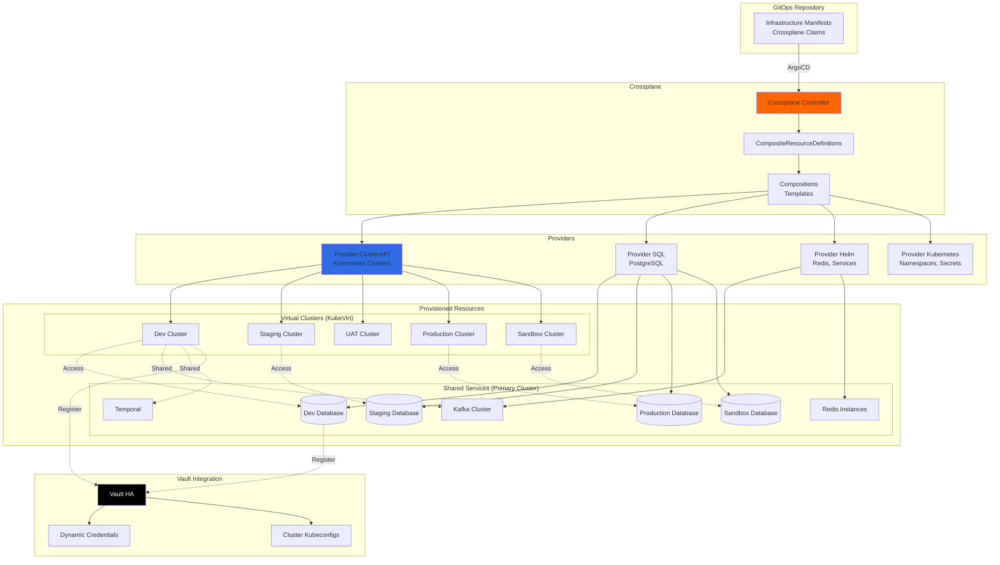

# Crossplane Infrastructure Provisioning

## Overview

Crossplane enables declarative infrastructure provisioning using Kubernetes CRDs. In our architecture, Crossplane serves two primary purposes:

1. **Cluster-as-a-Service**: Provision KubeVirt-based Kubernetes clusters per environment using ClusterAPI
2. **Database-as-a-Service**: Provision databases, caches, and other infrastructure resources per environment

This document covers both use cases and how they integrate with our GitOps workflow.

---

## Architecture Diagram



---

## 1. Crossplane Providers Setup

### Install Required Providers

```yaml
# crossplane/providers/provider-kubernetes.yaml
apiVersion: pkg.crossplane.io/v1
kind: Provider
metadata:
  name: provider-kubernetes
spec:
  package: xpkg.upbound.io/crossplane-contrib/provider-kubernetes:v0.13.0
  controllerConfigRef:
    name: provider-kubernetes-config
---
# crossplane/providers/provider-helm.yaml
apiVersion: pkg.crossplane.io/v1
kind: Provider
metadata:
  name: provider-helm
spec:
  package: xpkg.upbound.io/crossplane-contrib/provider-helm:v0.18.0
  controllerConfigRef:
    name: provider-helm-config
---
# crossplane/providers/provider-sql.yaml
apiVersion: pkg.crossplane.io/v1
kind: Provider
metadata:
  name: provider-sql
spec:
  package: xpkg.upbound.io/crossplane-contrib/provider-sql:v0.9.0
---
# crossplane/providers/controller-config.yaml
apiVersion: pkg.crossplane.io/v1alpha1
kind: ControllerConfig
metadata:
  name: provider-kubernetes-config
spec:
  serviceAccountName: crossplane-provider-kubernetes
---
apiVersion: pkg.crossplane.io/v1alpha1
kind: ControllerConfig
metadata:
  name: provider-helm-config
spec:
  serviceAccountName: crossplane-provider-helm
```

### Configure Providers

```yaml
# crossplane/provider-configs/sql-config.yaml
apiVersion: postgresql.sql.crossplane.io/v1alpha1
kind: ProviderConfig
metadata:
  name: postgres-provider
spec:
  credentials:
    source: PostgreSQLConnectionSecret
    connectionSecretRef:
      namespace: crossplane-system
      name: postgres-admin-creds
  sslMode: require
---
# crossplane/provider-configs/helm-config.yaml
apiVersion: helm.crossplane.io/v1beta1
kind: ProviderConfig
metadata:
  name: helm-provider
spec:
  credentials:
    source: InjectedIdentity
---
# crossplane/provider-configs/k8s-config.yaml
apiVersion: kubernetes.crossplane.io/v1alpha1
kind: ProviderConfig
metadata:
  name: kubernetes-provider
spec:
  credentials:
    source: InjectedIdentity
```

---

## 2. ClusterAPI Integration for Cluster Provisioning

### Overview

Crossplane wraps ClusterAPI resources to provide a self-service cluster provisioning experience. Instead of manually creating ClusterAPI `Cluster` resources, developers can claim a `KubernetesCluster` which Crossplane provisions using our standardized templates.

> **Note**: For detailed ClusterAPI + KubeVirt architecture, see `clusterapi-kubevirt-architecture.md`

### Kubernetes Cluster XRD

```yaml
# crossplane/xrds/cluster-xrd.yaml
apiVersion: apiextensions.crossplane.io/v1
kind: CompositeResourceDefinition
metadata:
  name: xkubernetesclusters.compute.yourdomain.com
spec:
  group: compute.yourdomain.com
  names:
    kind: XKubernetesCluster
    plural: xkubernetesclusters
  claimNames:
    kind: KubernetesCluster
    plural: kubernetesclusters

  versions:
    - name: v1alpha1
      served: true
      referenceable: true
      schema:
        openAPIV3Schema:
          type: object
          properties:
            spec:
              type: object
              properties:
                parameters:
                  type: object
                  properties:
                    environment:
                      type: string
                      description: "Environment name (dev, staging, uat, preprod, production, sandbox)"
                      enum: [dev, staging, uat, preprod, production, sandbox]
                    controlPlaneNodes:
                      type: integer
                      description: "Number of control plane nodes"
                      default: 3
                      minimum: 1
                      maximum: 5
                    workerNodes:
                      type: integer
                      description: "Number of worker nodes"
                      default: 3
                      minimum: 1
                      maximum: 10
                    controlPlaneCPU:
                      type: string
                      description: "CPU cores per control plane node"
                      default: "4"
                    controlPlaneMemory:
                      type: string
                      description: "Memory per control plane node"
                      default: "8Gi"
                    workerCPU:
                      type: string
                      description: "CPU cores per worker node"
                      default: "4"
                    workerMemory:
                      type: string
                      description: "Memory per worker node"
                      default: "8Gi"
                    workerStorage:
                      type: string
                      description: "Storage per worker node"
                      default: "100Gi"
                    kubernetesVersion:
                      type: string
                      description: "Kubernetes version"
                      default: "v1.31.0"
                    enableLiveMigration:
                      type: boolean
                      description: "Enable VM live migration support"
                      default: true
                    networkPlugin:
                      type: string
                      description: "CNI plugin (kube-ovn, calico, cilium)"
                      default: "kube-ovn"
                      enum: [kube-ovn, calico, cilium]
                    vaultPath:
                      type: string
                      description: "Vault path to store cluster credentials"
                  required:
                    - environment
                    - vaultPath
              required:
                - parameters
            status:
              type: object
              properties:
                clusterEndpoint:
                  type: string
                  description: "API server endpoint"
                clusterReady:
                  type: boolean
                  description: "Cluster ready status"
                kubeconfig:
                  type: string
                  description: "Reference to kubeconfig secret"
```

### Kubernetes Cluster Composition

```yaml
# crossplane/compositions/cluster-composition.yaml
apiVersion: apiextensions.crossplane.io/v1
kind: Composition
metadata:
  name: kubevirt-cluster-composition
  labels:
    crossplane.io/xrd: xkubernetesclusters.compute.yourdomain.com
    provider: kubevirt
spec:
  writeConnectionSecretsToNamespace: crossplane-system

  compositeTypeRef:
    apiVersion: compute.yourdomain.com/v1alpha1
    kind: XKubernetesCluster

  resources:
    # ClusterAPI Cluster
    - name: cluster
      base:
        apiVersion: kubernetes.crossplane.io/v1alpha1
        kind: Object
        spec:
          forProvider:
            manifest:
              apiVersion: cluster.x-k8s.io/v1beta1
              kind: Cluster
              metadata:
                namespace: default
              spec:
                clusterNetwork:
                  pods:
                    cidrBlocks: ["10.244.0.0/16"]
                  services:
                    cidrBlocks: ["10.96.0.0/12"]
                controlPlaneRef:
                  apiVersion: controlplane.cluster.x-k8s.io/v1beta1
                  kind: KubeadmControlPlane
                infrastructureRef:
                  apiVersion: infrastructure.cluster.x-k8s.io/v1alpha1
                  kind: KubevirtCluster
          providerConfigRef:
            name: kubernetes-provider
      patches:
        - type: FromCompositeFieldPath
          fromFieldPath: spec.parameters.environment
          toFieldPath: spec.forProvider.manifest.metadata.name
        - type: FromCompositeFieldPath
          fromFieldPath: spec.parameters.environment
          toFieldPath: spec.forProvider.manifest.spec.controlPlaneRef.name
        - type: FromCompositeFieldPath
          fromFieldPath: spec.parameters.environment
          toFieldPath: spec.forProvider.manifest.spec.infrastructureRef.name

    # KubevirtCluster (Infrastructure)
    - name: kubevirt-cluster
      base:
        apiVersion: kubernetes.crossplane.io/v1alpha1
        kind: Object
        spec:
          forProvider:
            manifest:
              apiVersion: infrastructure.cluster.x-k8s.io/v1alpha1
              kind: KubevirtCluster
              metadata:
                namespace: default
              spec:
                controlPlaneServiceTemplate:
                  spec:
                    type: LoadBalancer
          providerConfigRef:
            name: kubernetes-provider
      patches:
        - type: FromCompositeFieldPath
          fromFieldPath: spec.parameters.environment
          toFieldPath: spec.forProvider.manifest.metadata.name

    # KubeadmControlPlane
    - name: control-plane
      base:
        apiVersion: kubernetes.crossplane.io/v1alpha1
        kind: Object
        spec:
          forProvider:
            manifest:
              apiVersion: controlplane.cluster.x-k8s.io/v1beta1
              kind: KubeadmControlPlane
              metadata:
                namespace: default
              spec:
                kubeadmConfigSpec:
                  clusterConfiguration:
                    networking:
                      podSubnet: "10.244.0.0/16"
                      serviceSubnet: "10.96.0.0/12"
                  initConfiguration:
                    nodeRegistration:
                      kubeletExtraArgs:
                        cloud-provider: external
                  joinConfiguration:
                    nodeRegistration:
                      kubeletExtraArgs:
                        cloud-provider: external
                machineTemplate:
                  infrastructureRef:
                    apiVersion: infrastructure.cluster.x-k8s.io/v1alpha1
                    kind: KubevirtMachineTemplate
          providerConfigRef:
            name: kubernetes-provider
      patches:
        - type: FromCompositeFieldPath
          fromFieldPath: spec.parameters.environment
          toFieldPath: spec.forProvider.manifest.metadata.name
        - type: FromCompositeFieldPath
          fromFieldPath: spec.parameters.controlPlaneNodes
          toFieldPath: spec.forProvider.manifest.spec.replicas
        - type: FromCompositeFieldPath
          fromFieldPath: spec.parameters.kubernetesVersion
          toFieldPath: spec.forProvider.manifest.spec.version
        - type: FromCompositeFieldPath
          fromFieldPath: spec.parameters.environment
          toFieldPath: spec.forProvider.manifest.spec.machineTemplate.infrastructureRef.name
          transforms:
            - type: string
              string:
                fmt: "%s-control-plane"

    # Control Plane MachineTemplate
    - name: control-plane-template
      base:
        apiVersion: kubernetes.crossplane.io/v1alpha1
        kind: Object
        spec:
          forProvider:
            manifest:
              apiVersion: infrastructure.cluster.x-k8s.io/v1alpha1
              kind: KubevirtMachineTemplate
              metadata:
                namespace: default
              spec:
                template:
                  spec:
                    virtualMachineBootstrapCheck:
                      checkStrategy: ssh
                    virtualMachineTemplate:
                      metadata:
                        namespace: default
                      spec:
                        runStrategy: Always
                        dataVolumeTemplates:
                          - metadata:
                              name: system-disk
                            spec:
                              pvc:
                                accessModes:
                                  - ReadWriteMany
                                resources:
                                  requests:
                                    storage: 50Gi
                              source:
                                registry:
                                  url: docker://quay.io/capk/ubuntu-2204-container-disk:v1.31.0
                        template:
                          metadata:
                            annotations:
                              kubevirt.io/allow-pod-bridge-network-live-migration: "true"
                          spec:
                            evictionStrategy: LiveMigrate
                            domain:
                              devices:
                                disks:
                                  - name: system
                                    disk:
                                      bus: virtio
                                interfaces:
                                  - name: default
                                    bridge: {}
                              resources:
                                requests:
                                  memory: 8Gi
                            networks:
                              - name: default
                                pod: {}
                            volumes:
                              - name: system
                                dataVolume:
                                  name: system-disk
          providerConfigRef:
            name: kubernetes-provider
      patches:
        - type: FromCompositeFieldPath
          fromFieldPath: spec.parameters.environment
          toFieldPath: spec.forProvider.manifest.metadata.name
          transforms:
            - type: string
              string:
                fmt: "%s-control-plane"
        - type: FromCompositeFieldPath
          fromFieldPath: spec.parameters.controlPlaneCPU
          toFieldPath: spec.forProvider.manifest.spec.template.spec.virtualMachineTemplate.spec.template.spec.domain.resources.requests.cpu
        - type: FromCompositeFieldPath
          fromFieldPath: spec.parameters.controlPlaneMemory
          toFieldPath: spec.forProvider.manifest.spec.template.spec.virtualMachineTemplate.spec.template.spec.domain.resources.requests.memory
        - type: FromCompositeFieldPath
          fromFieldPath: spec.parameters.kubernetesVersion
          toFieldPath: spec.forProvider.manifest.spec.template.spec.virtualMachineTemplate.spec.dataVolumeTemplates[0].spec.source.registry.url
          transforms:
            - type: string
              string:
                fmt: "docker://quay.io/capk/ubuntu-2204-container-disk:%s"

    # Worker MachineDeployment
    - name: worker-deployment
      base:
        apiVersion: kubernetes.crossplane.io/v1alpha1
        kind: Object
        spec:
          forProvider:
            manifest:
              apiVersion: cluster.x-k8s.io/v1beta1
              kind: MachineDeployment
              metadata:
                namespace: default
              spec:
                selector:
                  matchLabels: {}
                template:
                  spec:
                    bootstrap:
                      configRef:
                        apiVersion: bootstrap.cluster.x-k8s.io/v1beta1
                        kind: KubeadmConfigTemplate
                    infrastructureRef:
                      apiVersion: infrastructure.cluster.x-k8s.io/v1alpha1
                      kind: KubevirtMachineTemplate
          providerConfigRef:
            name: kubernetes-provider
      patches:
        - type: FromCompositeFieldPath
          fromFieldPath: spec.parameters.environment
          toFieldPath: spec.forProvider.manifest.metadata.name
          transforms:
            - type: string
              string:
                fmt: "%s-workers"
        - type: FromCompositeFieldPath
          fromFieldPath: spec.parameters.environment
          toFieldPath: spec.forProvider.manifest.spec.clusterName
        - type: FromCompositeFieldPath
          fromFieldPath: spec.parameters.workerNodes
          toFieldPath: spec.forProvider.manifest.spec.replicas
        - type: FromCompositeFieldPath
          fromFieldPath: spec.parameters.kubernetesVersion
          toFieldPath: spec.forProvider.manifest.spec.template.spec.version
        - type: FromCompositeFieldPath
          fromFieldPath: spec.parameters.environment
          toFieldPath: spec.forProvider.manifest.spec.template.spec.bootstrap.configRef.name
          transforms:
            - type: string
              string:
                fmt: "%s-worker-bootstrap"
        - type: FromCompositeFieldPath
          fromFieldPath: spec.parameters.environment
          toFieldPath: spec.forProvider.manifest.spec.template.spec.infrastructureRef.name
          transforms:
            - type: string
              string:
                fmt: "%s-worker"

    # Worker Bootstrap Config Template
    - name: worker-bootstrap
      base:
        apiVersion: kubernetes.crossplane.io/v1alpha1
        kind: Object
        spec:
          forProvider:
            manifest:
              apiVersion: bootstrap.cluster.x-k8s.io/v1beta1
              kind: KubeadmConfigTemplate
              metadata:
                namespace: default
              spec:
                template:
                  spec:
                    joinConfiguration:
                      nodeRegistration:
                        kubeletExtraArgs:
                          cloud-provider: external
          providerConfigRef:
            name: kubernetes-provider
      patches:
        - type: FromCompositeFieldPath
          fromFieldPath: spec.parameters.environment
          toFieldPath: spec.forProvider.manifest.metadata.name
          transforms:
            - type: string
              string:
                fmt: "%s-worker-bootstrap"

    # Worker MachineTemplate
    - name: worker-template
      base:
        apiVersion: kubernetes.crossplane.io/v1alpha1
        kind: Object
        spec:
          forProvider:
            manifest:
              apiVersion: infrastructure.cluster.x-k8s.io/v1alpha1
              kind: KubevirtMachineTemplate
              metadata:
                namespace: default
              spec:
                template:
                  spec:
                    virtualMachineBootstrapCheck:
                      checkStrategy: ssh
                    virtualMachineTemplate:
                      metadata:
                        namespace: default
                      spec:
                        runStrategy: Always
                        dataVolumeTemplates:
                          - metadata:
                              name: system-disk
                            spec:
                              pvc:
                                accessModes:
                                  - ReadWriteMany
                                resources:
                                  requests:
                                    storage: 100Gi
                              source:
                                registry:
                                  url: docker://quay.io/capk/ubuntu-2204-container-disk:v1.31.0
                        template:
                          metadata:
                            annotations:
                              kubevirt.io/allow-pod-bridge-network-live-migration: "true"
                          spec:
                            evictionStrategy: LiveMigrate
                            domain:
                              devices:
                                disks:
                                  - name: system
                                    disk:
                                      bus: virtio
                                interfaces:
                                  - name: default
                                    bridge: {}
                              resources:
                                requests:
                                  cpu: "4"
                                  memory: 8Gi
                            networks:
                              - name: default
                                pod: {}
                            volumes:
                              - name: system
                                dataVolume:
                                  name: system-disk
          providerConfigRef:
            name: kubernetes-provider
      patches:
        - type: FromCompositeFieldPath
          fromFieldPath: spec.parameters.environment
          toFieldPath: spec.forProvider.manifest.metadata.name
          transforms:
            - type: string
              string:
                fmt: "%s-worker"
        - type: FromCompositeFieldPath
          fromFieldPath: spec.parameters.workerCPU
          toFieldPath: spec.forProvider.manifest.spec.template.spec.virtualMachineTemplate.spec.template.spec.domain.resources.requests.cpu
        - type: FromCompositeFieldPath
          fromFieldPath: spec.parameters.workerMemory
          toFieldPath: spec.forProvider.manifest.spec.template.spec.virtualMachineTemplate.spec.template.spec.domain.resources.requests.memory
        - type: FromCompositeFieldPath
          fromFieldPath: spec.parameters.workerStorage
          toFieldPath: spec.forProvider.manifest.spec.template.spec.virtualMachineTemplate.spec.dataVolumeTemplates[0].spec.pvc.resources.requests.storage
        - type: FromCompositeFieldPath
          fromFieldPath: spec.parameters.kubernetesVersion
          toFieldPath: spec.forProvider.manifest.spec.template.spec.virtualMachineTemplate.spec.dataVolumeTemplates[0].spec.source.registry.url
          transforms:
            - type: string
              string:
                fmt: "docker://quay.io/capk/ubuntu-2204-container-disk:%s"

    # KubeVirt Cloud Controller Manager (KCCM) Deployment
    - name: kccm-deployment
      base:
        apiVersion: helm.crossplane.io/v1beta1
        kind: Release
        spec:
          forProvider:
            chart:
              name: kubevirt-cloud-controller-manager
              repository: oci://ghcr.io/kubevirt/kubevirt-cloud-controller-manager-helm
              version: "0.7.0"
            namespace: kube-system
            values:
              infraClusterLabels:
                - "cluster.x-k8s.io/cluster-name"
          providerConfigRef:
            name: helm-provider
      patches:
        - type: FromCompositeFieldPath
          fromFieldPath: spec.parameters.environment
          toFieldPath: metadata.name
          transforms:
            - type: string
              string:
                fmt: "%s-kccm"
        - type: FromCompositeFieldPath
          fromFieldPath: spec.parameters.environment
          toFieldPath: spec.forProvider.values.infraClusterLabels[0]
          transforms:
            - type: string
              string:
                fmt: "cluster.x-k8s.io/cluster-name=%s"

    # Store kubeconfig in Vault
    - name: vault-kubeconfig
      base:
        apiVersion: kubernetes.crossplane.io/v1alpha1
        kind: Object
        spec:
          forProvider:
            manifest:
              apiVersion: batch/v1
              kind: Job
              metadata:
                namespace: crossplane-system
              spec:
                template:
                  spec:
                    serviceAccountName: crossplane-vault-sa
                    containers:
                      - name: vault-store
                        image: vault:latest
                        env:
                          - name: VAULT_ADDR
                            value: "http://vault.vault.svc:8200"
                        command:
                          - /bin/sh
                          - -c
                          - |
                            # Authenticate with Vault
                            export VAULT_TOKEN=$(vault write -field=token \
                              auth/kubernetes/login \
                              role=crossplane \
                              jwt=@/var/run/secrets/kubernetes.io/serviceaccount/token)

                            # Get kubeconfig from secret
                            KUBECONFIG_B64=$(kubectl get secret ${CLUSTER_NAME}-kubeconfig \
                              -n default -o jsonpath='{.data.value}')

                            # Store in Vault
                            echo "$KUBECONFIG_B64" | base64 -d | \
                              vault kv put ${VAULT_PATH}/kubeconfig value=-
                    restartPolicy: OnFailure
          providerConfigRef:
            name: kubernetes-provider
      patches:
        - type: FromCompositeFieldPath
          fromFieldPath: spec.parameters.environment
          toFieldPath: spec.forProvider.manifest.metadata.name
          transforms:
            - type: string
              string:
                fmt: "%s-vault-kubeconfig"
        - type: FromCompositeFieldPath
          fromFieldPath: spec.parameters.environment
          toFieldPath: spec.forProvider.manifest.spec.template.spec.containers[0].env[1].value
          transforms:
            - type: string
              string:
                fmt: "CLUSTER_NAME=%s"
        - type: FromCompositeFieldPath
          fromFieldPath: spec.parameters.vaultPath
          toFieldPath: spec.forProvider.manifest.spec.template.spec.containers[0].env[2].value
          transforms:
            - type: string
              string:
                fmt: "VAULT_PATH=%s"
```

### Example Cluster Claims

```yaml
# overlays/dev/infrastructure/cluster.yaml
apiVersion: compute.yourdomain.com/v1alpha1
kind: KubernetesCluster
metadata:
  name: dev-cluster
  namespace: default
spec:
  parameters:
    environment: dev
    controlPlaneNodes: 1
    workerNodes: 2
    controlPlaneCPU: "2"
    controlPlaneMemory: "4Gi"
    workerCPU: "2"
    workerMemory: "4Gi"
    workerStorage: "50Gi"
    kubernetesVersion: "v1.31.0"
    enableLiveMigration: true
    networkPlugin: kube-ovn
    vaultPath: secret/clusters/dev
  compositionSelector:
    matchLabels:
      crossplane.io/xrd: xkubernetesclusters.compute.yourdomain.com
      provider: kubevirt
---
# overlays/production/infrastructure/cluster.yaml
apiVersion: compute.yourdomain.com/v1alpha1
kind: KubernetesCluster
metadata:
  name: production-cluster
  namespace: default
spec:
  parameters:
    environment: production
    controlPlaneNodes: 3
    workerNodes: 5
    controlPlaneCPU: "4"
    controlPlaneMemory: "8Gi"
    workerCPU: "8"
    workerMemory: "16Gi"
    workerStorage: "200Gi"
    kubernetesVersion: "v1.31.0"
    enableLiveMigration: true
    networkPlugin: kube-ovn
    vaultPath: secret/clusters/production
  compositionSelector:
    matchLabels:
      crossplane.io/xrd: xkubernetesclusters.compute.yourdomain.com
      provider: kubevirt
```

---

## 3. Database and Cache Resource Definitions

### Database XRD

```yaml
# crossplane/xrds/database-xrd.yaml
apiVersion: apiextensions.crossplane.io/v1
kind: CompositeResourceDefinition
metadata:
  name: xpostgresqlinstances.database.yourdomain.com
spec:
  group: database.yourdomain.com
  names:
    kind: XPostgreSQLInstance
    plural: xpostgresqlinstances
  claimNames:
    kind: PostgreSQLInstance
    plural: postgresqlinstances
  
  versions:
    - name: v1alpha1
      served: true
      referenceable: true
      schema:
        openAPIV3Schema:
          type: object
          properties:
            spec:
              type: object
              properties:
                parameters:
                  type: object
                  properties:
                    environment:
                      type: string
                      enum: [dev, staging, uat, production, sandbox]
                    size:
                      type: string
                      enum: [small, medium, large]
                      default: small
                    storageGB:
                      type: integer
                      default: 20
                    enableBackup:
                      type: boolean
                      default: true
                    vaultPath:
                      type: string
                      description: "Vault path to store credentials"
                  required:
                    - environment
                    - vaultPath
              required:
                - parameters
```

### Redis XRD

```yaml
# crossplane/xrds/redis-xrd.yaml
apiVersion: apiextensions.crossplane.io/v1
kind: CompositeResourceDefinition
metadata:
  name: xredisinstances.cache.yourdomain.com
spec:
  group: cache.yourdomain.com
  names:
    kind: XRedisInstance
    plural: xredisinstances
  claimNames:
    kind: RedisInstance
    plural: redisinstances
  
  versions:
    - name: v1alpha1
      served: true
      referenceable: true
      schema:
        openAPIV3Schema:
          type: object
          properties:
            spec:
              type: object
              properties:
                parameters:
                  type: object
                  properties:
                    environment:
                      type: string
                      enum: [dev, staging, uat, production, sandbox]
                    replicas:
                      type: integer
                      default: 1
                    memoryGB:
                      type: integer
                      default: 1
                  required:
                    - environment
              required:
                - parameters
```

---

## 4. Database and Cache Compositions

### PostgreSQL Composition

```yaml
# crossplane/compositions/postgres-composition.yaml
apiVersion: apiextensions.crossplane.io/v1
kind: Composition
metadata:
  name: postgres-composition
  labels:
    crossplane.io/xrd: xpostgresqlinstances.database.yourdomain.com
spec:
  writeConnectionSecretsToNamespace: crossplane-system
  
  compositeTypeRef:
    apiVersion: database.yourdomain.com/v1alpha1
    kind: XPostgreSQLInstance
  
  resources:
    # Create Database
    - name: database
      base:
        apiVersion: postgresql.sql.crossplane.io/v1alpha1
        kind: Database
        spec:
          forProvider:
            encoding: UTF8
          providerConfigRef:
            name: postgres-provider
      patches:
        - fromFieldPath: spec.parameters.environment
          toFieldPath: metadata.name
          transforms:
            - type: string
              string:
                fmt: "%s-db"
    
    # Create Database User
    - name: user
      base:
        apiVersion: postgresql.sql.crossplane.io/v1alpha1
        kind: Role
        spec:
          forProvider:
            connectionLimit: -1
            inherit: true
            login: true
          providerConfigRef:
            name: postgres-provider
          writeConnectionSecretToRef:
            namespace: crossplane-system
      patches:
        - fromFieldPath: spec.parameters.environment
          toFieldPath: metadata.name
          transforms:
            - type: string
              string:
                fmt: "%s-user"
        - fromFieldPath: spec.parameters.environment
          toFieldPath: spec.writeConnectionSecretToRef.name
          transforms:
            - type: string
              string:
                fmt: "%s-db-credentials"
    
    # Grant Permissions
    - name: grant
      base:
        apiVersion: postgresql.sql.crossplane.io/v1alpha1
        kind: Grant
        spec:
          forProvider:
            privileges:
              - ALL
            withOption: false
          providerConfigRef:
            name: postgres-provider
      patches:
        - fromFieldPath: spec.parameters.environment
          toFieldPath: spec.forProvider.role
          transforms:
            - type: string
              string:
                fmt: "%s-user"
        - fromFieldPath: spec.parameters.environment
          toFieldPath: spec.forProvider.database
          transforms:
            - type: string
              string:
                fmt: "%s-db"
    
    # Create Kubernetes Secret
    - name: k8s-secret
      base:
        apiVersion: kubernetes.crossplane.io/v1alpha1
        kind: Object
        spec:
          forProvider:
            manifest:
              apiVersion: v1
              kind: Secret
              metadata:
                namespace: default
              type: Opaque
          providerConfigRef:
            name: kubernetes-provider
      patches:
        - fromFieldPath: spec.parameters.environment
          toFieldPath: spec.forProvider.manifest.metadata.name
          transforms:
            - type: string
              string:
                fmt: "%s-db-secret"
        - fromFieldPath: spec.parameters.environment
          toFieldPath: spec.forProvider.manifest.metadata.namespace
      connectionDetails:
        - fromConnectionSecretKey: username
        - fromConnectionSecretKey: password
        - fromConnectionSecretKey: endpoint
```

### Redis Composition

```yaml
# crossplane/compositions/redis-composition.yaml
apiVersion: apiextensions.crossplane.io/v1
kind: Composition
metadata:
  name: redis-composition
  labels:
    crossplane.io/xrd: xredisinstances.cache.yourdomain.com
spec:
  compositeTypeRef:
    apiVersion: cache.yourdomain.com/v1alpha1
    kind: XRedisInstance
  
  resources:
    # Deploy Redis via Helm
    - name: redis
      base:
        apiVersion: helm.crossplane.io/v1beta1
        kind: Release
        spec:
          forProvider:
            chart:
              name: redis
              repository: https://charts.bitnami.com/bitnami
              version: "19.0.0"
            values:
              auth:
                enabled: true
              master:
                persistence:
                  enabled: true
                  size: 8Gi
          providerConfigRef:
            name: helm-provider
      patches:
        - fromFieldPath: spec.parameters.environment
          toFieldPath: metadata.name
          transforms:
            - type: string
              string:
                fmt: "redis-%s"
        - fromFieldPath: spec.parameters.environment
          toFieldPath: spec.forProvider.namespace
        - fromFieldPath: spec.parameters.replicas
          toFieldPath: spec.forProvider.values.replica.replicaCount
        - fromFieldPath: spec.parameters.memoryGB
          toFieldPath: spec.forProvider.values.master.resources.limits.memory
          transforms:
            - type: string
              string:
                fmt: "%dGi"
```

---

## 5. Infrastructure Claims (Per Environment)

### Development Environment

```yaml
# overlays/dev/infrastructure/database.yaml
apiVersion: database.yourdomain.com/v1alpha1
kind: PostgreSQLInstance
metadata:
  name: dev-database
  namespace: dev
spec:
  parameters:
    environment: dev
    size: small
    storageGB: 20
    enableBackup: false
    vaultPath: secret/database/dev
  compositionSelector:
    matchLabels:
      crossplane.io/xrd: xpostgresqlinstances.database.yourdomain.com
  writeConnectionSecretToRef:
    name: postgres-connection
---
# overlays/dev/infrastructure/redis.yaml
apiVersion: cache.yourdomain.com/v1alpha1
kind: RedisInstance
metadata:
  name: dev-redis
  namespace: dev
spec:
  parameters:
    environment: dev
    replicas: 1
    memoryGB: 1
  compositionSelector:
    matchLabels:
      crossplane.io/xrd: xredisinstances.cache.yourdomain.com
```

### Staging Environment

```yaml
# overlays/staging/infrastructure/database.yaml
apiVersion: database.yourdomain.com/v1alpha1
kind: PostgreSQLInstance
metadata:
  name: staging-database
  namespace: staging
spec:
  parameters:
    environment: staging
    size: medium
    storageGB: 50
    enableBackup: true
    vaultPath: secret/database/staging
  compositionSelector:
    matchLabels:
      crossplane.io/xrd: xpostgresqlinstances.database.yourdomain.com
  writeConnectionSecretToRef:
    name: postgres-connection
---
# overlays/staging/infrastructure/redis.yaml
apiVersion: cache.yourdomain.com/v1alpha1
kind: RedisInstance
metadata:
  name: staging-redis
  namespace: staging
spec:
  parameters:
    environment: staging
    replicas: 2
    memoryGB: 2
  compositionSelector:
    matchLabels:
      crossplane.io/xrd: xredisinstances.cache.yourdomain.com
```

### Production Environment

```yaml
# overlays/production/infrastructure/database.yaml
apiVersion: database.yourdomain.com/v1alpha1
kind: PostgreSQLInstance
metadata:
  name: production-database
  namespace: production
spec:
  parameters:
    environment: production
    size: large
    storageGB: 200
    enableBackup: true
    vaultPath: secret/database/production
  compositionSelector:
    matchLabels:
      crossplane.io/xrd: xpostgresqlinstances.database.yourdomain.com
  writeConnectionSecretToRef:
    name: postgres-connection
---
# overlays/production/infrastructure/redis.yaml
apiVersion: cache.yourdomain.com/v1alpha1
kind: RedisInstance
metadata:
  name: production-redis
  namespace: production
spec:
  parameters:
    environment: production
    replicas: 3
    memoryGB: 8
  compositionSelector:
    matchLabels:
      crossplane.io/xrd: xredisinstances.cache.yourdomain.com
```

---

## 6. Vault Integration for Database Credentials

### Function to Register Database with Vault

```yaml
# crossplane/functions/vault-registration.yaml
apiVersion: kubernetes.crossplane.io/v1alpha1
kind: Object
metadata:
  name: vault-db-registration
spec:
  forProvider:
    manifest:
      apiVersion: batch/v1
      kind: Job
      metadata:
        name: register-db-vault
        namespace: crossplane-system
      spec:
        template:
          spec:
            serviceAccountName: crossplane-vault-sa
            containers:
              - name: vault-register
                image: vault:latest
                env:
                  - name: VAULT_ADDR
                    value: "http://vault.vault.svc:8200"
                  - name: DB_HOST
                    valueFrom:
                      secretKeyRef:
                        name: postgres-connection
                        key: endpoint
                  - name: DB_USER
                    valueFrom:
                      secretKeyRef:
                        name: postgres-connection
                        key: username
                  - name: DB_PASSWORD
                    valueFrom:
                      secretKeyRef:
                        name: postgres-connection
                        key: password
                  - name: ENVIRONMENT
                    value: "dev"
                command:
                  - /bin/sh
                  - -c
                  - |
                    # Authenticate with Vault
                    export VAULT_TOKEN=$(vault write -field=token \
                      auth/kubernetes/login \
                      role=crossplane \
                      jwt=@/var/run/secrets/kubernetes.io/serviceaccount/token)
                    
                    # Register database
                    vault write database/config/postgres-${ENVIRONMENT} \
                      plugin_name=postgresql-database-plugin \
                      connection_url="postgresql://{{username}}:{{password}}@${DB_HOST}:5432/${ENVIRONMENT}-db?sslmode=require" \
                      username="${DB_USER}" \
                      password="${DB_PASSWORD}" \
                      allowed_roles="${ENVIRONMENT}-*"
                    
                    # Create role for applications
                    vault write database/roles/${ENVIRONMENT}-readwrite \
                      db_name=postgres-${ENVIRONMENT} \
                      creation_statements="CREATE ROLE \"{{name}}\" WITH LOGIN PASSWORD '{{password}}' VALID UNTIL '{{expiration}}'; \
                        GRANT ALL PRIVILEGES ON DATABASE \"${ENVIRONMENT}-db\" TO \"{{name}}\";" \
                      default_ttl="1h" \
                      max_ttl="24h"
            restartPolicy: OnFailure
```

---

## 7. Dynamic Infrastructure for Preview Environments

### PR Preview Database Claim Template

```yaml
# crossplane/templates/pr-database-template.yaml
apiVersion: database.yourdomain.com/v1alpha1
kind: PostgreSQLInstance
metadata:
  name: pr-{{ PR_NUMBER }}-database
  namespace: pr-{{ PR_NUMBER }}
  annotations:
    crossplane.io/external-name: pr-{{ PR_NUMBER }}-db
    ttl: "168h"  # 7 days
spec:
  parameters:
    environment: pr-{{ PR_NUMBER }}
    size: small
    storageGB: 10
    enableBackup: false
    vaultPath: secret/database/pr-{{ PR_NUMBER }}
  compositionSelector:
    matchLabels:
      crossplane.io/xrd: xpostgresqlinstances.database.yourdomain.com
  writeConnectionSecretToRef:
    name: postgres-connection
```

### Tekton Task to Create PR Database

```yaml
# tekton/tasks/create-pr-infrastructure.yaml
apiVersion: tekton.dev/v1beta1
kind: Task
metadata:
  name: create-pr-infrastructure
spec:
  params:
    - name: pr-number
      type: string
  
  steps:
    - name: apply-infrastructure
      image: bitnami/kubectl
      script: |
        #!/bin/bash
        PR_NUM=$(params.pr-number)
        
        # Create namespace
        kubectl create namespace pr-${PR_NUM} || true
        
        # Apply database claim
        cat <<EOF | kubectl apply -f -
        apiVersion: database.yourdomain.com/v1alpha1
        kind: PostgreSQLInstance
        metadata:
          name: pr-${PR_NUM}-database
          namespace: pr-${PR_NUM}
        spec:
          parameters:
            environment: dev
            size: small
            storageGB: 10
            enableBackup: false
            vaultPath: secret/database/pr-${PR_NUM}
          writeConnectionSecretToRef:
            name: postgres-connection
        EOF
        
        # Wait for database to be ready
        kubectl wait --for=condition=Ready \
          postgresqlinstance/pr-${PR_NUM}-database \
          -n pr-${PR_NUM} \
          --timeout=300s
```

---

## 8. Sandbox Database (Production Clone)

### Sandbox Database Claim

```yaml
# overlays/sandbox/infrastructure/database.yaml
apiVersion: database.yourdomain.com/v1alpha1
kind: PostgreSQLInstance
metadata:
  name: sandbox-database
  namespace: sandbox
  annotations:
    crossplane.io/external-name: sandbox-db
    source: production-clone
spec:
  parameters:
    environment: sandbox
    size: large
    storageGB: 200
    enableBackup: false
    vaultPath: secret/database/sandbox
  compositionSelector:
    matchLabels:
      crossplane.io/xrd: xpostgresqlinstances.database.yourdomain.com
  writeConnectionSecretToRef:
    name: postgres-connection
```

### Sandbox Database Sync (Updated from sandbox-implementation.md)

```bash
#!/bin/bash
# Clone production database to sandbox

PROD_DB="postgresql://postgres.production.svc:5432/production-db"
SANDBOX_DB="postgresql://postgres.sandbox.svc:5432/sandbox-db"

# Dump production
pg_dump "$PROD_DB" \
    --no-owner \
    --no-privileges \
    --clean \
    > /tmp/prod-dump.sql

# Anonymize (as before)
python3 /scripts/anonymize-db.py /tmp/prod-dump.sql /tmp/sandbox-dump.sql

# Restore to sandbox
psql "$SANDBOX_DB" < /tmp/sandbox-dump.sql
```

---

## 9. Infrastructure Lifecycle Management

### Update Database Size

```bash
# Update dev database to medium size
kubectl patch postgresqlinstance dev-database \
  -n dev \
  --type=merge \
  -p '{"spec":{"parameters":{"size":"medium","storageGB":50}}}'
```

### Delete Infrastructure

```bash
# Delete dev database (will be cleaned up by Crossplane)
kubectl delete postgresqlinstance dev-database -n dev
```

### List All Databases

```bash
# List all PostgreSQL instances
kubectl get postgresqlinstance --all-namespaces

# Get detailed info
kubectl describe postgresqlinstance production-database -n production
```

---

## 10. Monitoring Crossplane Resources

### ServiceMonitor for Crossplane

```yaml
# crossplane/monitoring/servicemonitor.yaml
apiVersion: monitoring.coreos.com/v1
kind: ServiceMonitor
metadata:
  name: crossplane
  namespace: crossplane-system
spec:
  selector:
    matchLabels:
      app: crossplane
  endpoints:
    - port: metrics
```

### Alerts for Failed Provisions

```yaml
# crossplane/monitoring/prometheusrule.yaml
apiVersion: monitoring.coreos.com/v1
kind: PrometheusRule
metadata:
  name: crossplane-alerts
  namespace: crossplane-system
spec:
  groups:
    - name: crossplane
      interval: 30s
      rules:
        - alert: CrossplaneProvisionFailed
          expr: |
            crossplane_managed_resource_exists{condition_status="False",condition_type="Ready"} == 1
          for: 10m
          labels:
            severity: critical
          annotations:
            summary: "Crossplane resource failed to provision"
            description: "Resource {{ $labels.name }} in namespace {{ $labels.namespace }} has been in failed state for 10 minutes"
```

---

## 11. GitOps Integration

### Include Infrastructure in Overlays

```yaml
# overlays/dev/kustomization.yaml
apiVersion: kustomize.config.k8s.io/v1beta1
kind: Kustomization

namespace: dev

resources:
  # Application resources
  - ../../base/user-service
  
  # Infrastructure (Crossplane claims)
  - infrastructure/database.yaml
  - infrastructure/redis.yaml

# Application will reference the provisioned infrastructure
configMapGenerator:
  - name: user-service-config
    behavior: merge
    literals:
      - DATABASE_URL=postgresql://postgres.dev.svc:5432/dev-db
      - REDIS_URL=redis://redis-dev-master.dev.svc:6379
```

---

## 12. Backstage Integration for Self-Service

### Software Template for Cluster Provisioning

```yaml
# backstage/templates/kubernetes-cluster-template.yaml
apiVersion: scaffolder.backstage.io/v1beta3
kind: Template
metadata:
  name: kubernetes-cluster
  title: Provision Kubernetes Cluster
  description: Create a new KubeVirt-based Kubernetes cluster for your environment
spec:
  owner: platform-team
  type: infrastructure

  parameters:
    - title: Cluster Configuration
      required:
        - environment
        - controlPlaneNodes
        - workerNodes
      properties:
        environment:
          title: Environment
          type: string
          description: Environment name for this cluster
          enum:
            - dev
            - staging
            - uat
            - preprod
            - production
            - sandbox
        controlPlaneNodes:
          title: Control Plane Nodes
          type: integer
          description: Number of control plane nodes
          default: 3
          minimum: 1
          maximum: 5
        workerNodes:
          title: Worker Nodes
          type: integer
          description: Number of worker nodes
          default: 3
          minimum: 1
          maximum: 10
        controlPlaneCPU:
          title: Control Plane CPU
          type: string
          description: CPU cores per control plane node
          default: "4"
        controlPlaneMemory:
          title: Control Plane Memory
          type: string
          description: Memory per control plane node
          default: "8Gi"
        workerCPU:
          title: Worker CPU
          type: string
          description: CPU cores per worker node
          default: "4"
        workerMemory:
          title: Worker Memory
          type: string
          description: Memory per worker node
          default: "8Gi"
        workerStorage:
          title: Worker Storage
          type: string
          description: Storage per worker node
          default: "100Gi"
        kubernetesVersion:
          title: Kubernetes Version
          type: string
          description: Kubernetes version to deploy
          default: "v1.31.0"
          enum:
            - "v1.31.0"
            - "v1.30.0"
            - "v1.29.0"

  steps:
    - id: fetch-base
      name: Fetch Cluster Template
      action: fetch:template
      input:
        url: ./templates/cluster
        values:
          environment: ${{ parameters.environment }}
          controlPlaneNodes: ${{ parameters.controlPlaneNodes }}
          workerNodes: ${{ parameters.workerNodes }}
          controlPlaneCPU: ${{ parameters.controlPlaneCPU }}
          controlPlaneMemory: ${{ parameters.controlPlaneMemory }}
          workerCPU: ${{ parameters.workerCPU }}
          workerMemory: ${{ parameters.workerMemory }}
          workerStorage: ${{ parameters.workerStorage }}
          kubernetesVersion: ${{ parameters.kubernetesVersion }}

    - id: pr
      name: Create Pull Request
      action: publish:github:pull-request
      input:
        repoUrl: github.com?repo=pn-infra&owner=pnow-devsupreme
        branchName: cluster-${{ parameters.environment }}
        title: 'Provision ${{ parameters.environment }} Kubernetes Cluster'
        description: |
          ## Cluster Configuration

          - **Environment**: ${{ parameters.environment }}
          - **Control Plane**: ${{ parameters.controlPlaneNodes }} nodes (${{ parameters.controlPlaneCPU }} CPU, ${{ parameters.controlPlaneMemory }} RAM)
          - **Workers**: ${{ parameters.workerNodes }} nodes (${{ parameters.workerCPU }} CPU, ${{ parameters.workerMemory }} RAM, ${{ parameters.workerStorage }} storage)
          - **Kubernetes Version**: ${{ parameters.kubernetesVersion }}

          This PR will provision a new KubeVirt-based Kubernetes cluster using ClusterAPI.

  output:
    links:
      - title: Pull Request
        url: ${{ steps.pr.output.remoteUrl }}
```

### Software Template for Database Provisioning

```yaml
# backstage/templates/database-template.yaml
apiVersion: scaffolder.backstage.io/v1beta3
kind: Template
metadata:
  name: postgresql-database
  title: Provision PostgreSQL Database
  description: Create a new PostgreSQL database for your application
spec:
  owner: platform-team
  type: infrastructure

  parameters:
    - title: Database Configuration
      required:
        - environment
        - appName
      properties:
        environment:
          title: Environment
          type: string
          description: Environment for this database
          enum:
            - dev
            - staging
            - uat
            - production
            - sandbox
        appName:
          title: Application Name
          type: string
          description: Name of the application using this database
        size:
          title: Database Size
          type: string
          description: Database instance size
          default: small
          enum:
            - small
            - medium
            - large
        storageGB:
          title: Storage (GB)
          type: integer
          description: Storage size in GB
          default: 20
        enableBackup:
          title: Enable Backup
          type: boolean
          description: Enable automated backups
          default: true

  steps:
    - id: fetch-base
      name: Fetch Database Template
      action: fetch:template
      input:
        url: ./templates/database
        values:
          environment: ${{ parameters.environment }}
          appName: ${{ parameters.appName }}
          size: ${{ parameters.size }}
          storageGB: ${{ parameters.storageGB }}
          enableBackup: ${{ parameters.enableBackup }}

    - id: pr
      name: Create Pull Request
      action: publish:github:pull-request
      input:
        repoUrl: github.com?repo=pn-infra&owner=pnow-devsupreme
        branchName: db-${{ parameters.environment }}-${{ parameters.appName }}
        title: 'Provision ${{ parameters.environment }} database for ${{ parameters.appName }}'
        description: |
          ## Database Configuration

          - **Environment**: ${{ parameters.environment }}
          - **Application**: ${{ parameters.appName }}
          - **Size**: ${{ parameters.size }}
          - **Storage**: ${{ parameters.storageGB }}GB
          - **Backup Enabled**: ${{ parameters.enableBackup }}

          This PR will provision a new PostgreSQL database using Crossplane.

  output:
    links:
      - title: Pull Request
        url: ${{ steps.pr.output.remoteUrl }}
```

---

## Summary

This Crossplane integration provides comprehensive infrastructure-as-code capabilities:

### Cluster Provisioning
✅ **Kubernetes Cluster-as-a-Service** - Self-service cluster provisioning via ClusterAPI
✅ **KubeVirt Integration** - Virtual clusters on baremetal using KubeVirt VMs
✅ **Live Migration Support** - Zero-downtime VM migration with ReadWriteMany storage
✅ **LoadBalancer Services** - KCCM integration for LoadBalancer support in workload clusters
✅ **Multi-Environment** - Separate clusters for dev, staging, uat, preprod, production, sandbox
✅ **Standardized Templates** - Consistent cluster configuration across environments

### Database and Cache Provisioning
✅ **Declarative Infrastructure** - All infrastructure as code
✅ **Per-Environment Resources** - Databases, caches per environment
✅ **Dynamic Provisioning** - Automatic infrastructure for PR previews
✅ **Resource Templates** - Reusable compositions
✅ **Cost Optimization** - Right-sized resources per environment

### Integration and Workflow
✅ **Vault Integration** - Automatic credential and kubeconfig storage
✅ **GitOps Workflow** - Infrastructure in Git alongside apps
✅ **Lifecycle Management** - Easy updates and deletions
✅ **Backstage Self-Service** - Developer portal for infrastructure requests
✅ **ArgoCD Management** - Automatic sync of infrastructure changes
✅ **Monitoring** - Prometheus metrics and alerts for resource provisioning

### Architecture Benefits
✅ **Isolation** - Business apps in virtual clusters, shared services in primary cluster
✅ **Scalability** - Scale clusters and databases independently
✅ **Security** - Network isolation between environments, centralized secrets
✅ **Auditability** - All infrastructure changes tracked in Git
✅ **Reproducibility** - Consistent infrastructure across all environments
