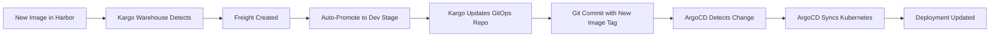

# Kargo Progressive Delivery Configurations

## Directory Structure
```
kargo/
├── project.yaml
├── warehouses/
│   ├── services-warehouse.yaml
│   └── packages-warehouse.yaml
├── stages/
│   ├── dev-stage.yaml
│   ├── staging-stage.yaml
│   ├── uat-stage.yaml
│   ├── preprod-stage.yaml
│   └── production-stage.yaml
└── promotions/
    └── promotion-policy.yaml
```

---

## 1. Kargo Project

```yaml
# kargo/project.yaml
apiVersion: kargo.akuity.io/v1alpha1
kind: Project
metadata:
  name: myapp
spec:
  promotionPolicies:
    - stage: dev
      autoPromotionEnabled: true
    - stage: staging
      autoPromotionEnabled: true
    - stage: uat
      autoPromotionEnabled: false  # Manual gate
    - stage: preprod
      autoPromotionEnabled: false  # Manual gate
    - stage: production
      autoPromotionEnabled: false  # Manual gate
```

---

## 2. Warehouse Configuration

### Services Warehouse (Tracks Harbor Images)

```yaml
# kargo/warehouses/services-warehouse.yaml
apiVersion: kargo.akuity.io/v1alpha1
kind: Warehouse
metadata:
  name: services-warehouse
  namespace: myapp
spec:
  # Track multiple services from Harbor
  subscriptions:
    # User Service
    - image:
        repoURL: harbor.yourdomain.com/services/user-service
        semverConstraint: ">=1.0.0-alpha"
        discoveryLimit: 10
        platform: linux/amd64
        allowTags:
          - pattern: "^v[0-9]+\\.[0-9]+\\.[0-9]+-alpha\\.[0-9]+$"  # Alpha tags
          - pattern: "^v[0-9]+\\.[0-9]+\\.[0-9]+-beta\\.[0-9]+$"   # Beta tags
          - pattern: "^v[0-9]+\\.[0-9]+\\.[0-9]+$"                   # Stable tags
    
    # Payment Service
    - image:
        repoURL: harbor.yourdomain.com/services/payment-service
        semverConstraint: ">=1.0.0-alpha"
        discoveryLimit: 10
        platform: linux/amd64
        allowTags:
          - pattern: "^v[0-9]+\\.[0-9]+\\.[0-9]+-alpha\\.[0-9]+$"
          - pattern: "^v[0-9]+\\.[0-9]+\\.[0-9]+-beta\\.[0-9]+$"
          - pattern: "^v[0-9]+\\.[0-9]+\\.[0-9]+$"
    
    # Notification Service
    - image:
        repoURL: harbor.yourdomain.com/services/notification-service
        semverConstraint: ">=1.0.0-alpha"
        discoveryLimit: 10
        platform: linux/amd64
        allowTags:
          - pattern: "^v[0-9]+\\.[0-9]+\\.[0-9]+-alpha\\.[0-9]+$"
          - pattern: "^v[0-9]+\\.[0-9]+\\.[0-9]+-beta\\.[0-9]+$"
          - pattern: "^v[0-9]+\\.[0-9]+\\.[0-9]+$"
  
  # Interval for checking new images
  interval: 5m
```

### Packages Warehouse (Tracks Verdaccio NPM Packages)

```yaml
# kargo/warehouses/packages-warehouse.yaml
apiVersion: kargo.akuity.io/v1alpha1
kind: Warehouse
metadata:
  name: packages-warehouse
  namespace: myapp
spec:
  subscriptions:
    # Track NPM packages from Verdaccio
    - chart:
        repoURL: https://verdaccio.yourdomain.com
        name: "@yourorg/common-types"
        semverConstraint: ">=1.0.0-alpha"
    
    - chart:
        repoURL: https://verdaccio.yourdomain.com
        name: "@yourorg/api-client"
        semverConstraint: ">=1.0.0-alpha"
    
    - chart:
        repoURL: https://verdaccio.yourdomain.com
        name: "@yourorg/utils"
        semverConstraint: ">=1.0.0-alpha"
  
  interval: 5m
```

---

## 3. Stage Configurations

### Development Stage

```yaml
# kargo/stages/dev-stage.yaml
apiVersion: kargo.akuity.io/v1alpha1
kind: Stage
metadata:
  name: dev
  namespace: myapp
spec:
  # Source from warehouse
  requestedFreight:
    - origin:
        kind: Warehouse
        name: services-warehouse
      sources:
        direct: true
  
  # Promotion mechanisms
  promotionMechanisms:
    # Update GitOps repo
    gitRepoUpdates:
      - repoURL: https://github.com/yourorg/gitops-config.git
        writeBranch: main
        kustomize:
          images:
            - repoURL: harbor.yourdomain.com/services/user-service
              path: overlays/dev
            - repoURL: harbor.yourdomain.com/services/payment-service
              path: overlays/dev
            - repoURL: harbor.yourdomain.com/services/notification-service
              path: overlays/dev
    
    # Trigger ArgoCD sync
    argoCDAppUpdates:
      - appNamespace: argocd
        appNames:
          - user-service-dev
          - payment-service-dev
          - notification-service-dev
  
  # Verification (smoke tests)
  verification:
    analysisTemplates:
      - name: smoke-tests
    analysisRuns:
      - analysisTemplate:
          name: smoke-tests
        args:
          - name: service-url
            value: "http://user-service.dev.svc.cluster.local"
```

### Staging Stage

```yaml
# kargo/stages/staging-stage.yaml
apiVersion: kargo.akuity.io/v1alpha1
kind: Stage
metadata:
  name: staging
  namespace: myapp
spec:
  # Subscribe to dev stage
  requestedFreight:
    - origin:
        kind: Warehouse
        name: services-warehouse
      sources:
        stages:
          - dev
  
  promotionMechanisms:
    gitRepoUpdates:
      - repoURL: https://github.com/yourorg/gitops-config.git
        writeBranch: main
        kustomize:
          images:
            - repoURL: harbor.yourdomain.com/services/user-service
              path: overlays/staging
            - repoURL: harbor.yourdomain.com/services/payment-service
              path: overlays/staging
            - repoURL: harbor.yourdomain.com/services/notification-service
              path: overlays/staging
    
    argoCDAppUpdates:
      - appNamespace: argocd
        appNames:
          - user-service-staging
          - payment-service-staging
          - notification-service-staging
  
  # Verification (integration & E2E tests)
  verification:
    analysisTemplates:
      - name: integration-tests
      - name: e2e-tests
      - name: performance-tests
    analysisRuns:
      - analysisTemplate:
          name: integration-tests
        args:
          - name: service-url
            value: "http://user-service.staging.svc.cluster.local"
      - analysisTemplate:
          name: e2e-tests
        args:
          - name: frontend-url
            value: "https://staging.yourdomain.com"
      - analysisTemplate:
          name: performance-tests
        args:
          - name: load-test-users
            value: "1000"
```

### UAT Stage

```yaml
# kargo/stages/uat-stage.yaml
apiVersion: kargo.akuity.io/v1alpha1
kind: Stage
metadata:
  name: uat
  namespace: myapp
spec:
  requestedFreight:
    - origin:
        kind: Warehouse
        name: services-warehouse
      sources:
        stages:
          - staging
  
  promotionMechanisms:
    gitRepoUpdates:
      - repoURL: https://github.com/yourorg/gitops-config.git
        writeBranch: main
        kustomize:
          images:
            - repoURL: harbor.yourdomain.com/services/user-service
              path: overlays/uat
            - repoURL: harbor.yourdomain.com/services/payment-service
              path: overlays/uat
            - repoURL: harbor.yourdomain.com/services/notification-service
              path: overlays/uat
    
    argoCDAppUpdates:
      - appNamespace: argocd
        appNames:
          - user-service-uat
          - payment-service-uat
          - notification-service-uat
  
  # Manual verification required (no automatic promotion)
  verification:
    analysisTemplates:
      - name: manual-uat-approval
```

### Pre-Production Stage

```yaml
# kargo/stages/preprod-stage.yaml
apiVersion: kargo.akuity.io/v1alpha1
kind: Stage
metadata:
  name: preprod
  namespace: myapp
spec:
  requestedFreight:
    - origin:
        kind: Warehouse
        name: services-warehouse
      sources:
        stages:
          - uat
  
  promotionMechanisms:
    gitRepoUpdates:
      - repoURL: https://github.com/yourorg/gitops-config.git
        writeBranch: main
        kustomize:
          images:
            - repoURL: harbor.yourdomain.com/services/user-service
              path: overlays/preprod
            - repoURL: harbor.yourdomain.com/services/payment-service
              path: overlays/preprod
            - repoURL: harbor.yourdomain.com/services/notification-service
              path: overlays/preprod
    
    argoCDAppUpdates:
      - appNamespace: argocd
        appNames:
          - user-service-preprod
          - payment-service-preprod
          - notification-service-preprod
  
  # Canary deployment verification with Argo Rollouts
  verification:
    analysisTemplates:
      - name: canary-metrics
    analysisRuns:
      - analysisTemplate:
          name: canary-metrics
        args:
          - name: service-name
            value: "user-service"
          - name: canary-pod-hash
            value: "{{ .Rollout.Status.Canary.StableRS }}"
          - name: stable-pod-hash
            value: "{{ .Rollout.Status.Stable.StableRS }}"
```

### Production Stage

```yaml
# kargo/stages/production-stage.yaml
apiVersion: kargo.akuity.io/v1alpha1
kind: Stage
metadata:
  name: production
  namespace: myapp
spec:
  requestedFreight:
    - origin:
        kind: Warehouse
        name: services-warehouse
      sources:
        stages:
          - preprod
  
  promotionMechanisms:
    gitRepoUpdates:
      - repoURL: https://github.com/yourorg/gitops-config.git
        writeBranch: main
        kustomize:
          images:
            - repoURL: harbor.yourdomain.com/services/user-service
              path: overlays/production
            - repoURL: harbor.yourdomain.com/services/payment-service
              path: overlays/production
            - repoURL: harbor.yourdomain.com/services/notification-service
              path: overlays/production
    
    argoCDAppUpdates:
      - appNamespace: argocd
        appNames:
          - user-service-production
          - payment-service-production
          - notification-service-production
  
  # Blue-Green deployment verification
  verification:
    analysisTemplates:
      - name: bluegreen-verification
    analysisRuns:
      - analysisTemplate:
          name: bluegreen-verification
        args:
          - name: service-name
            value: "user-service"
```

---

## 4. Analysis Templates (for Argo Rollouts Integration)

### Smoke Tests (Dev)

```yaml
# kargo/analysis-templates/smoke-tests.yaml
apiVersion: argoproj.io/v1alpha1
kind: AnalysisTemplate
metadata:
  name: smoke-tests
  namespace: myapp
spec:
  args:
    - name: service-url
  metrics:
    - name: health-check
      provider:
        web:
          url: "{{ args.service-url }}/health"
          method: GET
          successCondition: "result.statusCode == 200"
      count: 3
      interval: 10s
```

### Integration Tests (Staging)

```yaml
# kargo/analysis-templates/integration-tests.yaml
apiVersion: argoproj.io/v1alpha1
kind: AnalysisTemplate
metadata:
  name: integration-tests
  namespace: myapp
spec:
  args:
    - name: service-url
  metrics:
    - name: integration-test-suite
      provider:
        job:
          spec:
            backoffLimit: 0
            template:
              spec:
                containers:
                  - name: integration-tests
                    image: harbor.yourdomain.com/testing/integration-tests:latest
                    env:
                      - name: SERVICE_URL
                        value: "{{ args.service-url }}"
                    command:
                      - npm
                      - test
                restartPolicy: Never
```

### Canary Metrics (Pre-Prod)

```yaml
# kargo/analysis-templates/canary-metrics.yaml
apiVersion: argoproj.io/v1alpha1
kind: AnalysisTemplate
metadata:
  name: canary-metrics
  namespace: myapp
spec:
  args:
    - name: service-name
    - name: canary-pod-hash
    - name: stable-pod-hash
  metrics:
    - name: error-rate
      interval: 1m
      count: 5
      successCondition: result < 0.05
      provider:
        prometheus:
          address: http://prometheus.monitoring.svc:9090
          query: |
            sum(rate(
              http_requests_total{
                job="{{ args.service-name }}",
                status=~"5..",
                pod_template_hash="{{ args.canary-pod-hash }}"
              }[1m]
            )) / 
            sum(rate(
              http_requests_total{
                job="{{ args.service-name }}",
                pod_template_hash="{{ args.canary-pod-hash }}"
              }[1m]
            ))
    
    - name: latency-p95
      interval: 1m
      count: 5
      successCondition: result < 500
      provider:
        prometheus:
          address: http://prometheus.monitoring.svc:9090
          query: |
            histogram_quantile(0.95, 
              sum(rate(
                http_request_duration_seconds_bucket{
                  job="{{ args.service-name }}",
                  pod_template_hash="{{ args.canary-pod-hash }}"
                }[1m]
              )) by (le)
            ) * 1000
```

---

## 5. Manual Promotion Flow

### CLI Commands for Manual Promotions

```bash
# List available freight (versions)
kargo get freight --project myapp

# Promote to UAT (after staging success)
kargo promote --project myapp \
  --stage uat \
  --freight <freight-id>

# Promote to Pre-Prod (after UAT approval)
kargo promote --project myapp \
  --stage preprod \
  --freight <freight-id>

# Promote to Production (after pre-prod canary success)
kargo promote --project myapp \
  --stage production \
  --freight <freight-id>
```

### Web UI
Kargo also provides a web UI for manual promotions at:
```
http://kargo.yourdomain.com
```

---

## 6. Version Selection & Rollback

### Select Specific Version

```bash
# List all freight with versions
kargo get freight --project myapp --output wide

# Example output:
# NAME                    WAREHOUSE            VERSION                        CREATED
# freight-abc123          services-warehouse   v1.2.3-alpha.20241114153045   2024-11-14T15:30:45Z
# freight-def456          services-warehouse   v1.2.3-beta.1                 2024-11-15T10:20:30Z
# freight-ghi789          services-warehouse   v1.2.3                        2024-11-16T14:45:00Z

# Promote specific version to any stage
kargo promote --project myapp \
  --stage production \
  --freight freight-ghi789  # v1.2.3 stable
```

### Rollback to Previous Version

```bash
# View freight history for a stage
kargo get freight --project myapp --stage production

# Promote previous freight
kargo promote --project myapp \
  --stage production \
  --freight <previous-freight-id>
```

---

## 7. Maturity Tag Filtering

### Filter by Maturity Level

You can configure stages to only accept certain maturity levels:

```yaml
# Example: UAT only accepts beta and stable
apiVersion: kargo.akuity.io/v1alpha1
kind: Stage
metadata:
  name: uat
  namespace: myapp
spec:
  requestedFreight:
    - origin:
        kind: Warehouse
        name: services-warehouse
      sources:
        stages:
          - staging
      # Only promote beta and stable versions to UAT
      semverConstraint: ">=1.0.0-beta || >=1.0.0"
```

```yaml
# Example: Production only accepts stable
apiVersion: kargo.akuity.io/v1alpha1
kind: Stage
metadata:
  name: production
  namespace: myapp
spec:
  requestedFreight:
    - origin:
        kind: Warehouse
        name: services-warehouse
      sources:
        stages:
          - preprod
      # Only promote stable versions to production
      semverConstraint: ">=1.0.0"
      # Explicitly exclude pre-release versions
      excludePreReleases: true
```

---

## 8. Kargo Dashboard Configuration

```yaml
# kargo-dashboard-values.yaml
apiVersion: v1
kind: ConfigMap
metadata:
  name: kargo-dashboard-config
  namespace: kargo
data:
  config.yaml: |
    projects:
      - name: myapp
        warehouses:
          - services-warehouse
          - packages-warehouse
        stages:
          - dev
          - staging
          - uat
          - preprod
          - production
    
    ui:
      theme: dark
      refreshInterval: 30s
      
    notifications:
      slack:
        enabled: true
        webhook: https://hooks.slack.com/services/YOUR/WEBHOOK/URL
      
    rbac:
      enabled: true
      adminUsers:
        - admin@yourdomain.com
```

---

## 9. Integration with ArgoCD

Kargo updates the GitOps repo, which triggers ArgoCD to sync. Here's how they work together:



---

## 10. Complete Promotion Flow Example

```bash
# 1. Developer merges PR to develop
# → Tekton builds v1.2.3-alpha.20241114153045
# → Pushes to Harbor

# 2. Kargo warehouse detects new image
kargo get warehouse services-warehouse -o yaml
# Shows new freight with alpha version

# 3. Kargo auto-promotes to dev
# → Updates gitops-config/overlays/dev/kustomization.yaml
# → Commits to git
# → ArgoCD syncs to dev namespace

# 4. Dev smoke tests pass
# → Kargo auto-promotes to staging

# 5. Staging integration tests pass
# → Kargo auto-promotes to UAT

# 6. Manual UAT approval (via UI or CLI)
kargo promote --project myapp --stage uat --freight <freight-id>

# 7. UAT complete, promote to pre-prod
kargo promote --project myapp --stage preprod --freight <freight-id>

# 8. Pre-prod canary succeeds, promote to production
kargo promote --project myapp --stage production --freight <freight-id>

# 9. Production blue-green deployment
# → Argo Rollouts handles the switch
```

---

## Key Features Implemented

✅ **Progressive Delivery**: Automatic promotion through dev → staging → uat → preprod → production  
✅ **Manual Gates**: UAT, pre-prod, and production require approval  
✅ **Version Selection**: Can select and deploy any alpha/beta/stable version  
✅ **Maturity Tags**: Filter stages by alpha/beta/stable  
✅ **Verification**: Automated testing at each stage  
✅ **Rollback**: Simple rollback to previous freight  
✅ **Multi-service**: Handles multiple microservices in monorepo  
✅ **Package Management**: Also tracks Verdaccio npm packages  
✅ **Observability**: Integration with Prometheus for canary analysis  
✅ **GitOps**: Full GitOps workflow with config repo updates
