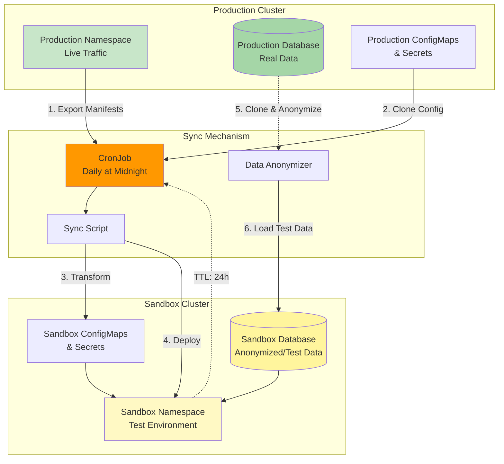

# Sandbox Environment Implementation

## Overview

The sandbox environment is a **production replica** that:
- Replicates production state daily
- Has a configurable TTL (default: 24 hours)
- Uses test database with realistic data
- Is publicly accessible for testing
- Does NOT propagate changes to production
- Receives updates FROM production only

---

## Architecture Diagram



---

## 1. CronJob Configuration

```yaml
# sandbox/cronjob.yaml
apiVersion: batch/v1
kind: CronJob
metadata:
  name: sandbox-sync
  namespace: production
spec:
  # Run daily at midnight UTC
  schedule: "0 0 * * *"
  
  # Keep history of last 3 runs
  successfulJobsHistoryLimit: 3
  failedJobsHistoryLimit: 3
  
  # Don't run multiple instances
  concurrencyPolicy: Forbid
  
  jobTemplate:
    spec:
      # Job timeout: 1 hour
      activeDeadlineSeconds: 3600
      
      template:
        metadata:
          labels:
            app: sandbox-sync
        spec:
          serviceAccountName: sandbox-sync-sa
          restartPolicy: OnFailure
          
          containers:
            - name: sync
              image: harbor.yourdomain.com/tools/sandbox-sync:latest
              env:
                # Configurable TTL
                - name: TTL_HOURS
                  valueFrom:
                    configMapKeyRef:
                      name: sandbox-config
                      key: TTL_HOURS
                
                # Source namespace
                - name: SOURCE_NAMESPACE
                  value: "production"
                
                # Target namespace
                - name: TARGET_NAMESPACE
                  value: "sandbox"
                
                # Database config
                - name: PROD_DB_HOST
                  valueFrom:
                    secretKeyRef:
                      name: prod-db-secret
                      key: host
                
                - name: SANDBOX_DB_HOST
                  valueFrom:
                    secretKeyRef:
                      name: sandbox-db-secret
                      key: host
                
                # Slack notifications
                - name: SLACK_WEBHOOK
                  valueFrom:
                    secretKeyRef:
                      name: slack-secret
                      key: webhook-url
              
              volumeMounts:
                - name: kubeconfig
                  mountPath: /root/.kube
                  readOnly: true
          
          volumes:
            - name: kubeconfig
              secret:
                secretName: sandbox-kubeconfig
```

---

## 2. Sandbox Configuration

```yaml
# sandbox/configmap.yaml
apiVersion: v1
kind: ConfigMap
metadata:
  name: sandbox-config
  namespace: production
data:
  TTL_HOURS: "24"
  
  # Services to sync
  SERVICES: |
    user-service
    payment-service
    notification-service
    api-gateway
  
  # Resources to sync
  RESOURCES: |
    deployment
    service
    configmap
    secret
    ingress
    horizontalpodautoscaler
  
  # Database sync strategy
  DB_SYNC_STRATEGY: "anonymize"  # Options: anonymize, synthetic, snapshot
  
  # Exclusions
  EXCLUDE_RESOURCES: |
    prod-.*-secret
    prod-tls-.*
```

---

## 3. Sync Script

```bash
#!/bin/bash
# sandbox-sync.sh

set -e

# Configuration
SOURCE_NS="${SOURCE_NAMESPACE:-production}"
TARGET_NS="${TARGET_NAMESPACE:-sandbox}"
TTL="${TTL_HOURS:-24}"
TIMESTAMP=$(date +%Y%m%d%H%M%S)

echo "=== Sandbox Sync Started at $(date) ==="
echo "Source: ${SOURCE_NS}"
echo "Target: ${TARGET_NS}"
echo "TTL: ${TTL} hours"

# Function: Send Slack notification
send_notification() {
    local message="$1"
    local color="$2"
    
    if [ -n "$SLACK_WEBHOOK" ]; then
        curl -X POST "$SLACK_WEBHOOK" \
            -H 'Content-Type: application/json' \
            -d "{
                \"text\": \"Sandbox Sync\",
                \"attachments\": [{
                    \"color\": \"$color\",
                    \"text\": \"$message\",
                    \"ts\": $(date +%s)
                }]
            }"
    fi
}

# Function: Check if namespace exists
check_namespace() {
    kubectl get namespace "$TARGET_NS" &>/dev/null
}

# Function: Delete and recreate sandbox namespace
recreate_namespace() {
    echo "Recreating sandbox namespace..."
    
    if check_namespace; then
        kubectl delete namespace "$TARGET_NS" --wait=true --timeout=300s
    fi
    
    kubectl create namespace "$TARGET_NS"
    
    # Add labels and annotations
    kubectl label namespace "$TARGET_NS" \
        environment=sandbox \
        sync-from=production \
        managed-by=sandbox-sync
    
    kubectl annotate namespace "$TARGET_NS" \
        last-sync="$(date -Iseconds)" \
        ttl="${TTL}h" \
        expires-at="$(date -d "+${TTL} hours" -Iseconds)"
}

# Function: Export production resources
export_production_resources() {
    echo "Exporting production resources..."
    
    local resources=("deployment" "service" "configmap" "secret" "ingress" "hpa")
    
    for resource in "${resources[@]}"; do
        echo "  Exporting ${resource}..."
        kubectl get "$resource" -n "$SOURCE_NS" -o yaml > "/tmp/${resource}.yaml"
    done
}

# Function: Transform manifests for sandbox
transform_manifests() {
    echo "Transforming manifests for sandbox..."
    
    for file in /tmp/*.yaml; do
        # Remove unwanted metadata
        yq eval 'del(.metadata.uid, .metadata.resourceVersion, .metadata.creationTimestamp, .metadata.generation, .status)' -i "$file"
        
        # Update namespace
        yq eval ".metadata.namespace = \"$TARGET_NS\"" -i "$file"
        
        # Add sandbox labels
        yq eval '.metadata.labels.environment = "sandbox"' -i "$file"
        
        # Update database URLs in ConfigMaps
        if [[ "$file" == *"configmap"* ]]; then
            yq eval '(.data.DATABASE_URL) |= sub("production-db", "sandbox-db")' -i "$file"
            yq eval '(.data.REDIS_URL) |= sub("production-redis", "sandbox-redis")' -i "$file"
        fi
        
        # Update image pull policy
        if [[ "$file" == *"deployment"* ]]; then
            yq eval '.spec.template.spec.containers[].imagePullPolicy = "Always"' -i "$file"
        fi
        
        # Scale down resources for sandbox
        if [[ "$file" == *"deployment"* ]]; then
            yq eval '.spec.replicas = 2' -i "$file"
        fi
        
        if [[ "$file" == *"hpa"* ]]; then
            yq eval '.spec.minReplicas = 1' -i "$file"
            yq eval '.spec.maxReplicas = 3' -i "$file"
        fi
    done
}

# Function: Sync database
sync_database() {
    echo "Syncing database..."
    
    case "$DB_SYNC_STRATEGY" in
        "anonymize")
            echo "  Using anonymization strategy..."
            /scripts/anonymize-db.sh
            ;;
        "synthetic")
            echo "  Using synthetic data strategy..."
            /scripts/generate-synthetic-data.sh
            ;;
        "snapshot")
            echo "  Using snapshot strategy..."
            /scripts/snapshot-db.sh
            ;;
        *)
            echo "  Unknown strategy: $DB_SYNC_STRATEGY"
            return 1
            ;;
    esac
}

# Function: Apply manifests to sandbox
apply_to_sandbox() {
    echo "Applying manifests to sandbox..."
    
    # Apply in order
    local order=("configmap" "secret" "service" "deployment" "ingress" "hpa")
    
    for resource in "${order[@]}"; do
        if [ -f "/tmp/${resource}.yaml" ]; then
            echo "  Applying ${resource}..."
            kubectl apply -f "/tmp/${resource}.yaml" -n "$TARGET_NS"
        fi
    done
}

# Function: Wait for deployments to be ready
wait_for_ready() {
    echo "Waiting for deployments to be ready..."
    
    kubectl wait --for=condition=available \
        --timeout=300s \
        deployment --all \
        -n "$TARGET_NS"
}

# Function: Create ingress for sandbox
create_sandbox_ingress() {
    echo "Creating sandbox ingress..."
    
    cat <<EOF | kubectl apply -f -
apiVersion: networking.k8s.io/v1
kind: Ingress
metadata:
  name: sandbox-ingress
  namespace: $TARGET_NS
  annotations:
    cert-manager.io/cluster-issuer: "letsencrypt-prod"
    nginx.ingress.kubernetes.io/rewrite-target: /
spec:
  ingressClassName: nginx
  tls:
    - hosts:
        - sandbox.yourdomain.com
      secretName: sandbox-tls
  rules:
    - host: sandbox.yourdomain.com
      http:
        paths:
          - path: /api/users
            pathType: Prefix
            backend:
              service:
                name: user-service
                port:
                  number: 80
          - path: /api/payments
            pathType: Prefix
            backend:
              service:
                name: payment-service
                port:
                  number: 80
EOF
}

# Function: Schedule cleanup
schedule_cleanup() {
    echo "Scheduling cleanup in ${TTL} hours..."
    
    local cleanup_time=$(date -d "+${TTL} hours" +"%Y-%m-%dT%H:%M:%S")
    
    cat <<EOF | kubectl apply -f -
apiVersion: batch/v1
kind: Job
metadata:
  name: sandbox-cleanup-${TIMESTAMP}
  namespace: production
spec:
  # Run at specified time
  # Note: This requires a custom controller or external scheduler
  # Alternative: Use annotation and external cleanup service
  template:
    spec:
      serviceAccountName: sandbox-sync-sa
      restartPolicy: Never
      containers:
        - name: cleanup
          image: bitnami/kubectl
          command:
            - /bin/bash
            - -c
            - |
              echo "Cleaning up sandbox namespace..."
              kubectl delete namespace $TARGET_NS --wait=true
              echo "Cleanup completed at \$(date)"
EOF
    
    # Alternative: Add annotation for external cleanup service
    kubectl annotate namespace "$TARGET_NS" \
        cleanup-at="$cleanup_time" \
        --overwrite
}

# Main execution
main() {
    # Start sync
    send_notification "Starting sandbox sync from production..." "warning"
    
    # Step 1: Recreate namespace
    recreate_namespace
    
    # Step 2: Export production resources
    export_production_resources
    
    # Step 3: Transform manifests
    transform_manifests
    
    # Step 4: Sync database
    if ! sync_database; then
        send_notification "❌ Database sync failed!" "danger"
        exit 1
    fi
    
    # Step 5: Apply to sandbox
    apply_to_sandbox
    
    # Step 6: Wait for ready
    if ! wait_for_ready; then
        send_notification "❌ Deployments failed to become ready!" "danger"
        exit 1
    fi
    
    # Step 7: Create ingress
    create_sandbox_ingress
    
    # Step 8: Schedule cleanup
    schedule_cleanup
    
    # Success
    echo "=== Sandbox Sync Completed Successfully ==="
    send_notification "✅ Sandbox sync completed successfully!\nAccess at: https://sandbox.yourdomain.com\nExpires: $(date -d "+${TTL} hours")" "good"
}

# Error handler
trap 'send_notification "❌ Sandbox sync failed at line $LINENO" "danger"' ERR

# Run main
main
```

---

## 4. Database Anonymization Script

```bash
#!/bin/bash
# scripts/anonymize-db.sh

set -e

echo "Starting database anonymization..."

# Configuration
PROD_DB="postgresql://${PROD_DB_HOST}:5432/production"
SANDBOX_DB="postgresql://${SANDBOX_DB_HOST}:5432/sandbox"

# Dump production database
echo "  Dumping production database..."
pg_dump "$PROD_DB" \
    --no-owner \
    --no-privileges \
    --clean \
    --if-exists \
    > /tmp/prod-dump.sql

# Anonymize PII data
echo "  Anonymizing PII data..."
python3 <<EOF
import re
import hashlib

def anonymize(text):
    # Anonymize emails
    text = re.sub(
        r'([a-zA-Z0-9._%+-]+)@([a-zA-Z0-9.-]+\.[a-zA-Z]{2,})',
        r'user_\1@example.com',
        text
    )
    
    # Anonymize phone numbers
    text = re.sub(
        r'\+?\d{10,15}',
        '+1234567890',
        text
    )
    
    # Anonymize credit cards (keep format)
    text = re.sub(
        r'\d{4}-\d{4}-\d{4}-\d{4}',
        '4111-1111-1111-1111',
        text
    )
    
    # Anonymize SSN
    text = re.sub(
        r'\d{3}-\d{2}-\d{4}',
        '123-45-6789',
        text
    )
    
    return text

# Read dump
with open('/tmp/prod-dump.sql', 'r') as f:
    sql = f.read()

# Anonymize
sql = anonymize(sql)

# Write anonymized dump
with open('/tmp/sandbox-dump.sql', 'w') as f:
    f.write(sql)

print("  Anonymization complete!")
EOF

# Load into sandbox database
echo "  Loading into sandbox database..."
psql "$SANDBOX_DB" < /tmp/sandbox-dump.sql

echo "Database anonymization completed!"
```

---

## 5. Synthetic Data Generation Script

```bash
#!/bin/bash
# scripts/generate-synthetic-data.sh

set -e

echo "Generating synthetic test data..."

python3 <<EOF
from faker import Faker
import psycopg2
import os

fake = Faker()

# Connect to sandbox database
conn = psycopg2.connect(os.environ['SANDBOX_DB_HOST'])
cur = conn.cursor()

# Clear existing data
cur.execute("TRUNCATE users, orders, payments CASCADE")

# Generate users
print("  Generating users...")
for i in range(10000):
    cur.execute("""
        INSERT INTO users (email, name, phone, address, created_at)
        VALUES (%s, %s, %s, %s, %s)
    """, (
        fake.email(),
        fake.name(),
        fake.phone_number(),
        fake.address(),
        fake.date_time_this_year()
    ))

# Generate orders
print("  Generating orders...")
for i in range(50000):
    cur.execute("""
        INSERT INTO orders (user_id, total, status, created_at)
        VALUES (%s, %s, %s, %s)
    """, (
        fake.random_int(1, 10000),
        fake.pydecimal(left_digits=3, right_digits=2, positive=True),
        fake.random_element(['pending', 'completed', 'cancelled']),
        fake.date_time_this_year()
    ))

# Commit
conn.commit()
cur.close()
conn.close()

print("Synthetic data generation complete!")
EOF
```

---

## 6. ServiceAccount & RBAC

```yaml
# sandbox/rbac.yaml
apiVersion: v1
kind: ServiceAccount
metadata:
  name: sandbox-sync-sa
  namespace: production
---
apiVersion: rbac.authorization.k8s.io/v1
kind: ClusterRole
metadata:
  name: sandbox-sync-role
rules:
  # Read production resources
  - apiGroups: [""]
    resources: ["*"]
    verbs: ["get", "list"]
  
  - apiGroups: ["apps"]
    resources: ["*"]
    verbs: ["get", "list"]
  
  - apiGroups: ["networking.k8s.io"]
    resources: ["*"]
    verbs: ["get", "list"]
  
  # Manage sandbox namespace
  - apiGroups: [""]
    resources: ["namespaces"]
    verbs: ["create", "delete", "get", "list", "update", "patch"]
  
  # Full control in sandbox namespace
  - apiGroups: ["*"]
    resources: ["*"]
    verbs: ["*"]
    resourceNames: ["sandbox"]
---
apiVersion: rbac.authorization.k8s.io/v1
kind: ClusterRoleBinding
metadata:
  name: sandbox-sync-binding
roleRef:
  apiGroup: rbac.authorization.k8s.io
  kind: ClusterRole
  name: sandbox-sync-role
subjects:
  - kind: ServiceAccount
    name: sandbox-sync-sa
    namespace: production
```

---

## 7. Cleanup Controller

```yaml
# sandbox/cleanup-controller.yaml
apiVersion: apps/v1
kind: Deployment
metadata:
  name: sandbox-cleanup-controller
  namespace: production
spec:
  replicas: 1
  selector:
    matchLabels:
      app: sandbox-cleanup-controller
  template:
    metadata:
      labels:
        app: sandbox-cleanup-controller
    spec:
      serviceAccountName: sandbox-sync-sa
      containers:
        - name: controller
          image: harbor.yourdomain.com/tools/cleanup-controller:latest
          env:
            - name: CHECK_INTERVAL
              value: "300"  # Check every 5 minutes
          command:
            - /bin/bash
            - -c
            - |
              while true; do
                echo "Checking for expired namespaces..."
                
                # Get namespaces with cleanup-at annotation
                kubectl get namespaces -l managed-by=sandbox-sync -o json | \
                jq -r '.items[] | select(.metadata.annotations."cleanup-at" != null) | 
                  select((.metadata.annotations."cleanup-at" | fromdateiso8601) < now) | 
                  .metadata.name' | \
                while read ns; do
                  echo "Deleting expired namespace: $ns"
                  kubectl delete namespace "$ns" --wait=false
                done
                
                sleep $CHECK_INTERVAL
              done
```

---

## 8. Monitoring & Alerts

```yaml
# sandbox/servicemonitor.yaml
apiVersion: monitoring.coreos.com/v1
kind: ServiceMonitor
metadata:
  name: sandbox-sync
  namespace: production
spec:
  selector:
    matchLabels:
      app: sandbox-sync
  endpoints:
    - port: metrics
---
# sandbox/prometheusrule.yaml
apiVersion: monitoring.coreos.com/v1
kind: PrometheusRule
metadata:
  name: sandbox-alerts
  namespace: production
spec:
  groups:
    - name: sandbox
      interval: 30s
      rules:
        - alert: SandboxSyncFailed
          expr: kube_job_status_failed{job_name=~"sandbox-sync.*"} > 0
          for: 5m
          labels:
            severity: warning
          annotations:
            summary: "Sandbox sync job failed"
            description: "The sandbox sync job has failed"
        
        - alert: SandboxExpiringSoon
          expr: |
            (sandbox_namespace_expires_at - time()) < 3600
          labels:
            severity: info
          annotations:
            summary: "Sandbox environment expiring soon"
            description: "Sandbox will expire in less than 1 hour"
```

---

## 9. Access Control

```yaml
# sandbox/networkpolicy.yaml
apiVersion: networking.k8s.io/v1
kind: NetworkPolicy
metadata:
  name: sandbox-isolation
  namespace: sandbox
spec:
  podSelector: {}
  policyTypes:
    - Ingress
    - Egress
  
  # Allow ingress only from ingress controller
  ingress:
    - from:
        - namespaceSelector:
            matchLabels:
              name: ingress-nginx
  
  # Allow egress to sandbox database only
  egress:
    - to:
        - podSelector:
            matchLabels:
              app: sandbox-db
      ports:
        - protocol: TCP
          port: 5432
    
    # Allow DNS
    - to:
        - namespaceSelector: {}
          podSelector:
            matchLabels:
              k8s-app: kube-dns
      ports:
        - protocol: UDP
          port: 53
```

---

## 10. Usage Examples

### Manual Trigger

```bash
# Trigger sync manually
kubectl create job --from=cronjob/sandbox-sync sandbox-sync-manual -n production

# Watch progress
kubectl logs -f job/sandbox-sync-manual -n production

# Check sandbox status
kubectl get all -n sandbox
```

### Extend TTL

```bash
# Extend sandbox TTL by 12 hours
NEW_EXPIRY=$(date -d "+12 hours" -Iseconds)
kubectl annotate namespace sandbox \
    expires-at="$NEW_EXPIRY" \
    --overwrite
```

### Access Sandbox

```bash
# Get sandbox URL
kubectl get ingress -n sandbox

# Example URLs:
# - https://sandbox.yourdomain.com/api/users
# - https://sandbox.yourdomain.com/api/payments
```

---

## Summary

This sandbox implementation provides:

✅ **Daily Production Clone**: Automatic sync at midnight  
✅ **Configurable TTL**: Default 24h, can be extended  
✅ **Data Anonymization**: PII protection  
✅ **Test Database**: Realistic but safe data  
✅ **One-way Sync**: Production → Sandbox only  
✅ **Public Access**: Exposed via ingress  
✅ **Automatic Cleanup**: Self-destructing environment  
✅ **Monitoring**: Prometheus metrics and alerts  
✅ **Network Isolation**: Sandbox cannot affect production  
✅ **Cost Efficient**: Scaled-down resources
