# Complete Platform Architecture - Single View

This diagram shows all 43 platform applications and their key dependencies in a single, comprehensive view organized by architectural layers.

---

## Complete Platform Dependency Graph

```mermaid
graph TB
    %% ============================================================================
    %% LAYER 0: FOUNDATION (External/Base)
    %% ============================================================================
    subgraph L0["⚡ Layer 0: Foundation"]
        direction LR
        MetalLB[MetalLB<br/>Operator]
        CertMgr[cert-manager<br/>TLS Automation]
        RookOp[rook-ceph<br/>Storage Operator]
        Sealed[sealed-secrets<br/>Git Secrets]
    end

    %% ============================================================================
    %% LAYER 1: CORE INFRASTRUCTURE
    %% ============================================================================
    subgraph L1["🏗️ Layer 1: Core Infrastructure"]
        direction LR
        RookCluster[rook-ceph-cluster<br/>25+ PVCs]
        MetalLBCfg[metallb-config<br/>IP Pool]
        ExtDNS[external-dns<br/>DNS Automation]
        CertCfg[cert-manager-config<br/>ClusterIssuer]
    end

    %% ============================================================================
    %% LAYER 2: DATA & NETWORKING
    %% ============================================================================
    subgraph L2["🌐 Layer 2: Data & Networking"]
        direction TB

        subgraph L2N["Networking"]
            IngressNginx[ingress-nginx<br/>103.110.174.18<br/>15 Web UIs]
            IngressCfg[ingress-nginx-config]
        end

        subgraph L2D["Database Operators"]
            ZalandoPG[zalando-pg<br/>PostgreSQL Operator]
            RedisOp[redis-operator<br/>Redis Operator]
            StrimziKafka[strimzi-kafka<br/>Kafka Operator]
            PGConfig[postgres-operator-config]
        end

        IngressNginx --- IngressCfg
        ZalandoPG --- PGConfig
    end

    %% ============================================================================
    %% LAYER 3: SECURITY & IDENTITY
    %% ============================================================================
    subgraph L3["🔒 Layer 3: Security & Identity"]
        direction LR
        Vault[vault<br/>Secret Store<br/>⚠️ Token Auth]
        Keycloak[keycloak<br/>SSO Provider<br/>⚠️ admin/admin]
        ExtSecrets[external-secrets<br/>⚠️ Not Used]
        Crossplane[crossplane<br/>⚠️ No Providers]
    end

    %% ============================================================================
    %% LAYER 4: OBSERVABILITY & GITOPS
    %% ============================================================================
    subgraph L4["👁️ Layer 4: Observability & GitOps"]
        direction TB

        subgraph L4G["GitOps"]
            ArgoCD[argocd-self<br/>43 Apps]
            ArgoCfg[argocd-config]
        end

        subgraph L4O["Observability"]
            Prom[prometheus<br/>Metrics]
            Loki[loki<br/>Logs]
            Tempo[tempo<br/>Traces]
            Promtail[promtail<br/>DaemonSet]
            Monitors[monitors<br/>ServiceMonitors]
        end

        ArgoCD --- ArgoCfg
        Loki --- Promtail
        Prom --- Monitors
    end

    %% ============================================================================
    %% LAYER 5: DATABASES & STORAGE SERVICES
    %% ============================================================================
    subgraph L5["💾 Layer 5: Database Instances"]
        direction LR
        TemporalDB[temporal-db<br/>PostgreSQL 3-node]
        KeycloakDB[keycloak-pg<br/>Internal]
        HarborDB[harbor-pg<br/>Internal]
        PlatformDB[platform-db<br/>PostgreSQL 5-node<br/>⚠️ SyncFailed]
        PlatformKV[platform-kv<br/>Redis<br/>103.110.174.21]
        CephRGW[Ceph RGW<br/>s3.pnats.cloud]
    end

    %% ============================================================================
    %% LAYER 6: PLATFORM SERVICES
    %% ============================================================================
    subgraph L6["🚀 Layer 6: Platform Services"]
        direction TB

        subgraph L6V["Visualization"]
            Grafana[grafana<br/>⚠️ admin/changeme]
            Kubecost[kubecost<br/>❌ No Auth]
            UptimeKuma[uptime-kuma]
        end

        subgraph L6D["Dev Tools"]
            Harbor[harbor<br/>Container Registry]
            Backstage[backstage<br/>✅ Keycloak SSO]
            Verdaccio[verdaccio<br/>NPM Registry]
        end

        subgraph L6C["CI/CD"]
            TektonOp[tekton-operator]
            TektonPipe[tekton-pipelines]
            TektonDash[tekton-dashboard<br/>❌ No Auth]
            Kargo[kargo<br/>Basic Auth]
            ArgoRollouts[argo-rollouts]
        end

        TektonOp --> TektonPipe
        TektonPipe --> TektonDash
    end

    %% ============================================================================
    %% LAYER 7: APPLICATION SERVICES
    %% ============================================================================
    subgraph L7["⚙️ Layer 7: Applications"]
        direction LR

        Temporal[temporal<br/>Workflows<br/>❌ No Auth UI<br/>103.110.174.23]

        KubeVirt[kubevirt<br/>VM Management]
        KubeVirtMgr[kubevirt-manager<br/>Web UI]

        ClusterAPI[clusterapi<br/>Cluster Mgmt]

        PlatformApp[platform-app<br/>App-of-Apps]

        KubeVirt --> KubeVirtMgr
    end

    %% ============================================================================
    %% EXTERNAL DEPENDENCIES
    %% ============================================================================
    subgraph EXT["🌍 External Services"]
        direction LR
        GitHub[GitHub<br/>Git + OAuth]
        DNS[DNS Provider<br/>Cloudflare/R53]
        LetsEncrypt[Let's Encrypt<br/>TLS CA]
    end

    %% ============================================================================
    %% LAYER 0 → LAYER 1 DEPENDENCIES
    %% ============================================================================
    MetalLB ==> MetalLBCfg
    CertMgr ==> CertCfg
    RookOp ==> RookCluster
    CertMgr ==> LetsEncrypt

    %% ============================================================================
    %% LAYER 1 → LAYER 2 DEPENDENCIES
    %% ============================================================================
    RookCluster ==> IngressNginx
    RookCluster ==> ZalandoPG
    RookCluster ==> RedisOp
    RookCluster ==> StrimziKafka
    MetalLBCfg ==> IngressNginx
    ExtDNS ==> IngressNginx
    ExtDNS ==> DNS
    CertCfg ==> IngressNginx

    %% ============================================================================
    %% LAYER 2 → LAYER 3 DEPENDENCIES
    %% ============================================================================
    RookCluster ==> Vault
    RookCluster ==> Keycloak
    IngressNginx ==> Vault
    IngressNginx ==> Keycloak
    CertMgr ==> Vault
    CertMgr ==> Keycloak
    Vault --> ExtSecrets
    Vault --> Crossplane

    %% ============================================================================
    %% LAYER 2 → LAYER 4 DEPENDENCIES
    %% ============================================================================
    RookCluster ==> ArgoCD
    RookCluster ==> Prom
    RookCluster ==> Loki
    RookCluster ==> Tempo
    IngressNginx ==> ArgoCD
    CertMgr ==> ArgoCD

    %% ============================================================================
    %% LAYER 2 → LAYER 5 DEPENDENCIES (Databases)
    %% ============================================================================
    ZalandoPG ==> TemporalDB
    ZalandoPG ==> PlatformDB
    RookCluster ==> KeycloakDB
    RookCluster ==> HarborDB
    RookCluster ==> CephRGW
    RedisOp ==> PlatformKV
    MetalLBCfg ==> PlatformKV
    MetalLBCfg ==> PlatformDB

    %% ============================================================================
    %% LAYER 3/5 → APPS (Security & DB to Apps)
    %% ============================================================================
    Keycloak -.->|SSO| Backstage
    TemporalDB ==> Temporal
    KeycloakDB ==> Keycloak
    HarborDB ==> Harbor
    CephRGW ==> Harbor
    Sealed -.->|secrets| Harbor
    Sealed -.->|secrets| Backstage
    Sealed -.->|secrets| Kargo

    %% ============================================================================
    %% LAYER 4 → LAYER 6 DEPENDENCIES (Observability & Platform)
    %% ============================================================================
    Prom ==> Grafana
    Loki ==> Grafana
    Tempo ==> Grafana
    Prom ==> Kubecost
    RookCluster ==> Grafana
    RookCluster ==> Harbor
    RookCluster ==> Backstage
    RookCluster ==> Kubecost
    RookCluster ==> UptimeKuma
    RookCluster ==> Verdaccio
    RookCluster ==> TektonPipe
    IngressNginx ==> Grafana
    IngressNginx ==> Harbor
    IngressNginx ==> Backstage
    IngressNginx ==> Kubecost
    IngressNginx ==> UptimeKuma
    IngressNginx ==> TektonDash
    IngressNginx ==> Kargo
    CertMgr ==> Grafana
    CertMgr ==> Harbor
    CertMgr ==> Backstage
    CertMgr ==> Kubecost
    CertMgr ==> UptimeKuma
    CertMgr ==> TektonDash
    CertMgr ==> Kargo

    %% ============================================================================
    %% LAYER 6 → LAYER 7 DEPENDENCIES
    %% ============================================================================
    RookCluster ==> Temporal
    RookCluster ==> KubeVirt
    IngressNginx ==> Temporal
    IngressNginx ==> KubeVirtMgr
    CertMgr ==> Temporal
    CertMgr ==> KubeVirtMgr
    MetalLBCfg ==> Temporal
    Harbor -.->|images| ArgoCD
    ArgoCD ==> PlatformApp
    TektonPipe -.->|build| Harbor
    Backstage -.->|catalog| ArgoCD
    GitHub -.->|source| ArgoCD
    GitHub -.->|source| TektonPipe
    GitHub -.->|oauth| Keycloak

    %% ============================================================================
    %% OBSERVABILITY CONNECTIONS (Dotted - Soft Dependencies)
    %% ============================================================================
    Promtail -.->|logs from| ArgoCD
    Promtail -.->|logs from| Harbor
    Promtail -.->|logs from| Temporal
    Promtail -.->|logs from| Grafana
    Monitors -.->|metrics from| ArgoCD
    Monitors -.->|metrics from| Harbor
    Monitors -.->|metrics from| Temporal
    Monitors -.->|metrics from| Keycloak
    Monitors -.->|metrics from| Vault

    %% ============================================================================
    %% STYLING
    %% ============================================================================
    classDef foundation fill:#e1f5ff,stroke:#01579b,stroke-width:3px,color:#000
    classDef core fill:#fff3e0,stroke:#e65100,stroke-width:3px,color:#000
    classDef network fill:#f3e5f5,stroke:#4a148c,stroke-width:2px,color:#000
    classDef database fill:#e0f2f1,stroke:#00695c,stroke-width:2px,color:#000
    classDef security fill:#ffebee,stroke:#b71c1c,stroke-width:3px,color:#000
    classDef observability fill:#e8f5e9,stroke:#1b5e20,stroke-width:2px,color:#000
    classDef platform fill:#fff9c4,stroke:#f57f17,stroke-width:2px,color:#000
    classDef application fill:#e8eaf6,stroke:#3f51b5,stroke-width:2px,color:#000
    classDef external fill:#fce4ec,stroke:#c2185b,stroke-width:2px,color:#000
    classDef warning fill:#ffccbc,stroke:#d84315,stroke-width:3px,color:#000
    classDef good fill:#c8e6c9,stroke:#388e3c,stroke-width:3px,color:#000

    %% Layer Classifications
    class MetalLB,CertMgr,RookOp,Sealed foundation
    class RookCluster,MetalLBCfg,ExtDNS,CertCfg core
    class IngressNginx,IngressCfg,ZalandoPG,RedisOp,StrimziKafka,PGConfig network
    class TemporalDB,KeycloakDB,HarborDB,PlatformDB,PlatformKV,CephRGW database
    class Vault,Keycloak,ExtSecrets,Crossplane security
    class ArgoCD,ArgoCfg,Prom,Loki,Tempo,Promtail,Monitors observability
    class Grafana,Harbor,Backstage,Verdaccio,Kubecost,UptimeKuma,TektonOp,TektonPipe,TektonDash,Kargo,ArgoRollouts platform
    class Temporal,KubeVirt,KubeVirtMgr,ClusterAPI,PlatformApp application
    class GitHub,DNS,LetsEncrypt external

    %% Status-based Classifications (Override)
    class Backstage good
    class Grafana,Keycloak,Kubecost,TektonDash,Temporal,ExtSecrets,Crossplane,PlatformDB warning
```



---

## Diagram Key

### Layers (Top to Bottom)
- **Layer 0** (⚡ Foundation): Base operators that must be deployed first
- **Layer 1** (🏗️ Core Infrastructure): Storage, networking, DNS, certificates
- **Layer 2** (🌐 Data & Networking): Ingress, database operators, networking config
- **Layer 3** (🔒 Security & Identity): Vault, Keycloak, External Secrets, Crossplane
- **Layer 4** (👁️ Observability & GitOps): ArgoCD, Prometheus, Loki, Tempo
- **Layer 5** (💾 Database Instances): All database clusters and storage services
- **Layer 6** (🚀 Platform Services): Developer tools, CI/CD, visualization
- **Layer 7** (⚙️ Applications): Application workloads and services

### Connection Types
- **Solid thick arrow** (==>) : Hard dependency (must exist)
- **Solid thin arrow** (-->) : Configuration/internal dependency
- **Dotted arrow** (-.-> ) : Soft dependency or usage relationship
- **Solid line** (---) : Related components (same category)

### Status Indicators
- ✅ **Green**: Properly configured and secure
- ⚠️ **Orange**: Security issue or not fully utilized
- ❌ **Red**: Missing authentication or critical issue

### Application Status Colors
- **Blue** (Foundation): Core infrastructure - must be healthy
- **Orange** (Core): Essential services
- **Purple** (Network): Networking components
- **Teal** (Database): Data storage
- **Red** (Security): Authentication & secrets - **has security issues**
- **Green** (Observability): Monitoring stack
- **Yellow** (Platform): Developer services
- **Indigo** (Application): Application workloads
- **Pink** (External): External dependencies

### Security Issues Highlighted
- 🟧 **Grafana**: Hardcoded password "changeme"
- 🟧 **Keycloak**: Admin credentials "admin/admin" in values.yaml
- 🟧 **Kubecost**: No authentication
- 🟧 **Temporal UI**: No authentication
- 🟧 **Tekton Dashboard**: No authentication
- 🟧 **External Secrets**: Deployed but not used
- 🟧 **Crossplane**: No providers installed
- 🟧 **Platform-DB**: Status SyncFailed

---

## Critical Statistics

### Infrastructure Health
- **43 Total Applications** (39 healthy, 4 progressing)
- **15 Web UIs** via HTTPS ingress
- **6 LoadBalancer IPs** (MetalLB: 103.110.174.18-23)
- **51 TLS Certificates** (cert-manager + Let's Encrypt)
- **25+ Persistent Volumes** (Rook Ceph)

### Database & Storage
- **3 PostgreSQL Operators** (Zalando)
- **8 PostgreSQL Instances** (3 temporal, 5 platform, + internal)
- **2 Redis Instances** (platform-kv, harbor-internal)
- **1 Ceph Cluster** (object + block storage)

### Observability
- **43 ServiceMonitors** (Prometheus metrics)
- **1 DaemonSet** (Promtail on all nodes)
- **3 Data Sources** (Prometheus, Loki, Tempo)
- **1 Grafana** (15+ dashboards)

### Security Posture
- **1/15 apps** use Keycloak SSO (Backstage only)
- **5 apps** use Sealed Secrets
- **0 apps** use External Secrets + Vault
- **3 critical** security issues (hardcoded passwords)
- **3 web UIs** with no authentication

### Crossplane Status
- **✅ Installed**: Core crossplane
- **❌ Not Configured**: No providers
- **❌ Not Used**: 0 resources provisioned

---

## Single Point of Failure Analysis

If these components fail, the entire platform or large portions will fail:

### 🔴 **Critical - Multiple Apps Affected**
1. **rook-ceph-cluster**: 25+ apps lose storage → cascading failures
2. **ingress-nginx**: 15 web UIs become unreachable
3. **metallb-config**: LoadBalancers lose IPs → ingress-nginx fails
4. **cert-manager**: TLS certificates expire → browser warnings on all UIs
5. **zalando-pg**: Database clusters fail → Temporal, Keycloak, Platform DB down

### 🟡 **High Impact - Specific Services**
6. **argocd-self**: GitOps stops → no deployments or updates
7. **prometheus**: Metrics collection stops → monitoring blind
8. **keycloak**: SSO fails → Backstage inaccessible (more when migrated)
9. **vault**: Secret rotation fails → credentials become stale

### 🟢 **Medium Impact - Isolated Services**
10. Individual applications (Grafana, Harbor, etc.) - isolated failures

---

## Deployment Order (From Scratch)

To deploy this platform from a bare Kubernetes cluster:

```
1. MetalLB Operator (external)
2. cert-manager
3. rook-ceph
4. sealed-secrets
   ↓
5. rook-ceph-cluster (wait for healthy)
6. metallb-config
7. external-dns
8. cert-manager-config
   ↓
9. ingress-nginx
10. zalando-pg
11. redis-operator
12. strimzi-kafka-operator
    ↓
13. vault
14. keycloak
15. external-secrets
16. crossplane
    ↓
17. argocd-self (can now manage all remaining apps)
18. prometheus, loki, tempo
    ↓
19. Database instances (temporal-db, platform-db, etc.)
    ↓
20. Platform services (grafana, harbor, backstage, etc.)
    ↓
21. Applications (temporal, kubevirt, etc.)
    ↓
22. platform-app (ArgoCD app-of-apps)
```

---

## Production Readiness Gaps

### Immediate Action Required (Security)
1. Rotate Grafana admin password → Vault
2. Rotate Keycloak admin credentials → Vault
3. Deploy OAuth2 Proxy for: Temporal UI, Tekton Dashboard, Kubecost

### High Priority (SSO Integration)
4. Configure GitHub OAuth in Keycloak
5. Integrate ArgoCD (Dex), Grafana, Harbor, Vault, Kargo with Keycloak
6. Test end-to-end SSO flows

### Medium Priority (Secrets Migration)
7. Migrate all Sealed Secrets to Vault
8. Create External Secret CRDs for all apps
9. Remove hardcoded secrets from values.yaml

### Low Priority (Crossplane)
10. Install provider-kubernetes, provider-helm
11. Create PostgreSQL, Redis, S3 compositions
12. Migrate existing resources to Crossplane

**Current Production Readiness**: 🔴 **30%**

---

## Related Documentation

- [APP-DEPENDENCIES.md](APP-DEPENDENCIES.md) - Detailed dependency breakdown per app
- [PRODUCTION-READINESS-PLAN.md](PRODUCTION-READINESS-PLAN.md) - Complete integration plan
- [DEPENDENCY-DIAGRAM.md](DEPENDENCY-DIAGRAM.md) - Focused views (10 diagrams)
- [README.md](README.md) - Platform status overview
- [CHANGELOG.md](CHANGELOG.md) - Platform change history

---

**Last Updated**: 2025-11-19
**Maintainer**: Platform Team
**Status**: 🔴 Not Production Ready (Security Issues Present)
