# Platform Application Dependency Diagram

This document contains Mermaid diagrams showing the dependency relationships between all 43 platform applications, organized by layers and categories for clarity.

---

## Complete Layered Architecture

This diagram shows the complete platform architecture in layers, from foundation to applications.

```mermaid
graph TB
    subgraph "Layer 0: Foundation"
        MetalLB[MetalLB Operator]
        CertManager[cert-manager]
        RookCeph[rook-ceph]
        SealedSecrets[sealed-secrets]
    end

    subgraph "Layer 1: Core Infrastructure"
        RookCluster[rook-ceph-cluster]
        MetalLBConfig[metallb-config]
        ExternalDNS[external-dns]
        CertConfig[cert-manager-config]
    end

    subgraph "Layer 2: Networking & Storage"
        IngressNginx[ingress-nginx]
        ZalandoPG[zalando-pg]
        RedisOp[redis-operator]
    end

    subgraph "Layer 3: Security & Identity"
        Vault[vault]
        Keycloak[keycloak]
        ExternalSecrets[external-secrets]
        Crossplane[crossplane]
    end

    subgraph "Layer 4: GitOps & Observability"
        ArgoCD[argocd-self]
        Prometheus[prometheus]
        Loki[loki]
        Tempo[tempo]
    end

    subgraph "Layer 5: Platform Services"
        Grafana[grafana]
        Harbor[harbor]
        Backstage[backstage]
        Temporal[temporal]
        Tekton[tekton-pipelines]
    end

    subgraph "Layer 6: Applications"
        Apps[All Other Apps]
    end

    %% Layer 0 → Layer 1
    MetalLB --> MetalLBConfig
    CertManager --> CertConfig
    RookCeph --> RookCluster

    %% Layer 1 → Layer 2
    RookCluster --> IngressNginx
    RookCluster --> ZalandoPG
    RookCluster --> RedisOp
    MetalLBConfig --> IngressNginx
    ExternalDNS --> IngressNginx

    %% Layer 2 → Layer 3
    RookCluster --> Vault
    RookCluster --> Keycloak
    IngressNginx --> Vault
    IngressNginx --> Keycloak
    CertManager --> Vault
    CertManager --> Keycloak
    Vault --> ExternalSecrets
    Vault --> Crossplane

    %% Layer 3 → Layer 4
    RookCluster --> ArgoCD
    RookCluster --> Prometheus
    RookCluster --> Loki
    RookCluster --> Tempo
    IngressNginx --> ArgoCD
    CertManager --> ArgoCD

    %% Layer 4 → Layer 5
    Prometheus --> Grafana
    Loki --> Grafana
    Tempo --> Grafana
    RookCluster --> Grafana
    RookCluster --> Harbor
    RookCluster --> Backstage
    RookCluster --> Temporal
    IngressNginx --> Grafana
    IngressNginx --> Harbor
    IngressNginx --> Backstage
    IngressNginx --> Temporal
    CertManager --> Grafana
    CertManager --> Harbor
    CertManager --> Backstage
    CertManager --> Temporal
    Keycloak --> Backstage
    ZalandoPG --> Temporal

    %% Layer 5 → Layer 6
    ArgoCD --> Apps
    Harbor --> Apps
    Prometheus --> Apps

    classDef foundation fill:#e1f5ff,stroke:#01579b,stroke-width:2px
    classDef core fill:#fff3e0,stroke:#e65100,stroke-width:2px
    classDef network fill:#f3e5f5,stroke:#4a148c,stroke-width:2px
    classDef security fill:#ffebee,stroke:#b71c1c,stroke-width:2px
    classDef observability fill:#e8f5e9,stroke:#1b5e20,stroke-width:2px
    classDef services fill:#fff9c4,stroke:#f57f17,stroke-width:2px

    class MetalLB,CertManager,RookCeph,SealedSecrets foundation
    class RookCluster,MetalLBConfig,ExternalDNS,CertConfig core
    class IngressNginx,ZalandoPG,RedisOp network
    class Vault,Keycloak,ExternalSecrets,Crossplane security
    class ArgoCD,Prometheus,Loki,Tempo observability
    class Grafana,Harbor,Backstage,Temporal,Tekton services
```

---

## Infrastructure Layer Dependencies

Shows only core infrastructure components and their relationships.

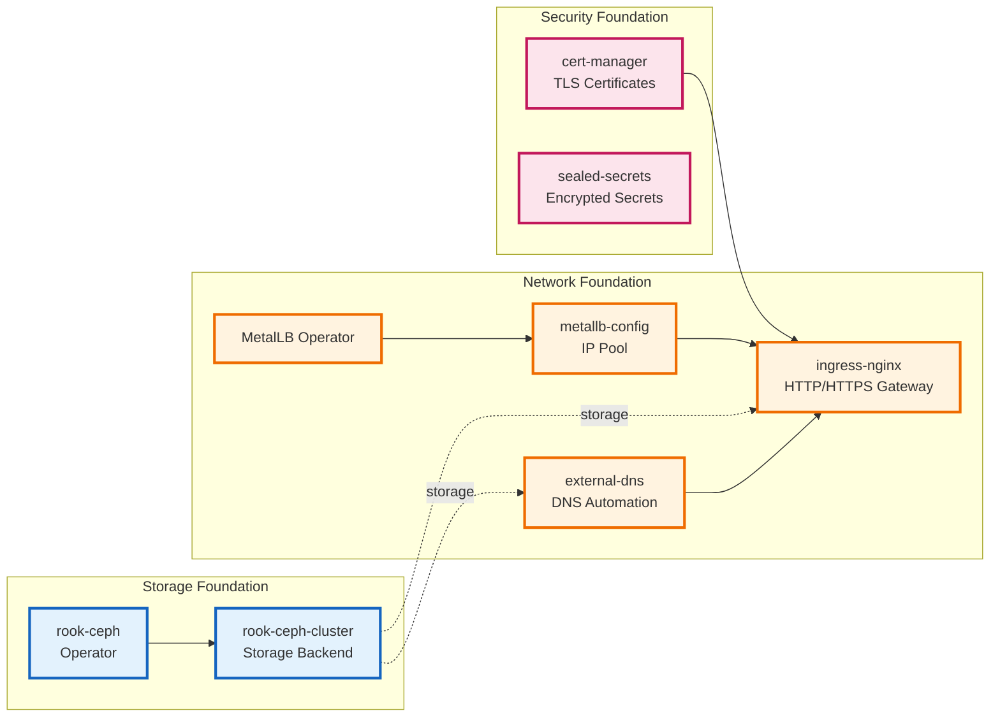

---

## Database & Storage Layer

Shows all database operators and storage services.

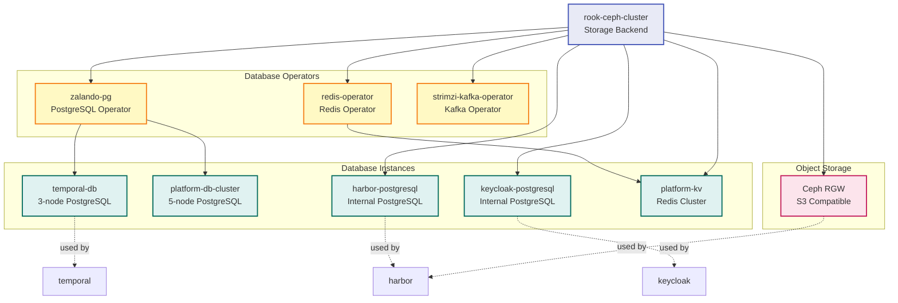

---

## Security & Authentication Flow

Shows authentication and secrets management relationships.

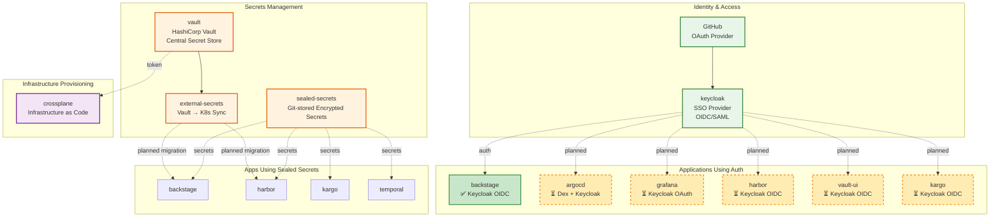

---

## Observability Stack

Shows monitoring, logging, and tracing relationships.

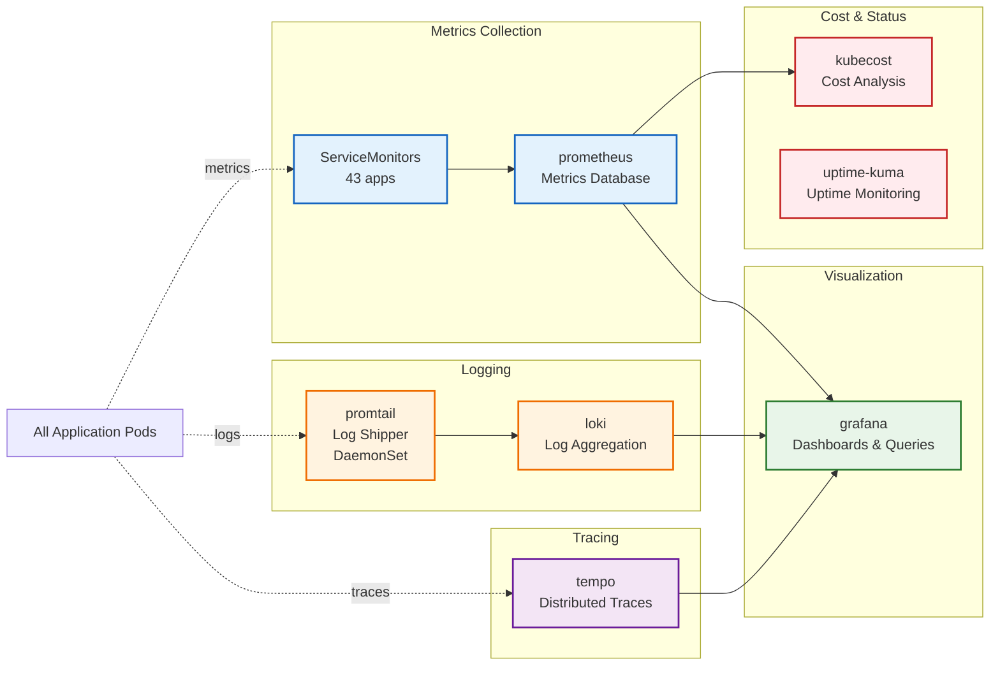

---

## CI/CD Pipeline Architecture

Shows the complete CI/CD and deployment workflow.

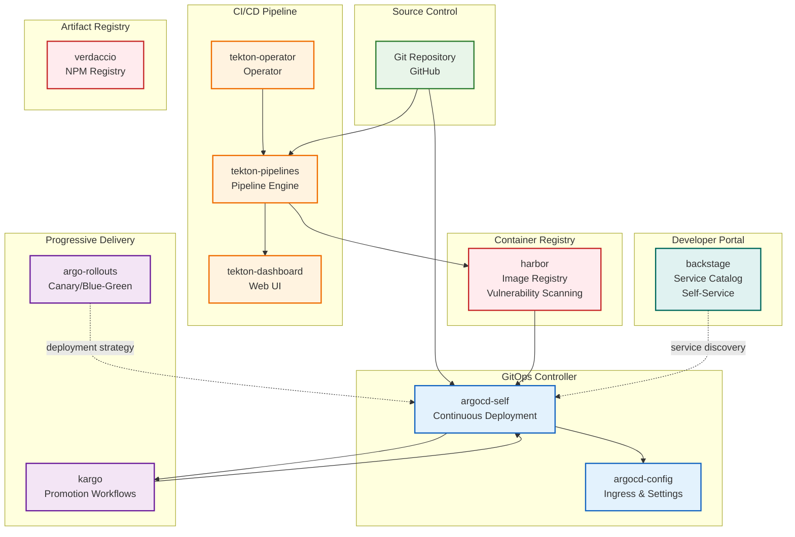

---

## Application Services

Shows higher-level application services and their dependencies.

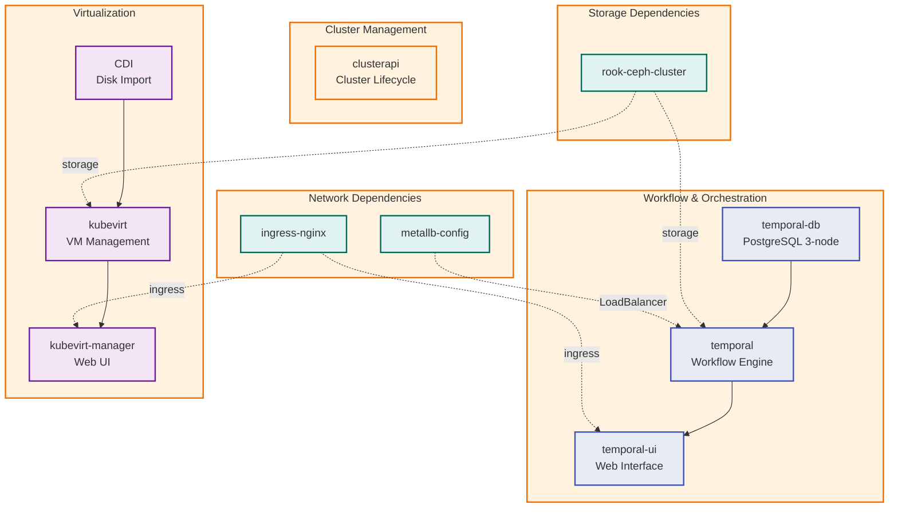

---

## Web UI Access Flow

Shows how users access various web interfaces through the platform.

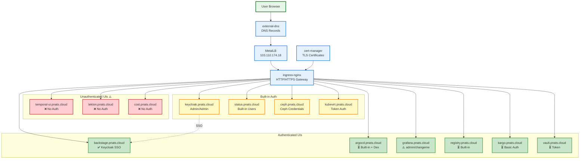

---

## Critical Dependency Paths

Shows the most critical dependency chains - if any of these fail, multiple apps are affected.

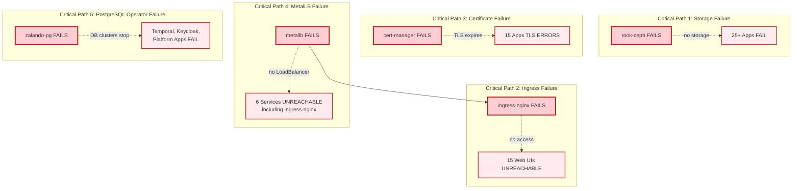

---

## Recommended Deployment Order

Shows the correct sequence for deploying the platform from scratch.

```mermaid
graph TD
    Start[Start Fresh Cluster]

    subgraph "Phase 1: Foundation"
        P1A[1. MetalLB Operator]
        P1B[2. cert-manager]
        P1C[3. rook-ceph]
        P1D[4. sealed-secrets]
    end

    subgraph "Phase 2: Core Infrastructure"
        P2A[5. rook-ceph-cluster]
        P2B[6. metallb-config]
        P2C[7. external-dns]
        P2D[8. cert-manager-config]
    end

    subgraph "Phase 3: Networking"
        P3A[9. ingress-nginx]
        P3B[10. zalando-pg]
        P3C[11. redis-operator]
    end

    subgraph "Phase 4: Security & Identity"
        P4A[12. vault]
        P4B[13. keycloak]
        P4C[14. external-secrets]
        P4D[15. crossplane]
    end

    subgraph "Phase 5: GitOps & Observability"
        P5A[16. argocd-self]
        P5B[17. prometheus]
        P5C[18. loki]
        P5D[19. tempo]
    end

    subgraph "Phase 6: Platform Services"
        P6A[20. grafana]
        P6B[21. harbor]
        P6C[22. backstage]
        P6D[23. temporal]
        P6E[24. tekton]
    end

    subgraph "Phase 7: Applications"
        P7[25-43. All other apps]
    end

    Start --> P1A
    P1A --> P1B
    P1B --> P1C
    P1C --> P1D

    P1D --> P2A
    P2A --> P2B
    P2B --> P2C
    P2C --> P2D

    P2D --> P3A
    P3A --> P3B
    P3B --> P3C

    P3C --> P4A
    P4A --> P4B
    P4B --> P4C
    P4C --> P4D

    P4D --> P5A
    P5A --> P5B
    P5B --> P5C
    P5C --> P5D

    P5D --> P6A
    P6A --> P6B
    P6B --> P6C
    P6C --> P6D
    P6D --> P6E

    P6E --> P7

    classDef phase1 fill:#e1f5ff,stroke:#01579b,stroke-width:2px
    classDef phase2 fill:#fff3e0,stroke:#e65100,stroke-width:2px
    classDef phase3 fill:#f3e5f5,stroke:#4a148c,stroke-width:2px
    classDef phase4 fill:#ffebee,stroke:#b71c1c,stroke-width:2px
    classDef phase5 fill:#e8f5e9,stroke:#1b5e20,stroke-width:2px
    classDef phase6 fill:#fff9c4,stroke:#f57f17,stroke-width:2px
    classDef phase7 fill:#e0f2f1,stroke:#004d40,stroke-width:2px

    class P1A,P1B,P1C,P1D phase1
    class P2A,P2B,P2C,P2D phase2
    class P3A,P3B,P3C phase3
    class P4A,P4B,P4C,P4D phase4
    class P5A,P5B,P5C,P5D phase5
    class P6A,P6B,P6C,P6D,P6E phase6
    class P7 phase7
```

---

## Production Readiness Integration Flow

Shows how Keycloak, Vault, and Crossplane will integrate with existing applications.

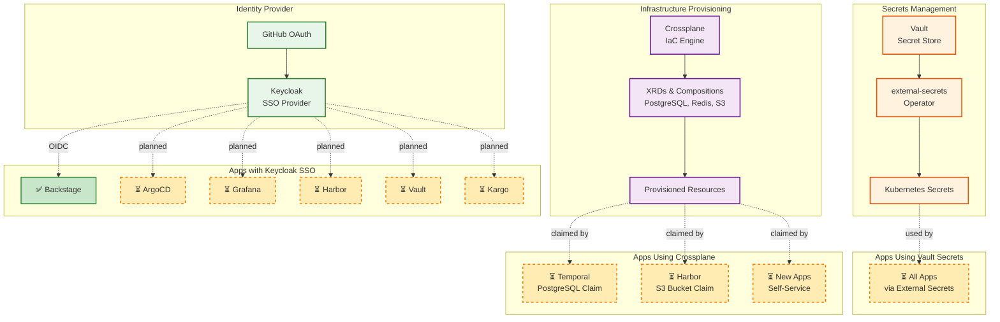

---

## Legend

### Node Colors and Meanings

- **Blue** (Foundation): Core infrastructure components that must be deployed first
- **Orange** (Core Infrastructure): Essential services that depend on foundation
- **Purple** (Network): Networking and ingress components
- **Red** (Security): Authentication, authorization, and secrets management
- **Green** (Observability): Monitoring, logging, and tracing
- **Yellow** (Services): Platform services and applications
- **Teal** (Specialized): Databases, storage, and specialized services

### Connection Types

- **Solid line** (→): Direct hard dependency
- **Dotted line** (-.->): Soft dependency or usage relationship
- **Dashed line** (⏳): Planned but not yet implemented

### Status Indicators

- ✅ **Deployed and Operational**
- ⏳ **Planned / In Progress**
- ⚠️ **Security Risk / Needs Attention**
- ❌ **Not Configured / Missing**

---

## Notes

1. **Scalability**: This dependency structure is designed to scale horizontally. Most components support multiple replicas.

2. **High Availability**: Critical paths (storage, ingress, certificates) should have redundancy configured.

3. **GitOps**: All applications managed by ArgoCD, enabling declarative infrastructure and easy rollbacks.

4. **Security**: Current state has security gaps (hardcoded passwords, open UIs). See [PRODUCTION-READINESS-PLAN.md](PRODUCTION-READINESS-PLAN.md) for remediation.

5. **Observability**: Complete metrics/logs/traces stack deployed and operational.

---

For detailed dependency information, see [APP-DEPENDENCIES.md](APP-DEPENDENCIES.md).
For production readiness plans, see [PRODUCTION-READINESS-PLAN.md](PRODUCTION-READINESS-PLAN.md).
