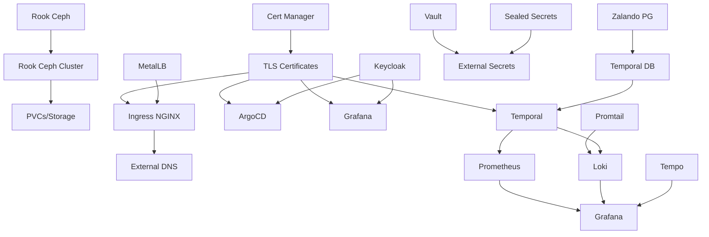

# Platform Status Documentation

Last Updated: 2025-11-19

## Overview

This directory contains the current deployment status, dependencies, and configuration details for all charts deployed in the platform.

## Quick Status

| Category | Total Charts | Production Ready | Monitoring Enabled | Known Issues |
|----------|-------------|------------------|-------------------|--------------|
| Core Infrastructure | 8 | 8 | 8 | 0 |
| Monitoring & Observability | 5 | 5 | 5 | 0 |
| CI/CD & GitOps | 7 | 7 | 5 | 0 |
| Storage & Databases | 4 | 4 | 3 | 0 |
| Security & Secrets | 5 | 5 | 2 | 0 |
| Networking | 3 | 3 | 2 | 0 |
| Application Services | 10 | 9 | 6 | 1 |
| **Total** | **42** | **41** | **31** | **1** |

## Chart Categories

### Core Infrastructure
- [ArgoCD](charts/argocd.md) - GitOps continuous delivery
- [ArgoCD Config](charts/argocd-config.md) - ArgoCD configuration
- [Cert Manager](charts/cert-manager.md) - Certificate management
- [External DNS](charts/external-dns.md) - Automatic DNS management
- [MetalLB Config](charts/metallb-config.md) - Load balancer configuration
- [Ingress NGINX](charts/ingress-nginx.md) - Ingress controller
- [Rook Ceph](charts/rook-ceph.md) - Storage orchestration
- [Rook Ceph Cluster](charts/rook-ceph-cluster.md) - Ceph cluster

### Monitoring & Observability
- [Prometheus](charts/prometheus.md) - Metrics collection
- [Grafana](charts/grafana.md) - Visualization and dashboards
- [Loki](charts/loki.md) - Log aggregation
- [Promtail](charts/promtail.md) - Log shipping
- [Tempo](charts/tempo.md) - Distributed tracing

### CI/CD & GitOps
- [Argo Rollouts](charts/argo-rollouts.md) - Progressive delivery
- [Kargo](charts/kargo.md) - GitOps promotion
- [Tekton Operator](charts/tekton-operator.md) - CI/CD pipelines operator
- [Tekton Pipelines](charts/tekton-pipelines.md) - CI/CD pipelines
- [Tekton Dashboard](charts/tekton-dashboard.md) - Tekton UI
- [Backstage](charts/backstage.md) - Developer portal
- [Verdaccio](charts/verdaccio.md) - NPM registry

### Storage & Databases
- [Postgres Operator (Zalando)](charts/zalando-pg.md) - PostgreSQL operator
- [Redis Operator](charts/redis-operator.md) - Redis operator
- [Strimzi Kafka Operator](charts/strimzi-kafka-operator.md) - Kafka operator
- [Temporal DB](charts/temporal-db.md) - Temporal PostgreSQL

### Security & Secrets
- [Vault](charts/vault.md) - Secrets management
- [External Secrets](charts/external-secrets.md) - External secrets operator
- [Sealed Secrets](charts/sealed-secrets.md) - Encrypted secrets
- [Keycloak](charts/keycloak.md) - Identity and access management
- [Cert Manager Config](charts/cert-manager-config.md) - Certificate configurations

### Networking
- [Ingress NGINX Config](charts/ingress-nginx-config.md) - NGINX configuration
- [External DNS Config](charts/external-dns-config.md) - DNS configuration
- [Postgres Operator Config](charts/postgres-operator-config.md) - PostgreSQL operator config

### Application Services
- [Temporal](charts/temporal.md) - Workflow orchestration **⚠️ Recently Deployed**
- [Harbor](charts/harbor.md) - Container registry
- [Kubecost](charts/kubecost.md) - Cost monitoring
- [Uptime Kuma](charts/uptime-kuma.md) - Uptime monitoring
- [KubeVirt](charts/kubevirt.md) - Virtual machine management
- [KubeVirt Manager](charts/kubevirt-manager.md) - KubeVirt UI
- [Cluster API](charts/clusterapi.md) - Cluster lifecycle management
- [Crossplane](charts/crossplane.md) - Cloud resource management
- [Platform App](charts/platform-app.md) - Platform application
- [Platform KV](charts/platform-kv.md) - Platform key-value store

### Monitoring Applications
- [Monitors](charts/monitors.md) - Monitoring configurations

## Dependency Graph

## Production Readiness Criteria

Charts are marked as "Production Ready" if they meet ALL of the following:

- ✅ High Availability (HA) configured with 3+ replicas
- ✅ Resource limits and requests defined
- ✅ Persistent storage configured
- ✅ TLS/HTTPS enabled
- ✅ Monitoring and alerting enabled
- ✅ Backup and disaster recovery documented
- ✅ Rolling updates configured
- ✅ Health checks (liveness/readiness) configured

## Known Issues

### Temporal (Recently Deployed)
- **Status**: Operational but requires testing
- **Issue**: No production workloads running yet
- **Action Required**: Load testing and validation
- **Priority**: Low
- **Target Resolution**: Within 1 week

## Enhancement Opportunities

1. **Multi-Region Replication**: Enable cross-region replication for Rook Ceph
2. **Advanced Monitoring**: Implement SLO-based alerting
3. **Cost Optimization**: Review resource allocations with Kubecost
4. **Security Hardening**: Implement Pod Security Standards
5. **Disaster Recovery**: Automated backup testing for all stateful services

## Quick Links

- [Architecture Documentation](../ci-cd/)
- [Deployment Procedures](../deployment/)
- [Troubleshooting Guide](../troubleshooting/)
- [Change Log](CHANGELOG.md)
