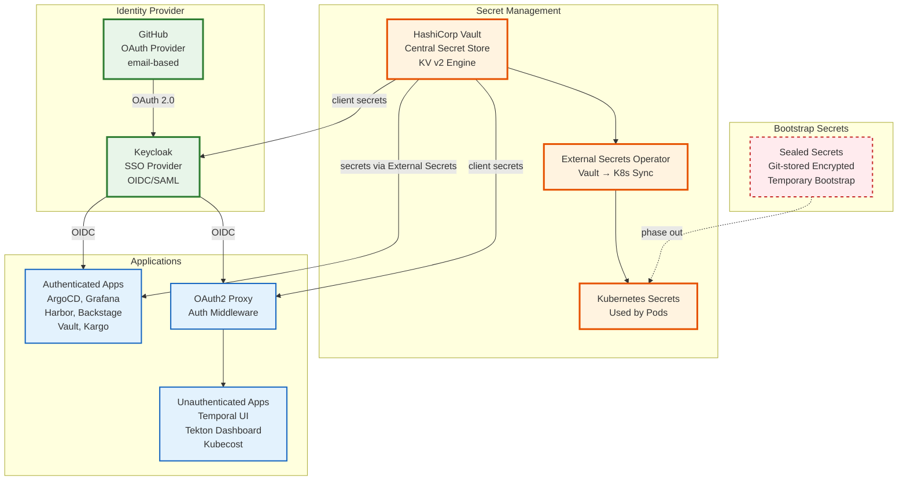
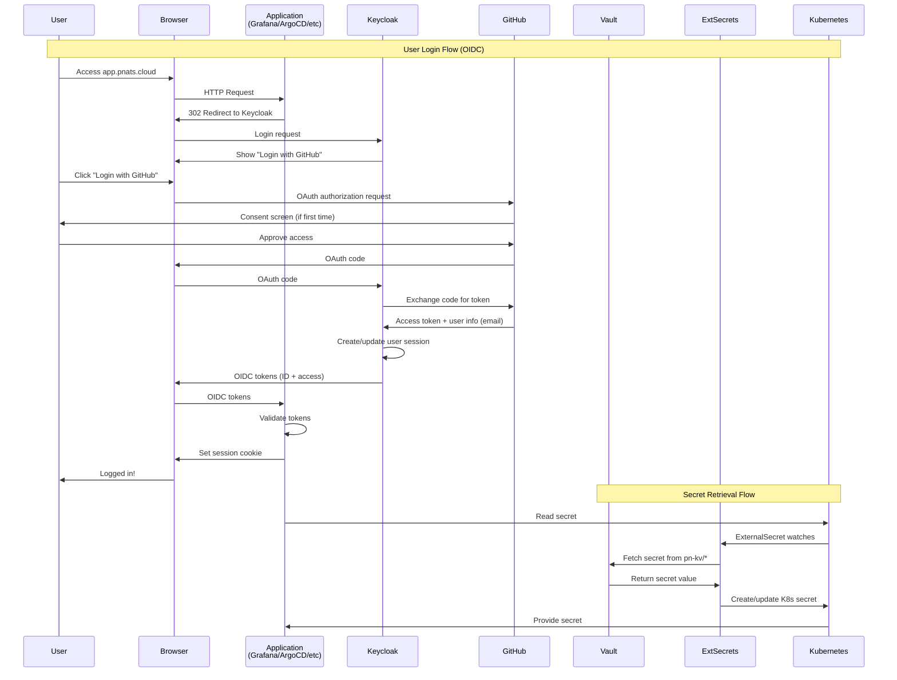

# Security, Authentication & Identity Implementation Plan

## Executive Summary

This document provides a complete, step-by-step implementation plan for securing the PN Infrastructure platform using:
- **Sealed Secrets** → Bootstrap secrets before security infrastructure exists
- **Vault** → Centralized secret management
- **External Secrets** → Kubernetes secret synchronization from Vault
- **Keycloak** → Single Sign-On with GitHub OAuth
- **OIDC/SAML** → Standards-based authentication

**Current State**: 🔴 Not Secure (hardcoded passwords, no centralized auth)
**Target State**: ✅ Production-ready security with GitHub SSO for all apps

---

## Table of Contents

1. [Architecture Overview](#architecture-overview)
2. [Bootstrap Phase: Sealed Secrets](#bootstrap-phase-sealed-secrets)
3. [Phase 1: Vault Foundation](#phase-1-vault-foundation)
4. [Phase 2: Keycloak + GitHub OAuth](#phase-2-keycloak--github-oauth)
5. [Phase 3: External Secrets Migration](#phase-3-external-secrets-migration)
6. [Phase 4: Application SSO Integration](#phase-4-application-sso-integration)
7. [Phase 5: Cleanup & Audit](#phase-5-cleanup--audit)
8. [Security Best Practices](#security-best-practices)
9. [Validation & Testing](#validation--testing)
10. [Troubleshooting Guide](#troubleshooting-guide)

---

## Architecture Overview

### The Security Stack



### Authentication Flow



### Why This Architecture?

**Sealed Secrets (Bootstrap Only)**
- ✅ Git-stored, encrypted at rest
- ✅ No external dependencies (works in fresh cluster)
- ✅ Perfect for bootstrapping Vault and Keycloak
- ❌ Not centralized (per-cluster encryption key)
- ❌ No audit trail
- ❌ Rotation requires resealing

**Vault (Long-term)**
- ✅ Centralized secret management
- ✅ Complete audit log
- ✅ Fine-grained access control (policies)
- ✅ Secret versioning and rollback
- ✅ Dynamic secrets (database credentials, etc.)
- ✅ Encryption as a service

**External Secrets Operator**
- ✅ GitOps-friendly (secrets defined as CRDs)
- ✅ Automatic sync from Vault to K8s
- ✅ No application changes required
- ✅ Multiple backend support (Vault, AWS, GCP, Azure)

**Keycloak + GitHub OAuth**
- ✅ Single Sign-On across all apps
- ✅ GitHub as identity source (email-based)
- ✅ Organization/team-based access control
- ✅ OIDC and SAML support
- ✅ User federation and social login

---

## Bootstrap Phase: Sealed Secrets

### Purpose
Use Sealed Secrets ONLY for initial deployment of Vault and Keycloak. These are temporary bootstrap secrets that will be migrated to Vault once the security infrastructure is operational.

### What Needs Sealed Secrets?

#### 1. Vault Bootstrap Secrets
```yaml
# v0.2.0/platform/charts/vault/secrets/vault-init-sealed.yaml
apiVersion: bitnami.com/v1alpha1
kind: SealedSecret
metadata:
  name: vault-init
  namespace: vault
spec:
  encryptedData:
    root_token: <sealed-base64-encoded>
    unseal_key_1: <sealed-base64-encoded>
    unseal_key_2: <sealed-base64-encoded>
    unseal_key_3: <sealed-base64-encoded>
```

**Why**: Vault needs unseal keys to start. Chicken-and-egg problem.

#### 2. Keycloak Bootstrap Secrets
```yaml
# v0.2.0/platform/charts/keycloak/secrets/keycloak-admin-sealed.yaml
apiVersion: bitnami.com/v1alpha1
kind: SealedSecret
metadata:
  name: keycloak-admin
  namespace: keycloak
spec:
  encryptedData:
    admin-user: <sealed-base64-encoded>  # 'admin'
    admin-password: <sealed-base64-encoded>  # Strong generated password
```

**Why**: Need admin access to configure Keycloak before Vault is ready.

#### 3. Keycloak Database Secrets
```yaml
# v0.2.0/platform/charts/keycloak/secrets/keycloak-postgres-sealed.yaml
apiVersion: bitnami.com/v1alpha1
kind: SealedSecret
metadata:
  name: keycloak-postgresql
  namespace: keycloak
spec:
  encryptedData:
    postgres-password: <sealed-base64-encoded>
    password: <sealed-base64-encoded>  # bn_keycloak user password
```

**Why**: Keycloak PostgreSQL needs credentials before Vault is available.

#### 4. GitHub OAuth Application Credentials (for Keycloak)
```yaml
# v0.2.0/platform/charts/keycloak/secrets/github-oauth-sealed.yaml
apiVersion: bitnami.com/v1alpha1
kind: SealedSecret
metadata:
  name: github-oauth
  namespace: keycloak
spec:
  encryptedData:
    client-id: <sealed-base64-encoded>
    client-secret: <sealed-base64-encoded>
```

**Why**: Keycloak needs GitHub OAuth credentials to enable social login.

### Creating Sealed Secrets

#### Step 1: Install kubeseal CLI
```bash
# Install kubeseal client
wget https://github.com/bitnami-labs/sealed-secrets/releases/download/v0.24.0/kubeseal-0.24.0-linux-amd64.tar.gz
tar xfz kubeseal-0.24.0-linux-amd64.tar.gz
sudo install -m 755 kubeseal /usr/local/bin/kubeseal
```

#### Step 2: Generate Strong Secrets
```bash
# Generate Vault root token (64 bytes base64)
VAULT_ROOT_TOKEN=$(openssl rand -base64 48)

# Generate Vault unseal keys (32 bytes each, base64)
VAULT_UNSEAL_KEY_1=$(openssl rand -base64 32)
VAULT_UNSEAL_KEY_2=$(openssl rand -base64 32)
VAULT_UNSEAL_KEY_3=$(openssl rand -base64 32)

# Generate Keycloak admin password (32 bytes base64)
KEYCLOAK_ADMIN_PASSWORD=$(openssl rand -base64 32)

# Generate Keycloak PostgreSQL password (32 bytes base64)
KEYCLOAK_POSTGRES_PASSWORD=$(openssl rand -base64 32)

# GitHub OAuth Client ID and Secret (from GitHub OAuth App)
GITHUB_CLIENT_ID="<from-github-oauth-app>"
GITHUB_CLIENT_SECRET="<from-github-oauth-app>"
```

#### Step 3: Create Sealed Secrets
```bash
# Vault init secret
kubectl create secret generic vault-init \
  --namespace=vault \
  --from-literal=root_token="${VAULT_ROOT_TOKEN}" \
  --from-literal=unseal_key_1="${VAULT_UNSEAL_KEY_1}" \
  --from-literal=unseal_key_2="${VAULT_UNSEAL_KEY_2}" \
  --from-literal=unseal_key_3="${VAULT_UNSEAL_KEY_3}" \
  --dry-run=client -o yaml | \
  kubeseal --controller-namespace=kube-system -o yaml > \
  v0.2.0/platform/charts/vault/secrets/vault-init-sealed.yaml

# Keycloak admin secret
kubectl create secret generic keycloak-admin \
  --namespace=keycloak \
  --from-literal=admin-user="admin" \
  --from-literal=admin-password="${KEYCLOAK_ADMIN_PASSWORD}" \
  --dry-run=client -o yaml | \
  kubeseal --controller-namespace=kube-system -o yaml > \
  v0.2.0/platform/charts/keycloak/secrets/keycloak-admin-sealed.yaml

# Keycloak PostgreSQL secret
kubectl create secret generic keycloak-postgresql \
  --namespace=keycloak \
  --from-literal=postgres-password="${KEYCLOAK_POSTGRES_PASSWORD}" \
  --from-literal=password="${KEYCLOAK_POSTGRES_PASSWORD}" \
  --dry-run=client -o yaml | \
  kubeseal --controller-namespace=kube-system -o yaml > \
  v0.2.0/platform/charts/keycloak/secrets/keycloak-postgres-sealed.yaml

# GitHub OAuth secret
kubectl create secret generic github-oauth \
  --namespace=keycloak \
  --from-literal=client-id="${GITHUB_CLIENT_ID}" \
  --from-literal=client-secret="${GITHUB_CLIENT_SECRET}" \
  --dry-run=client -o yaml | \
  kubeseal --controller-namespace=kube-system -o yaml > \
  v0.2.0/platform/charts/keycloak/secrets/github-oauth-sealed.yaml
```

#### Step 4: Store Bootstrap Secrets Securely (OFFLINE)
```bash
# Create secure backup (NEVER commit this to Git)
cat > ~/vault-keycloak-bootstrap-secrets.txt <<EOF
# PN Infrastructure Bootstrap Secrets
# Created: $(date)
# WARNING: Store this file securely offline (password manager, encrypted USB, etc.)

VAULT_ROOT_TOKEN=${VAULT_ROOT_TOKEN}
VAULT_UNSEAL_KEY_1=${VAULT_UNSEAL_KEY_1}
VAULT_UNSEAL_KEY_2=${VAULT_UNSEAL_KEY_2}
VAULT_UNSEAL_KEY_3=${VAULT_UNSEAL_KEY_3}

KEYCLOAK_ADMIN_PASSWORD=${KEYCLOAK_ADMIN_PASSWORD}
KEYCLOAK_POSTGRES_PASSWORD=${KEYCLOAK_POSTGRES_PASSWORD}

GITHUB_CLIENT_ID=${GITHUB_CLIENT_ID}
GITHUB_CLIENT_SECRET=${GITHUB_CLIENT_SECRET}
EOF

# Encrypt for storage
gpg --symmetric --cipher-algo AES256 ~/vault-keycloak-bootstrap-secrets.txt

# Store encrypted file in password manager or secure location
# DELETE plaintext file
shred -u ~/vault-keycloak-bootstrap-secrets.txt
```

#### Step 5: Commit Sealed Secrets to Git
```bash
git add v0.2.0/platform/charts/vault/secrets/vault-init-sealed.yaml
git add v0.2.0/platform/charts/keycloak/secrets/*.yaml
git commit -m "security: add bootstrap sealed secrets for Vault and Keycloak"
git push
```

---

## Phase 1: Vault Foundation

### Step 1: Update Vault Values to Use Sealed Secrets

```yaml
# v0.2.0/platform/charts/vault/values.yaml
server:
  ha:
    enabled: true
    replicas: 3

    config: |
      ui = true

      listener "tcp" {
        address = "[::]:8200"
        cluster_address = "[::]:8201"
        tls_disable = true
      }

      storage "raft" {
        path = "/vault/data"

        retry_join {
          leader_api_addr = "http://vault-0.vault-internal:8200"
        }
        retry_join {
          leader_api_addr = "http://vault-1.vault-internal:8200"
        }
        retry_join {
          leader_api_addr = "http://vault-2.vault-internal:8200"
        }
      }

      service_registration "kubernetes" {}

      seal "transit" {
        address = "http://vault-active.vault.svc:8200"
        disable_renewal = "false"
        key_name = "autounseal"
        mount_path = "transit/"
        tls_skip_verify = "true"
      }

  # Use sealed secret for initialization
  extraSecretEnvironmentVars:
    - envName: VAULT_TOKEN
      secretName: vault-init
      secretKey: root_token

# Enable auto-unseal (requires Vault already initialized)
autoUnseal:
  enabled: true

ui:
  enabled: true

ingress:
  enabled: true
  hosts:
    - host: vault.pnats.cloud
      paths:
        - /
  tls:
    - secretName: vault-tls
      hosts:
        - vault.pnats.cloud
```

### Step 2: Initialize Vault (First Time Only)

```bash
# Port-forward to Vault
kubectl port-forward -n vault svc/vault 8200:8200 &

# Initialize Vault (if not already initialized)
vault operator init -key-shares=5 -key-threshold=3

# This will output:
# Unseal Key 1: <key-1>
# Unseal Key 2: <key-2>
# Unseal Key 3: <key-3>
# Unseal Key 4: <key-4>
# Unseal Key 5: <key-5>
# Initial Root Token: <root-token>

# Store these in your password manager!
# Update sealed secret with actual values

# Unseal Vault (first time)
vault operator unseal <unseal-key-1>
vault operator unseal <unseal-key-2>
vault operator unseal <unseal-key-3>

# Login with root token
export VAULT_ADDR='http://localhost:8200'
vault login <root-token>
```

### Step 3: Configure Vault KV Engine

```bash
# Enable KV v2 secrets engine
vault secrets enable -path=pn-kv kv-v2

# Configure max versions
vault kv metadata put -max-versions=10 pn-kv

# Create secret paths structure
vault kv put pn-kv/metadata/created-by value="platform-team"
vault kv put pn-kv/metadata/created-at value="$(date -Iseconds)"
```

### Step 4: Enable Kubernetes Auth for External Secrets

```bash
# Enable Kubernetes auth
vault auth enable kubernetes

# Configure Kubernetes auth
vault write auth/kubernetes/config \
    kubernetes_host="https://kubernetes.default.svc:443"

# Create policy for External Secrets Operator
vault policy write external-secrets-policy - <<EOF
# Allow reading all secrets under pn-kv/*
path "pn-kv/data/*" {
  capabilities = ["read", "list"]
}

path "pn-kv/metadata/*" {
  capabilities = ["read", "list"]
}
EOF

# Create Kubernetes auth role for External Secrets
vault write auth/kubernetes/role/external-secrets \
    bound_service_account_names=external-secrets \
    bound_service_account_namespaces=external-secrets \
    policies=external-secrets-policy \
    ttl=24h
```

### Step 5: Create Application Secret Policies

```bash
# Policy for ArgoCD secrets
vault policy write argocd-policy - <<EOF
path "pn-kv/data/argocd/*" {
  capabilities = ["read"]
}
EOF

# Policy for Grafana secrets
vault policy write grafana-policy - <<EOF
path "pn-kv/data/grafana/*" {
  capabilities = ["read"]
}
EOF

# Policy for Harbor secrets
vault policy write harbor-policy - <<EOF
path "pn-kv/data/harbor/*" {
  capabilities = ["read"]
}
EOF

# Policy for Keycloak secrets (will store GitHub OAuth, etc.)
vault policy write keycloak-policy - <<EOF
path "pn-kv/data/keycloak/*" {
  capabilities = ["read"]
}
EOF

# Policy for OAuth2 Proxy
vault policy write oauth2-proxy-policy - <<EOF
path "pn-kv/data/oauth2-proxy/*" {
  capabilities = ["read"]
}
EOF

# Admin policy (for platform team)
vault policy write platform-admin - <<EOF
path "pn-kv/*" {
  capabilities = ["create", "read", "update", "delete", "list"]
}

path "sys/policies/*" {
  capabilities = ["read", "list"]
}

path "auth/*" {
  capabilities = ["read", "list"]
}
EOF
```

### Step 6: Enable Vault Audit Logging

```bash
# Enable audit logging to file
vault audit enable file file_path=/vault/audit/audit.log

# Verify audit is enabled
vault audit list
```

### Step 7: Configure Vault UI Access (Temporary Token)

```bash
# Create a long-lived token for platform team (use for UI access)
vault token create \
    -display-name="platform-team-ui" \
    -policy=platform-admin \
    -ttl=720h \
    -renewable=true

# Save this token for Vault UI access at https://vault.pnats.cloud
```

---

## Phase 2: Keycloak + GitHub OAuth

### Step 1: Create GitHub OAuth Application

1. Go to GitHub Organization Settings → Developer Settings → OAuth Apps
2. Click "New OAuth App"
3. Fill in details:
   - **Application name**: PN Infrastructure SSO
   - **Homepage URL**: `https://keycloak.pnats.cloud`
   - **Authorization callback URL**: `https://keycloak.pnats.cloud/realms/platform/broker/github/endpoint`
4. Click "Register application"
5. Generate a new client secret
6. Save **Client ID** and **Client Secret** (already in sealed secret from bootstrap)

### Step 2: Update Keycloak Values to Use Sealed Secrets

```yaml
# v0.2.0/platform/charts/keycloak/values.yaml
auth:
  # Use sealed secret for admin credentials
  existingSecret: keycloak-admin
  adminUser: admin  # This will be overridden by secret
  # adminPassword removed - comes from secret

postgresql:
  enabled: true
  auth:
    existingSecret: keycloak-postgresql
    username: bn_keycloak
    database: bitnami_keycloak
    # password removed - comes from secret

replicaCount: 2

autoscaling:
  enabled: true
  minReplicas: 2
  maxReplicas: 4
  targetCPU: 75

ingress:
  enabled: true
  hostname: keycloak.pnats.cloud
  tls: true
  certManager: true
  annotations:
    cert-manager.io/cluster-issuer: letsencrypt-production
    external-dns.alpha.kubernetes.io/hostname: keycloak.pnats.cloud

# Keycloak configuration
extraEnvVars:
  - name: KEYCLOAK_PRODUCTION
    value: "true"
  - name: KEYCLOAK_PROXY
    value: "edge"
  - name: KEYCLOAK_LOG_LEVEL
    value: "INFO"

# Resource limits
resources:
  requests:
    cpu: 500m
    memory: 1Gi
  limits:
    cpu: 2000m
    memory: 2Gi
```

### Step 3: Access Keycloak Admin Console

```bash
# Get admin password from sealed secret
kubectl get secret -n keycloak keycloak-admin -o jsonpath='{.data.admin-password}' | base64 -d
echo

# Access Keycloak at https://keycloak.pnats.cloud
# Username: admin
# Password: <from above>
```

### Step 4: Configure Keycloak Realm

#### Create Platform Realm
1. Log in to Keycloak Admin Console
2. Hover over "Master" realm → Click "Create Realm"
3. Realm name: `platform`
4. Enabled: ON
5. Click "Create"

#### Configure Realm Settings
1. Go to Realm Settings → General
   - Display name: `PN Infrastructure`
   - HTML Display name: `<strong>PN Infrastructure</strong>`
   - Frontend URL: `https://keycloak.pnats.cloud`

2. Go to Realm Settings → Login
   - User registration: OFF (GitHub only)
   - Forgot password: ON
   - Remember me: ON
   - Email as username: ON (important!)
   - Login with email: ON

3. Go to Realm Settings → Email
   - Configure SMTP (optional but recommended for password resets)

4. Go to Realm Settings → Themes
   - Login theme: keycloak
   - Account theme: keycloak
   - Admin console theme: keycloak
   - Email theme: keycloak

5. Go to Realm Settings → Tokens
   - Access Token Lifespan: 5 minutes
   - SSO Session Idle: 30 minutes
   - SSO Session Max: 10 hours

### Step 5: Configure GitHub Identity Provider

1. Go to Identity Providers → Add provider → GitHub
2. Fill in:
   - **Alias**: `github`
   - **Display name**: `GitHub`
   - **Client ID**: (from sealed secret - manual entry for now)
   - **Client Secret**: (from sealed secret - manual entry for now)
   - **Store Tokens**: ON (optional - for accessing GitHub API)
   - **Stored Tokens Readable**: OFF

3. Scroll down to "Scopes":
   - Default: `read:user user:email read:org`

4. Click "Save"

5. Copy the **Redirect URI** (should be):
   - `https://keycloak.pnats.cloud/realms/platform/broker/github/endpoint`

6. Verify this matches GitHub OAuth App callback URL

### Step 6: Configure GitHub Identity Provider Mappers

Map GitHub user info to Keycloak user attributes:

#### Mapper 1: Username
1. Go to Identity Providers → GitHub → Mappers → Create
   - Name: `github-username`
   - Sync Mode Override: `import`
   - Mapper Type: `Attribute Importer`
   - Social Profile JSON Field Path: `login`
   - User Attribute Name: `github_username`

#### Mapper 2: Email
1. Create another mapper:
   - Name: `github-email`
   - Sync Mode Override: `import`
   - Mapper Type: `Attribute Importer`
   - Social Profile JSON Field Path: `email`
   - User Attribute Name: `email`

#### Mapper 3: Full Name
1. Create another mapper:
   - Name: `github-name`
   - Sync Mode Override: `import`
   - Mapper Type: `Attribute Importer`
   - Social Profile JSON Field Path: `name`
   - User Attribute Name: `name`

#### Mapper 4: Organization (Custom - Requires Token)
1. Create another mapper:
   - Name: `github-orgs`
   - Sync Mode Override: `import`
   - Mapper Type: `Attribute Importer`
   - Social Profile JSON Field Path: `organizations_url`
   - User Attribute Name: `github_organizations`

### Step 7: Configure Email as Primary Identifier

1. Go to Realm Settings → User Profile
2. Click on `email` attribute
3. Edit:
   - **Required field**: ON
   - **Unique**: ON
4. Click "Save"

5. Go to Authentication → Required Actions
6. Enable:
   - Verify Email
   - Update Profile

### Step 8: Test GitHub OAuth Login

```bash
# Open Keycloak Account Console
https://keycloak.pnats.cloud/realms/platform/account

# Click "Sign In"
# Click "GitHub" button
# Approve GitHub OAuth (first time)
# Should redirect back logged in

# Verify user created:
# Keycloak Admin → Users → View all users
# Should see your GitHub email
```

### Step 9: Configure GitHub Organization Restriction (Optional but Recommended)

To restrict access to only members of your GitHub organization:

#### Method 1: Authentication Flow (Recommended)

1. Go to Authentication → Flows
2. Duplicate "Browser" flow → Name it "Browser with Org Check"
3. Click on the duplicated flow
4. Add execution: "Script Authenticator" (if available)
5. Or use "Conditional OTP Form" workaround with organization check

#### Method 2: Manual Group Assignment

1. Create Keycloak group: `github-org-members`
2. Manually add users who are org members
3. Configure client role mapping to require this group

#### Method 3: External Validation (Custom)

Use a custom event listener or external service to validate organization membership on login.

**For now, proceed without org restriction** - we'll implement this later.

---

## Phase 3: External Secrets Migration

### Step 1: Verify External Secrets Operator

```bash
# Check External Secrets Operator is running
kubectl get pods -n external-secrets

# Check ClusterSecretStore exists and is ready
kubectl get clustersecretstore vault-backend -o yaml
```

Expected output:
```yaml
status:
  conditions:
  - status: "True"
    type: Ready
```

### Step 2: Update ClusterSecretStore for Kubernetes Auth

```yaml
# v0.2.0/platform/charts/external-secrets/cluster-secret-store.yaml
apiVersion: external-secrets.io/v1beta1
kind: ClusterSecretStore
metadata:
  name: vault-backend
spec:
  provider:
    vault:
      server: "http://vault-active.vault.svc.cluster.local:8200"
      path: "pn-kv"
      version: "v2"

      # Use Kubernetes auth instead of token
      auth:
        kubernetes:
          mountPath: "kubernetes"
          role: "external-secrets"
          serviceAccountRef:
            name: "external-secrets"
            namespace: "external-secrets"
```

Apply:
```bash
kubectl apply -f v0.2.0/platform/charts/external-secrets/cluster-secret-store.yaml

# Verify connection
kubectl get clustersecretstore vault-backend -o jsonpath='{.status.conditions[?(@.type=="Ready")].status}'
# Should output: True
```

### Step 3: Create Vault Secret Structure

Store all application secrets in Vault:

```bash
# Keycloak secrets (GitHub OAuth credentials from sealed secret)
GITHUB_CLIENT_ID=$(kubectl get secret -n keycloak github-oauth -o jsonpath='{.data.client-id}' | base64 -d)
GITHUB_CLIENT_SECRET=$(kubectl get secret -n keycloak github-oauth -o jsonpath='{.data.client-secret}' | base64 -d)

vault kv put pn-kv/keycloak \
    github-oauth-client-id="${GITHUB_CLIENT_ID}" \
    github-oauth-client-secret="${GITHUB_CLIENT_SECRET}"

# Grafana secrets (generate new admin password)
GRAFANA_ADMIN_PASSWORD=$(openssl rand -base64 32)
vault kv put pn-kv/grafana \
    admin-password="${GRAFANA_ADMIN_PASSWORD}"

# ArgoCD secrets
ARGOCD_ADMIN_PASSWORD=$(openssl rand -base64 32)
vault kv put pn-kv/argocd \
    admin-password="${ARGOCD_ADMIN_PASSWORD}"

# Harbor secrets (migrate from sealed secrets)
HARBOR_ADMIN_PASSWORD=$(kubectl get secret -n harbor harbor-secrets -o jsonpath='{.data.HARBOR_ADMIN_PASSWORD}' | base64 -d)
HARBOR_DB_PASSWORD=$(openssl rand -base64 32)
HARBOR_S3_ACCESS_KEY=$(kubectl get secret -n harbor harbor-s3-credentials -o jsonpath='{.data.accessKey}' | base64 -d)
HARBOR_S3_SECRET_KEY=$(kubectl get secret -n harbor harbor-s3-credentials -o jsonpath='{.data.secretKey}' | base64 -d)

vault kv put pn-kv/harbor \
    admin-password="${HARBOR_ADMIN_PASSWORD}" \
    database-password="${HARBOR_DB_PASSWORD}" \
    s3-access-key="${HARBOR_S3_ACCESS_KEY}" \
    s3-secret-key="${HARBOR_S3_SECRET_KEY}"

# Backstage secrets (migrate from sealed secrets)
BACKSTAGE_GITHUB_TOKEN=$(kubectl get secret -n backstage backstage-secrets -o jsonpath='{.data.GITHUB_TOKEN}' | base64 -d)
BACKSTAGE_KEYCLOAK_SECRET=$(kubectl get secret -n backstage backstage-secrets -o jsonpath='{.data.KEYCLOAK_CLIENT_SECRET}' | base64 -d)

vault kv put pn-kv/backstage \
    github-token="${BACKSTAGE_GITHUB_TOKEN}" \
    keycloak-client-secret="${BACKSTAGE_KEYCLOAK_SECRET}"

# Kargo secrets (migrate from sealed secrets)
KARGO_ADMIN_PASSWORD=$(kubectl get secret -n kargo kargo-admin-secret -o jsonpath='{.data.password}' | base64 -d)

vault kv put pn-kv/kargo \
    admin-password="${KARGO_ADMIN_PASSWORD}"

# OAuth2 Proxy secrets (new - for unauthenticated apps)
OAUTH2_PROXY_CLIENT_SECRET=$(openssl rand -base64 32)
OAUTH2_PROXY_COOKIE_SECRET=$(openssl rand -base64 32)

vault kv put pn-kv/oauth2-proxy \
    client-secret="${OAUTH2_PROXY_CLIENT_SECRET}" \
    cookie-secret="${OAUTH2_PROXY_COOKIE_SECRET}"

# Vault OIDC client secret (for Vault UI login via Keycloak)
VAULT_OIDC_CLIENT_SECRET=$(openssl rand -base64 32)

vault kv put pn-kv/vault \
    keycloak-oidc-client-secret="${VAULT_OIDC_CLIENT_SECRET}"

# Temporal secrets (optional - if not using Zalando auto-generated)
# Zalando operator auto-generates PostgreSQL passwords, so we keep those
```

### Step 4: Create ExternalSecret Resources

#### Example: Grafana External Secret

```yaml
# v0.2.0/platform/charts/grafana/external-secrets/grafana-secrets.yaml
apiVersion: external-secrets.io/v1beta1
kind: ExternalSecret
metadata:
  name: grafana-secrets
  namespace: monitoring
spec:
  refreshInterval: 1h

  secretStoreRef:
    name: vault-backend
    kind: ClusterSecretStore

  target:
    name: grafana
    creationPolicy: Owner
    template:
      engineVersion: v2
      data:
        admin-password: "{{ .adminPassword }}"

  data:
    - secretKey: adminPassword
      remoteRef:
        key: pn-kv/grafana
        property: admin-password
```

Apply and verify:
```bash
kubectl apply -f v0.2.0/platform/charts/grafana/external-secrets/grafana-secrets.yaml

# Wait for sync (max 1 hour, but usually immediate)
kubectl get externalsecret -n monitoring grafana-secrets -w

# Verify K8s secret created
kubectl get secret -n monitoring grafana -o jsonpath='{.data.admin-password}' | base64 -d
```

#### Create External Secrets for All Apps

```bash
# Create directory structure
mkdir -p v0.2.0/platform/charts/{argocd-self,harbor,backstage,kargo,oauth2-proxy,vault}/external-secrets

# Copy template and customize for each app
# (Templates provided in following sections)
```

---

## Phase 4: Application SSO Integration

### Application 1: Grafana (Email-based OIDC)

#### Step 1: Create Keycloak Client for Grafana

1. Go to Clients → Create Client
   - Client type: OpenID Connect
   - Client ID: `grafana`
   - Name: `Grafana`
   - Click "Next"

2. Capability config:
   - Client authentication: ON
   - Authorization: OFF
   - Standard flow: ON
   - Direct access grants: OFF
   - Click "Next"

3. Login settings:
   - Root URL: `https://grafana.pnats.cloud`
   - Home URL: `https://grafana.pnats.cloud`
   - Valid redirect URIs: `https://grafana.pnats.cloud/login/generic_oauth`
   - Valid post logout redirect URIs: `https://grafana.pnats.cloud`
   - Web origins: `https://grafana.pnats.cloud`
   - Click "Save"

4. Go to Credentials tab → Copy **Client Secret**

5. Store in Vault:
```bash
vault kv patch pn-kv/grafana keycloak-client-secret="<client-secret-from-keycloak>"
```

#### Step 2: Configure Grafana Values for OIDC

```yaml
# v0.2.0/platform/charts/grafana/values.yaml
grafana.ini:
  server:
    root_url: https://grafana.pnats.cloud

  auth:
    disable_login_form: false  # Keep for emergency admin access
    oauth_auto_login: true
    signout_redirect_url: https://keycloak.pnats.cloud/realms/platform/protocol/openid-connect/logout?redirect_uri=https://grafana.pnats.cloud

  auth.generic_oauth:
    enabled: true
    name: Keycloak SSO
    allow_sign_up: true
    client_id: grafana
    client_secret: $__file{/etc/secrets/keycloak-client-secret}
    scopes: openid profile email
    email_attribute_path: email
    login_attribute_path: preferred_username
    name_attribute_path: name
    auth_url: https://keycloak.pnats.cloud/realms/platform/protocol/openid-connect/auth
    token_url: https://keycloak.pnats.cloud/realms/platform/protocol/openid-connect/token
    api_url: https://keycloak.pnats.cloud/realms/platform/protocol/openid-connect/userinfo
    role_attribute_path: contains(groups[*], 'grafana-admins') && 'Admin' || contains(groups[*], 'grafana-editors') && 'Editor' || 'Viewer'
    allow_assign_grafana_admin: true

# Mount secret from External Secret
extraSecretMounts:
  - name: keycloak-secret
    secretName: grafana
    defaultMode: 0440
    mountPath: /etc/secrets
    readOnly: true

# Use External Secret for admin password (emergency access)
admin:
  existingSecret: grafana
  userKey: admin-user
  passwordKey: admin-password
```

#### Step 3: Create Keycloak Groups for Grafana Roles

1. Go to Groups → Create group
   - Name: `grafana-admins`
   - Click "Create"

2. Create more groups:
   - `grafana-editors`
   - `grafana-viewers`

3. Assign users to groups:
   - Go to Users → Find user → Groups tab → Join Group

#### Step 4: Test Grafana SSO

```bash
# Restart Grafana to pick up new config
kubectl rollout restart deployment/grafana -n monitoring

# Wait for rollout
kubectl rollout status deployment/grafana -n monitoring

# Access Grafana
open https://grafana.pnats.cloud

# Click "Sign in with Keycloak SSO"
# Should redirect to Keycloak → GitHub → back to Grafana logged in
```

---

### Application 2: ArgoCD (Email-based OIDC via Dex)

#### Step 1: Create Keycloak Client for ArgoCD

1. Clients → Create Client
   - Client ID: `argocd`
   - Name: `ArgoCD`

2. Capability config:
   - Client authentication: ON
   - Standard flow: ON

3. Login settings:
   - Root URL: `https://argocd.pnats.cloud`
   - Valid redirect URIs:
     - `https://argocd.pnats.cloud/auth/callback`
     - `https://argocd.pnats.cloud/api/dex/callback`
   - Web origins: `https://argocd.pnats.cloud`

4. Credentials → Copy **Client Secret** → Store in Vault:
```bash
vault kv patch pn-kv/argocd keycloak-client-secret="<client-secret>"
```

#### Step 2: Configure Keycloak Client Scopes for Groups

1. Client Scopes → Create client scope
   - Name: `groups`
   - Type: Optional
   - Protocol: OpenID Connect
   - Display on consent: OFF
   - Include in token scope: ON

2. Mappers tab → Create mapper
   - Mapper type: Group Membership
   - Name: `groups`
   - Token Claim Name: `groups`
   - Full group path: OFF
   - Add to ID token: ON
   - Add to access token: ON
   - Add to userinfo: ON

3. Go back to argocd client → Client scopes tab
4. Add `groups` to **Assigned optional client scopes**

#### Step 3: Configure ArgoCD Dex

```yaml
# v0.2.0/platform/charts/argocd-self/values.yaml
server:
  config:
    url: https://argocd.pnats.cloud

    # Enable Dex
    dex.config: |
      connectors:
      - type: oidc
        id: keycloak
        name: Keycloak (GitHub SSO)
        config:
          issuer: https://keycloak.pnats.cloud/realms/platform
          clientID: argocd
          clientSecret: $dex.keycloak.clientSecret
          requestedScopes:
            - openid
            - profile
            - email
            - groups
          requestedIDTokenClaims:
            email:
              essential: true
            groups:
              essential: true
          insecureSkipEmailVerified: true
          getUserInfo: true

  # RBAC Configuration
  rbac:
    policy.default: role:readonly
    policy.csv: |
      # Platform admins (based on Keycloak group)
      g, grafana-admins, role:admin

      # Developers (based on Keycloak group)
      g, grafana-editors, role:developer

      # Viewers (default)
      p, role:developer, applications, get, */*, allow
      p, role:developer, applications, sync, */*, allow
      p, role:developer, logs, get, */*, allow
      p, role:developer, exec, create, */*, deny
      p, role:developer, repositories, get, *, allow

# External Secret for Dex client secret
configs:
  secret:
    createSecret: false  # Use External Secret instead

# ExternalSecret will create argocd-secret with dex.keycloak.clientSecret key
```

#### Step 4: Create External Secret for ArgoCD

```yaml
# v0.2.0/platform/charts/argocd-self/external-secrets/argocd-secrets.yaml
apiVersion: external-secrets.io/v1beta1
kind: ExternalSecret
metadata:
  name: argocd-dex-secret
  namespace: argocd
spec:
  refreshInterval: 1h

  secretStoreRef:
    name: vault-backend
    kind: ClusterSecretStore

  target:
    name: argocd-secret
    creationPolicy: Merge  # Merge with existing secret
    template:
      engineVersion: v2
      data:
        dex.keycloak.clientSecret: "{{ .keycloakClientSecret }}"
        admin.password: "{{ .adminPassword | bcrypt }}"

  data:
    - secretKey: keycloakClientSecret
      remoteRef:
        key: pn-kv/argocd
        property: keycloak-client-secret

    - secretKey: adminPassword
      remoteRef:
        key: pn-kv/argocd
        property: admin-password
```

#### Step 5: Test ArgoCD SSO

```bash
kubectl apply -f v0.2.0/platform/charts/argocd-self/external-secrets/argocd-secrets.yaml
kubectl rollout restart deployment/argocd-server -n argocd

# Access ArgoCD
open https://argocd.pnats.cloud

# Click "Log in via Keycloak (GitHub SSO)"
```

---

### Application 3: Harbor (Email-based OIDC)

Similar process to Grafana. Create Keycloak client `harbor`, configure Harbor OIDC settings.

(Detailed steps similar to Grafana, omitted for brevity - can expand if needed)

---

### Application 4: OAuth2 Proxy for Unauthenticated Apps

For apps without native OAuth support (Temporal UI, Tekton Dashboard, Kubecost):

#### Step 1: Create Keycloak Client for OAuth2 Proxy

```bash
# In Keycloak Admin Console
# Clients → Create Client
# Client ID: oauth2-proxy
# Valid Redirect URIs:
#   https://temporal-ui.pnats.cloud/oauth2/callback
#   https://tekton.pnats.cloud/oauth2/callback
#   https://cost.pnats.cloud/oauth2/callback
```

Store client secret in Vault (already done in Phase 3).

#### Step 2: Deploy OAuth2 Proxy Helm Chart

```yaml
# v0.2.0/platform/charts/oauth2-proxy/values.yaml
config:
  clientID: oauth2-proxy
  clientSecret: ""  # From External Secret
  cookieSecret: ""  # From External Secret

  configFile: |-
    provider = "keycloak-oidc"
    provider_display_name = "GitHub SSO"

    oidc_issuer_url = "https://keycloak.pnats.cloud/realms/platform"
    redirect_url = "https://temporal-ui.pnats.cloud/oauth2/callback"

    email_domains = [ "*" ]

    cookie_domains = [ ".pnats.cloud" ]
    whitelist_domains = [ ".pnats.cloud" ]

    pass_access_token = true
    pass_user_headers = true
    set_xauthrequest = true
    set_authorization_header = true

    cookie_secure = true
    cookie_httponly = true
    cookie_samesite = "lax"

    ssl_insecure_skip_verify = false

    skip_provider_button = true

extraEnv:
  - name: OAUTH2_PROXY_CLIENT_SECRET
    valueFrom:
      secretKeyRef:
        name: oauth2-proxy
        key: client-secret

  - name: OAUTH2_PROXY_COOKIE_SECRET
    valueFrom:
      secretKeyRef:
        name: oauth2-proxy
        key: cookie-secret

service:
  type: ClusterIP
  port: 4180

resources:
  requests:
    cpu: 100m
    memory: 128Mi
  limits:
    cpu: 500m
    memory: 256Mi
```

#### Step 3: Update Application Ingresses

```yaml
# Example: Temporal UI with OAuth2 Proxy
# v0.2.0/platform/charts/temporal/ingress/temporal-ui-ingress.yaml
apiVersion: networking.k8s.io/v1
kind: Ingress
metadata:
  name: temporal-web
  namespace: temporal
  annotations:
    cert-manager.io/cluster-issuer: letsencrypt-production
    external-dns.alpha.kubernetes.io/hostname: temporal-ui.pnats.cloud

    # OAuth2 Proxy annotations
    nginx.ingress.kubernetes.io/auth-url: "https://$host/oauth2/auth"
    nginx.ingress.kubernetes.io/auth-signin: "https://$host/oauth2/start?rd=$escaped_request_uri"
    nginx.ingress.kubernetes.io/auth-response-headers: "X-Auth-Request-User, X-Auth-Request-Email, Authorization"

spec:
  ingressClassName: nginx
  tls:
  - hosts:
    - temporal-ui.pnats.cloud
    secretName: temporal-ui-tls

  rules:
  - host: temporal-ui.pnats.cloud
    http:
      paths:
      # OAuth2 proxy endpoints
      - path: /oauth2
        pathType: Prefix
        backend:
          service:
            name: oauth2-proxy
            port:
              number: 4180

      # Application
      - path: /
        pathType: Prefix
        backend:
          service:
            name: temporal-web
            port:
              number: 8080
```

Repeat for Tekton Dashboard and Kubecost.

---

## Phase 5: Cleanup & Audit

### Step 1: Remove Hardcoded Passwords from Values Files

```bash
# Remove plaintext passwords from all values.yaml files
# Example: Grafana
sed -i '/adminPassword:/d' v0.2.0/platform/charts/grafana/values.yaml

# Example: Keycloak
sed -i '/adminPassword:/d' v0.2.0/platform/charts/keycloak/values.yaml
sed -i '/password:/d' v0.2.0/platform/charts/keycloak/values.yaml
```

### Step 2: Deprecate and Remove Sealed Secrets

Once all secrets are migrated to Vault via External Secrets:

```bash
# Delete sealed secret manifests
rm -rf v0.2.0/platform/charts/*/secrets/*-sealed.yaml

# Commit removal
git add -A
git commit -m "security: remove all sealed secrets (migrated to Vault)"
git push
```

**Important**: Keep Vault and Keycloak bootstrap sealed secrets until auto-unseal is fully configured!

### Step 3: Enable Vault Auto-Unseal with Transit Engine

```bash
# On Vault leader node, enable Transit engine
vault secrets enable transit

# Create encryption key for auto-unseal
vault write -f transit/keys/autounseal

# Create policy for auto-unseal
vault policy write autounseal - <<EOF
path "transit/encrypt/autounseal" {
  capabilities = [ "update" ]
}

path "transit/decrypt/autounseal" {
  capabilities = [ "update" ]
}
EOF

# Create token for auto-unseal
vault token create -policy=autounseal -orphan -renewable=true -period=24h

# Store this token in a NEW sealed secret: vault-autounseal-token
# Update Vault config to use Transit seal (already in values.yaml from Phase 1)
```

### Step 4: Audit All Application Configurations

```bash
# Check all applications are using External Secrets
kubectl get externalsecret -A

# Verify no hardcoded passwords in Git
git grep -i "password.*:" v0.2.0/platform/charts/*/values.yaml

# Should return nothing or only references to existingSecret
```

### Step 5: Enable Vault OIDC Auth for Web UI

```bash
# Enable OIDC auth method
vault auth enable oidc

# Configure OIDC with Keycloak
vault write auth/oidc/config \
    oidc_discovery_url="https://keycloak.pnats.cloud/realms/platform" \
    oidc_client_id="vault" \
    oidc_client_secret="$(vault kv get -field=keycloak-oidc-client-secret pn-kv/vault)" \
    default_role="platform-user"

# Create role
vault write auth/oidc/role/platform-user \
    bound_audiences="vault" \
    allowed_redirect_uris="https://vault.pnats.cloud/ui/vault/auth/oidc/oidc/callback" \
    allowed_redirect_uris="https://vault.pnats.cloud/oidc/callback" \
    user_claim="email" \
    groups_claim="groups" \
    policies="platform-read"

# Create admin role for grafana-admins group
vault write auth/oidc/role/platform-admin \
    bound_audiences="vault" \
    allowed_redirect_uris="https://vault.pnats.cloud/ui/vault/auth/oidc/oidc/callback" \
    user_claim="email" \
    groups_claim="groups" \
    bound_claims='{"groups":["grafana-admins"]}' \
    policies="platform-admin"
```

Now users can log in to Vault UI with GitHub via Keycloak!

---

## Security Best Practices

### 1. Principle of Least Privilege
- Each application gets its own Vault policy (read-only to its own path)
- Keycloak groups map to application roles (admin, editor, viewer)
- External Secrets Operator has read-only access to pn-kv/*

### 2. Secret Rotation
```bash
# Rotate a secret (example: Grafana admin password)
NEW_PASSWORD=$(openssl rand -base64 32)
vault kv put pn-kv/grafana admin-password="${NEW_PASSWORD}"

# External Secrets will auto-sync within 1 hour (or force sync)
kubectl annotate externalsecret -n monitoring grafana-secrets \
    force-sync="$(date +%s)" --overwrite

# Restart application to pick up new secret
kubectl rollout restart deployment/grafana -n monitoring
```

### 3. Audit Logging
```bash
# Review Vault audit logs
kubectl exec -n vault vault-0 -- cat /vault/audit/audit.log | jq .

# Key events to monitor:
# - Secret reads (who accessed what)
# - Policy changes
# - Authentication attempts
# - Token creations
```

### 4. Backup and Disaster Recovery

#### Backup Vault Data
```bash
# Backup Vault Raft storage
kubectl exec -n vault vault-0 -- vault operator raft snapshot save /tmp/vault-backup.snap
kubectl cp vault/vault-0:/tmp/vault-backup.snap ./vault-backup-$(date +%Y%m%d).snap

# Encrypt and store offsite
gpg --encrypt --recipient platform-team@example.com vault-backup-$(date +%Y%m%d).snap
```

#### Backup Keycloak Database
```bash
# Backup Keycloak PostgreSQL
kubectl exec -n keycloak keycloak-postgresql-0 -- \
    pg_dump -U bn_keycloak bitnami_keycloak > keycloak-backup-$(date +%Y%m%d).sql

# Encrypt and store offsite
gpg --encrypt --recipient platform-team@example.com keycloak-backup-$(date +%Y%m%d).sql
```

### 5. Regular Security Reviews

**Monthly**:
- Review Vault audit logs for anomalies
- Review Keycloak user accounts (remove ex-employees)
- Review application access (who has admin vs viewer)
- Rotate long-lived tokens

**Quarterly**:
- Rotate all service account passwords
- Review and update Vault policies
- Test disaster recovery procedures
- Penetration testing of auth flows

---

## Validation & Testing

### Test 1: End-to-End SSO Flow
```bash
# Clear browser cookies
# Navigate to https://grafana.pnats.cloud
# Click "Sign in with Keycloak SSO"
# → Redirected to Keycloak
# Click "GitHub"
# → Redirected to GitHub (first time: OAuth consent)
# Approve access
# → Redirected back to Keycloak
# → Redirected back to Grafana
# → Logged in as your GitHub email

# Verify session
# User avatar in top-right should show your name/email
```

### Test 2: Secret Rotation Without Downtime
```bash
# Rotate Grafana admin password
vault kv patch pn-kv/grafana admin-password="new-password-123"

# Force External Secret sync
kubectl annotate externalsecret -n monitoring grafana-secrets force-sync="$(date +%s)" --overwrite

# Wait for secret update (check events)
kubectl get events -n monitoring --field-selector involvedObject.name=grafana

# Test old session still works (cookie still valid)
# Test new login works with new password
```

### Test 3: Access Control
```bash
# Test user in grafana-admins group can:
# - Edit dashboards
# - Create new dashboards
# - Manage data sources

# Test user NOT in grafana-admins group:
# - Can only view dashboards
# - Cannot edit or create
```

### Test 4: OAuth2 Proxy Protection
```bash
# Clear cookies
# Navigate to https://temporal-ui.pnats.cloud
# Should redirect to Keycloak login (not directly to Temporal)
# After GitHub SSO, should access Temporal UI

# Verify headers passed to Temporal
# Check nginx logs: should see X-Auth-Request-User, X-Auth-Request-Email headers
```

---

## Troubleshooting Guide

### Issue 1: Keycloak Shows "Invalid redirect URI"

**Symptoms**: After GitHub OAuth, redirected to Keycloak error page.

**Cause**: Keycloak client redirect URI doesn't match actual callback.

**Fix**:
```bash
# Check actual callback URL in browser
# Update Keycloak client redirect URIs to match exactly
# Ensure trailing slash matches (https://app.com/callback vs https://app.com/callback/)
```

### Issue 2: External Secret Not Syncing

**Symptoms**: `kubectl get externalsecret` shows "SecretSyncedError"

**Debug**:
```bash
# Check ExternalSecret status
kubectl describe externalsecret -n <namespace> <name>

# Check External Secrets Operator logs
kubectl logs -n external-secrets deployment/external-secrets

# Common causes:
# 1. Vault path doesn't exist
vault kv get pn-kv/<path>

# 2. Kubernetes auth not configured
vault read auth/kubernetes/role/external-secrets

# 3. Service account missing
kubectl get sa -n external-secrets external-secrets
```

### Issue 3: Application Still Using Old Password

**Symptoms**: After secret rotation, app still uses old credentials.

**Cause**: Application hasn't reloaded secret from filesystem.

**Fix**:
```bash
# Restart application to pick up new secret
kubectl rollout restart deployment/<app> -n <namespace>

# Or use secret reloader (automatic restarts on secret change)
# Install: https://github.com/stakater/Reloader
```

### Issue 4: Vault Sealed After Restart

**Symptoms**: Vault pods in "Sealed" state after restart.

**Cause**: Auto-unseal not configured or Transit key missing.

**Fix**:
```bash
# Manual unseal (temporary)
kubectl exec -n vault vault-0 -- vault operator unseal <key-1>
kubectl exec -n vault vault-0 -- vault operator unseal <key-2>
kubectl exec -n vault vault-0 -- vault operator unseal <key-3>

# Permanent fix: Configure auto-unseal with Transit (see Phase 5)
```

### Issue 5: User Cannot Access App Despite Being in GitHub Org

**Symptoms**: User logs in via GitHub but gets "Access Denied" in application.

**Cause**: Keycloak group mapping not configured.

**Fix**:
```bash
# Verify user has correct groups in Keycloak
# Keycloak Admin → Users → Find user → Groups tab

# If missing, manually add user to group
# Or check Identity Provider mapper (GitHub → Keycloak groups)

# Verify OIDC token contains groups claim
# Use https://jwt.io to decode ID token and check for "groups" claim
```

---

## Summary Checklist

### Bootstrap Phase ✓
- [ ] Create GitHub OAuth application
- [ ] Generate strong secrets for Vault and Keycloak
- [ ] Create sealed secrets for Vault and Keycloak
- [ ] Store bootstrap secrets offline (encrypted, password manager)
- [ ] Commit sealed secrets to Git

### Phase 1: Vault ✓
- [ ] Deploy Vault with sealed secrets
- [ ] Initialize Vault (first time only)
- [ ] Unseal Vault
- [ ] Enable KV v2 engine at pn-kv
- [ ] Enable Kubernetes auth
- [ ] Create application policies
- [ ] Enable audit logging
- [ ] Create platform admin token for UI

### Phase 2: Keycloak ✓
- [ ] Deploy Keycloak with sealed secrets
- [ ] Access admin console
- [ ] Create "platform" realm
- [ ] Configure realm settings (email as username)
- [ ] Configure GitHub Identity Provider
- [ ] Create Identity Provider mappers
- [ ] Create Keycloak groups (grafana-admins, etc.)
- [ ] Test GitHub OAuth login

### Phase 3: External Secrets ✓
- [ ] Update ClusterSecretStore for Kubernetes auth
- [ ] Create Vault secret structure (pn-kv/*)
- [ ] Store all application secrets in Vault
- [ ] Create ExternalSecret resources for each app
- [ ] Verify secrets syncing to Kubernetes
- [ ] Update application values to use External Secrets

### Phase 4: Application SSO ✓
- [ ] Create Keycloak clients for each app
- [ ] Configure Grafana OIDC
- [ ] Configure ArgoCD Dex
- [ ] Configure Harbor OIDC
- [ ] Configure Vault OIDC auth
- [ ] Configure Kargo OIDC
- [ ] Deploy OAuth2 Proxy
- [ ] Update ingresses for OAuth2 Proxy
- [ ] Test SSO for all applications

### Phase 5: Cleanup ✓
- [ ] Remove hardcoded passwords from values.yaml
- [ ] Delete sealed secret manifests (except bootstrap)
- [ ] Enable Vault auto-unseal
- [ ] Audit all configurations
- [ ] Enable Vault OIDC for web UI
- [ ] Document secret rotation procedures
- [ ] Set up backup automation
- [ ] Schedule regular security reviews

---

## Timeline Estimate

- **Bootstrap Phase**: 2 hours
- **Phase 1 (Vault)**: 4 hours
- **Phase 2 (Keycloak)**: 3 hours
- **Phase 3 (External Secrets)**: 6 hours (10 apps)
- **Phase 4 (Application SSO)**: 8 hours (6 apps + OAuth2 Proxy)
- **Phase 5 (Cleanup)**: 2 hours
- **Testing & Validation**: 3 hours

**Total**: ~28 hours (~4 days)

---

## Success Metrics

- ✅ Zero hardcoded passwords in Git
- ✅ 100% of secrets in Vault
- ✅ All 15 web UIs require authentication
- ✅ GitHub SSO working for 10+ applications
- ✅ Email-based user identification
- ✅ Vault audit log capturing all secret access
- ✅ Secret rotation tested and documented
- ✅ Disaster recovery procedures validated
- ✅ Platform security score: 90%+

---

**Last Updated**: 2025-11-19
**Owner**: Platform Team
**Status**: 🟡 Implementation Required
