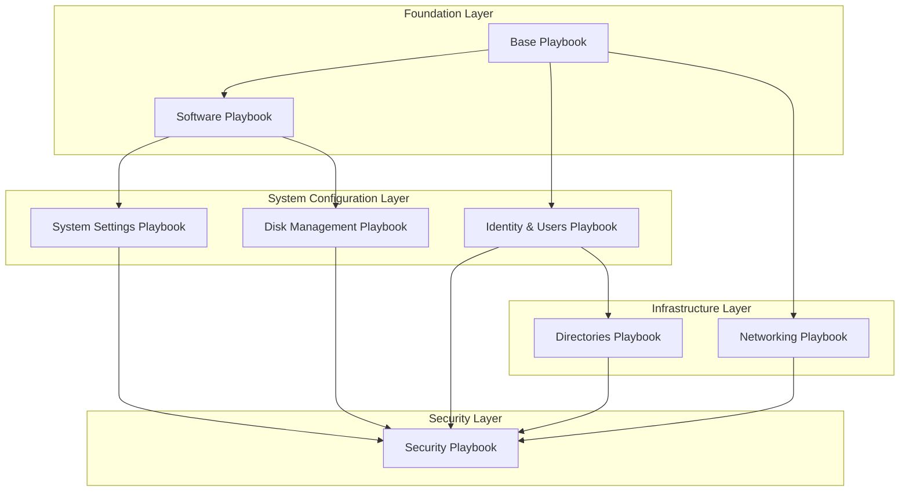
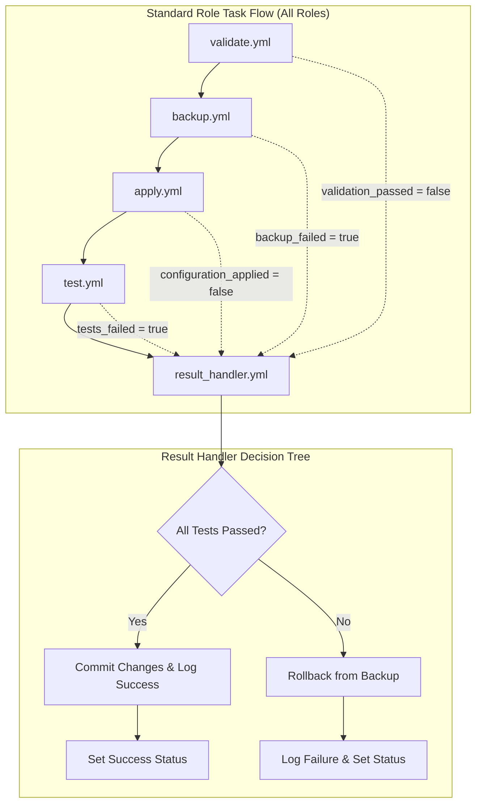

# Domain-Based Ansible Provisioning System

## Complete Implementation Plan

### PROJECT OVERVIEW

This system creates a domain-driven Ansible provisioning framework for infrastructure automation. The code gets packaged into VM templates and executed by an external orchestration system (`configure-node.sh` + systemd service) that checks for success markers.

### CORE ARCHITECTURAL DECISIONS

**Validation Granularity**: ROLE-LEVEL

- Each role implements: validate → backup → apply → test → revert/continue
- Reduces code duplication, easier rollback management
- Individual tasks within a role are cohesive operations

**Dependency Chain**:

```
Base → Software → System Settings → Disk → Identity → Directories → Networking → Security
```

**Execution Strategy**:

- Master orchestrator enforces dependencies
- Failed role skips dependent roles, continues with independent ones
- Each role is atomic (all-or-nothing within the role)

**Error Handling**:

- Continue if forthcoming task is not dependent on failed task
- Skip to next independent task/role/playbook if dependent
- Log failures and set status flags for dependency checking

### FOLDER STRUCTURE

```
provisioner/
├── ansible.cfg
├── requirements.yml
├── inventories/
│   └── production/
│       ├── hosts.yml
│       └── group_vars/
│           ├── k8s_master.yml       # Domain-organized variables
│           ├── k8s_worker.yml
│           ├── k8s_storage.yml
│           └── ans_controller.yml
├── playbooks/
│   ├── site.yml                     # Master orchestrator playbook
│   ├── base.yml                     # Timezone, locale, time sync, logging
│   ├── software.yml                 # Package installation
│   ├── system_settings.yml          # Kernel, sysctl, systemd, optimization
│   ├── disk_management.yml          # Partitioning, mounting, fstab
│   ├── identity_users.yml           # Users, SSH, groups, permissions
│   ├── directories.yml              # Directory creation, ownership
│   ├── networking.yml               # VLANs configuration
│   └── security.yml                 # Firewall, fail2ban, hardening
└── roles/
    ├── base/
    │   ├── tasks/
    │   │   ├── main.yml
    │   │   ├── validate.yml
    │   │   ├── backup.yml
    │   │   ├── apply.yml
    │   │   ├── test.yml
    │   │   └── result_handler.yml
    │   ├── handlers/main.yml
    │   └── templates/
    ├── software/
    ├── system_settings/
    ├── disk_management/
    ├── identity_users/
    ├── directories/
    ├── networking/
    └── security/
```

### 8 DOMAIN PLAYBOOKS

1. **base.yml** - Timezone, locale, time sync, logging (FOUNDATIONAL)
2. **software.yml** - Package installation (FOUNDATIONAL DEPENDENCY)
3. **system_settings.yml** - Kernel modules, sysctl, systemd, optimization
4. **disk_management.yml** - Partitioning, filesystem, mounting, fstab
5. **identity_users.yml** - Users, SSH, groups, permissions, keys
6. **directories.yml** - Creation, ownership, permissions (with cascade control)
7. **networking.yml** - VLANs configuration
8. **security.yml** - Firewall, fail2ban, hardening (DEPENDS ON MOST OTHERS)

### INVENTORY VARIABLE ORGANIZATION

Each `group_vars/role_name.yml` file structured by domain:

```yaml
# Example: k8s_master.yml
role:
    id: 110
    name: k8s-master
    category: kubernetes

base:
    timezone: Asia/Kolkata
    locale: en_US
    time_sync: true
    logging: true

software:
    packages:
        - curl
        - vim
        - containerd
        # ... role-specific packages

system_settings:
    kernel_modules: ['br_netfilter', 'overlay']
    sysctl:
        - name: net.bridge.bridge-nf-call-iptables
          value: 1
    systemd_services:
        - name: containerd
          enabled: true
          state: started

disk_management:
    partitions: [] # Role-specific disk config

identity:
    users:
        - username: ansible
          groups: [sudo]
          sudo: true
          shell: /bin/bash
          password_login: false
          hashed_passwd: $6$...
          ssh_keys:
              - ssh-ed25519 AAAAC3...

directories:
    - path: /opt/k8s
      owner: root
      group: root
      mode: '0755'
      cascade_ownership: true # Apply ownership to entire path
      cascade_permissions: true # Apply permissions to entire path
    - path: /var/log/kubernetes
      owner: root
      group: adm
      mode: '0755'
      cascade_ownership: false # Only final directory gets ownership
      cascade_permissions: false # Only final directory gets permissions

networking:
    vlans:
        - name: management
          id: 107
          gateway: 192.168.107.1
        # ... VLAN definitions

security:
    enabled: false # Start disabled, enable later
    ssh:
        hardening: false
        port: 22
        root_login: false
    firewall:
        enabled: false
        rules: []
```

### MASTER ORCHESTRATOR STRUCTURE

**site.yml** (Master Orchestrator):

```yaml
---
- import_playbook: base.yml
- import_playbook: software.yml

- import_playbook: system_settings.yml
  when: software_status == 'success'

- import_playbook: disk_management.yml
  when: software_status == 'success'

- import_playbook: identity_users.yml
  when: base_status == 'success'

- import_playbook: directories.yml
  when: identity_status == 'success'

- import_playbook: networking.yml
  when: base_status == 'success'

- import_playbook: security.yml
  when:
      - base_status == 'success'
      - software_status == 'success'
      - identity_status == 'success'
      - networking_status == 'success'
```

### INDIVIDUAL PLAYBOOK STRUCTURE

**Standard Template** (consistent across all playbooks):

```yaml
---
- name: [Domain Name] Configuration
  hosts: all
  become: true
  gather_facts: true
  vars:
    [domain]_status: "unknown"

  roles:
    - role: [domain_name]
      when: [domain_name] is defined

  post_tasks:
    - name: Set domain completion status
      set_fact:
        "[domain]_status": "{{ 'success' if ansible_failed_task is not defined else 'failed' }}"
```

### ROLE SAFETY PATTERN

Each role follows this pattern in `tasks/main.yml`:

```yaml
---
# Phase 1: VALIDATE
- name: 'Validate {{ role_name }} prerequisites'
  include_tasks: validate.yml
  register: validation_result
  ignore_errors: true

# Phase 2: BACKUP
- name: 'Backup {{ role_name }} configurations'
  include_tasks: backup.yml
  when: validation_result is succeeded

# Phase 3: APPLY
- name: 'Apply {{ role_name }} configuration'
  include_tasks: apply.yml
  when: validation_result is succeeded
  register: apply_result
  ignore_errors: true

# Phase 4: TEST
- name: 'Test {{ role_name }} configuration'
  include_tasks: test.yml
  when: apply_result is succeeded
  register: test_result
  ignore_errors: true

# Phase 5: HANDLE RESULT
- name: 'Handle {{ role_name }} result'
  include_tasks: result_handler.yml
  when: apply_result is defined
```

### TASK FILE ORGANIZATION (PER ROLE)

Each role contains these task files:

- **validate.yml** - Pre-flight checks, set validation_passed flag
- **backup.yml** - Backup existing configs if applicable
- **apply.yml** - Apply new configuration (may include sub-tasks)
- **test.yml** - Validate new configuration works
- **result_handler.yml** - Success/failure handling and rollback logic

### DEPENDENCY DIAGRAMS

#### Inter-Playbook Dependencies



#### Intra-Playbook Dependencies (Role & Task Level)



### IMPLEMENTATION SEQUENCE (MULTI-AGENT)

**Phase 1: Foundation** (System Engineering Agent - Responses 1-2)

1. Base role (timezone, locale, time sync, logging)
2. Software role (package installation with validation)

**Phase 2: System Core** (System Engineering Agent + Security Engineering Agent - Responses 3-5) 3. System Settings role (kernel, sysctl, systemd, optimization) - System Agent 4. Disk Management role (partitioning, mounting, fstab) - System Agent 5. Identity & Users role (users, SSH, groups, permissions) - Security Agent

**Phase 3: Infrastructure** (DevOps Integration Agent + Network Engineering Agent - Responses 6-7) 6. Directories role (creation, ownership, permissions with cascade control) - DevOps Agent 7. Networking role (VLANs configuration) - Network Agent

**Phase 4: Security & Integration** (Security Engineering Agent + DevOps Integration Agent - Responses 8-9) 8. Security role (firewall, fail2ban, hardening) - Security Agent 9. Master orchestrator integration and testing - DevOps Agent

**Phase 5: Finalization** (DevOps Integration Agent - Response 10) 10. Complete integration testing and documentation - DevOps Agent

### QUALITY GATES

Each implementation response must include:

- Complete working code for the assigned component
- Safety validations and rollback mechanisms
- Clear error messages and logging
- Integration points with other roles
- Testing and validation procedures

### SUCCESS CRITERIA

**Technical**:

- No duplicate operations across roles
- Atomic role operations (all-or-nothing)
- Proper dependency handling
- Safe rollback on failures
- Clear logging and error reporting

**Functional**:

- Each role can run independently (if prerequisites met)
- Failed roles don't break independent functionality
- Easy to enable/disable features via boolean gates
- Production-ready safety mechanisms

### SPECIAL REQUIREMENTS

**Directory Cascade Control**:

```yaml
directories:
    - path: /opt/scripts/system/
      owner: root
      group: root
      mode: '0755'
      cascade_ownership: true # Applies root:root to /opt, /opt/scripts, /opt/scripts/system
      cascade_permissions: true # Applies 0755 to entire path
```

**Error Handling Strategy**:

- Role-level atomicity: all tasks in role succeed or role fails
- Dependency-aware continuation: skip dependent, continue independent
- Comprehensive logging: all failures logged with context
- Safe rollback: backup-based recovery for critical changes

### EXECUTION CONTEXT

This Ansible collection gets packaged into VM templates. External orchestration (`configure-node.sh` + systemd service) executes the playbooks and manages success markers. The provisioner code itself does not handle execution - it's a pure Ansible collection designed for template packaging.
