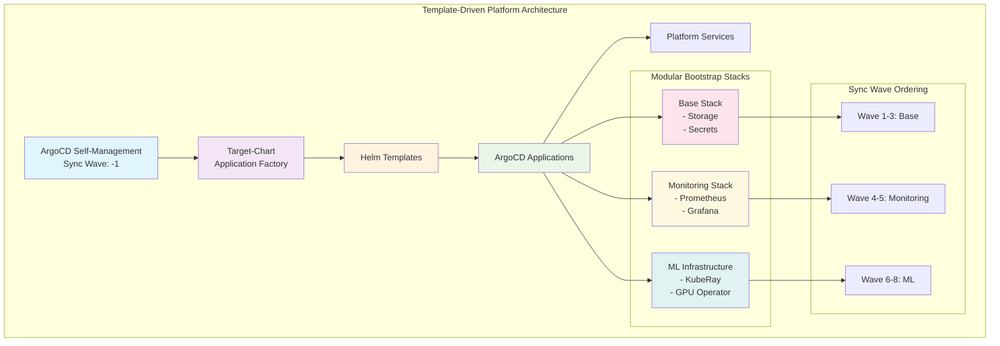

# Platform Infrastructure (Template-Driven Deployment)

This directory contains the complete template-driven deployment system for platform infrastructure management.

## Architecture Overview



## Directory Structure

```
platform/
├── target-chart/              # Application factory (Helm chart)
│   ├── Chart.yaml
│   ├── templates/
│   │   └── application.yaml   # Generates ArgoCD applications
│   ├── values-production.yaml # All 8 applications
│   ├── values-staging.yaml    # 5 applications (no ML)
│   ├── values-development.yaml # Dev environment
│   └── values.yaml           # Base values
├── charts/                   # Individual application charts
│   ├── argocd/              # ArgoCD self-management
│   ├── rook-ceph/           # Storage operator
│   ├── rook-ceph-cluster/   # Storage cluster
│   ├── vault/               # Secrets management
│   ├── prometheus/          # Monitoring
│   ├── grafana/             # Visualization
│   ├── kuberay-crds/        # ML CRDs
│   ├── kuberay-operator/    # ML operator
│   └── gpu-operator/        # GPU management
├── bootstrap/                # Platform deployment
│   ├── platform-root-template-driven.yaml # Main root application
│   ├── bootstrap-template-driven.sh       # Deployment script
│   ├── values-hooks.yaml                  # Hooks configuration
│   ├── infrastructure-validation.yaml     # Platform validation hook
│   ├── sync-failure-notification.yaml     # Failure notification hook
│   └── ARGOCD-SELF-MANAGEMENT.md          # Documentation
├── hooks/                    # ArgoCD hooks for automation
│   ├── validation/          # Pre-sync validation hooks
│   ├── health-checks/       # Post-sync health verification
│   ├── notifications/       # Failure and success notifications
│   └── README.md           # Hooks documentation
└── README.md                # This file
```

## Quick Start

### Prerequisites
- Kubernetes cluster running
- ArgoCD deployed (via Kubespray)
- kubectl and helm installed

### Deploy Complete Platform

```bash
# 1. Deploy template-driven root application (includes ArgoCD self-management)
kubectl apply -f bootstrap/platform-root-template-driven.yaml

# 2. Verify deployment
kubectl get applications -n argocd

# 3. Monitor all platform components
watch kubectl get applications -n argocd
```

### Deploy with Automation Script

```bash
# Use the bootstrap script for guided deployment
./bootstrap/bootstrap-template-driven.sh

# Options:
# - base: Core infrastructure only (storage, secrets)
# - monitoring: Base + monitoring stack  
# - ml: Base + monitoring + ML infrastructure
# - all: Complete platform (production)
```

### Deploy Selective Stacks (Advanced)

```bash
# Generate specific environment configurations
helm template platform-stage target-chart -f target-chart/values-staging.yaml | kubectl apply -f -

# Deploy development environment (minimal apps)  
helm template platform-dev target-chart -f target-chart/values-development.yaml | kubectl apply -f -

# Custom stack via target-chart
helm template my-stack target-chart -f my-custom-values.yaml | kubectl apply -f -
```

## Platform Services

| Service | Sync Wave | Purpose | Stack |
|---------|-----------|---------|-------|
| argocd-self-management | -1 | GitOps self-management | Core |
| rook-ceph | 1 | Storage operator | Base |
| rook-ceph-cluster | 2 | Storage cluster | Base |
| vault | 3 | Secrets management | Base |
| prometheus | 4 | Monitoring | Monitoring |
| grafana | 5 | Visualization | Monitoring |
| kuberay-crds | 6 | ML CRDs | ML |
| kuberay-operator | 7 | ML operator | ML |
| gpu-operator | 8 | GPU management | ML |

## Configuration Management

### Environment-Specific Deployments

```bash
# Production (all 8 applications)
helm template platform-prod target-chart -f target-chart/values-production.yaml

# Staging (5 applications, no ML)
helm template platform-stage target-chart -f target-chart/values-staging.yaml

# Development (custom configuration)
helm template platform-dev target-chart -f my-dev-values.yaml
```

### Modifying Configurations

1. **Application-specific changes**: Edit `charts/{app}/values.yaml`
2. **Stack-specific changes**: Edit `bootstrap/values-{stack}.yaml`
3. **Environment changes**: Edit `target-chart/values-{env}.yaml`

### Adding New Applications

1. Create new chart in `charts/new-app/`
2. Add to appropriate values files
3. Apply bootstrap applications

## Migration from Legacy

The template-driven system replaces the previous static application approach:

- **Before**: 8 static YAML files in `applications/`
- **After**: Dynamic generation from `target-chart/`
- **Legacy files**: Archived in `../../archive/platform-legacy/`

### Rollback Procedure

```bash
# 1. Remove template-driven applications  
kubectl delete -f bootstrap/

# 2. Restore legacy files
mkdir -p applications/
cp ../../archive/platform-legacy/legacy-applications/* applications/

# 3. Apply legacy root application
kubectl apply -f /path/to/legacy/platform-root-app.yaml
```

## Operational Procedures

### Monitoring Deployment Status

```bash
# Check all applications
kubectl get applications -n argocd

# Check specific stack
kubectl get applications -n argocd -l stack=base

# Check sync status
kubectl get applications -n argocd -o custom-columns=NAME:.metadata.name,SYNC:.status.sync.status,HEALTH:.status.health.status
```

### Troubleshooting

**Application Stuck in Sync:**
```bash
kubectl describe application <app-name> -n argocd
```

**Template Generation Issues:**
```bash
helm template test-stack target-chart -f values-file.yaml --debug
```

**Sync Wave Problems:**
```bash
kubectl get applications -n argocd -o custom-columns=NAME:.metadata.name,SYNC-WAVE:.metadata.annotations.argocd\.argoproj\.io/sync-wave
```

## Platform Hooks

The platform includes automated validation, health checks, and failure notifications via ArgoCD hooks:

### Hook Categories

#### Validation Hooks (Pre-Sync)
- **Infrastructure Validation** (Wave -10): Validates ArgoCD, namespaces, CNI, ingress, cert-manager
- **Storage Validation** (Wave -5): Validates storage prerequisites before Rook-Ceph deployment

#### Health Check Hooks (Post-Sync)
- **Rook-Ceph Health Check** (Wave 2): Comprehensive Ceph cluster validation after deployment
- **Monitoring Validation** (Wave 5): Monitoring stack health verification

#### Notification Hooks (On Failure)
- **Sync Failure Notification**: Automated failure alerting and logging

### Hook Configuration

Enable/disable hooks per environment via values files:

```yaml
# Production - all hooks enabled
global:
  hooks:
    enabled: true
    validation:
      infrastructure: true
      storage: true
    healthChecks:
      rookCeph: true
      monitoring: true
    notifications:
      syncFailure: true

# Development - minimal hooks
global:
  hooks:
    enabled: false
    notifications:
      syncFailure: true  # Keep failure notifications
```

### Hook Management

```bash
# View hook execution status
kubectl get jobs -n argocd -l argocd.argoproj.io/hook

# Check hook logs
kubectl logs job/platform-infrastructure-validation -n argocd

# Clean up completed hooks
kubectl delete jobs -n argocd -l argocd.argoproj.io/hook-delete-policy=BeforeHookCreation
```

## Benefits

✅ **Modular Deployment**: Deploy base, monitoring, or ML stacks independently  
✅ **Environment Flexibility**: Easy creation of dev/staging/prod variants  
✅ **Template-Driven**: Zero static manifests, everything generated from values  
✅ **GitOps Compliant**: Complete infrastructure-as-code with ArgoCD self-management  
✅ **Reduced Maintenance**: Single source of truth in values files  
✅ **Application Factory Pattern**: Industry-standard GitOps pattern implementation  
✅ **Automated Validation**: Pre-sync hooks prevent deployment failures  
✅ **Health Monitoring**: Post-sync hooks verify component health  
✅ **Failure Detection**: Immediate notification of sync failures  

## Documentation

- [ArgoCD Self-Management Guide](bootstrap/ARGOCD-SELF-MANAGEMENT.md)
- [Template Testing](validate-applications.sh)
- [Validation Report](validation-report.md)
- [Architecture Specs](../../openspec/changes/template-driven-deployment/)

## Support

For questions about the template-driven deployment system:
1. Check the troubleshooting section above
2. Review the ArgoCD application logs
3. Validate template generation with helm
4. Consult the OpenSpec documentation