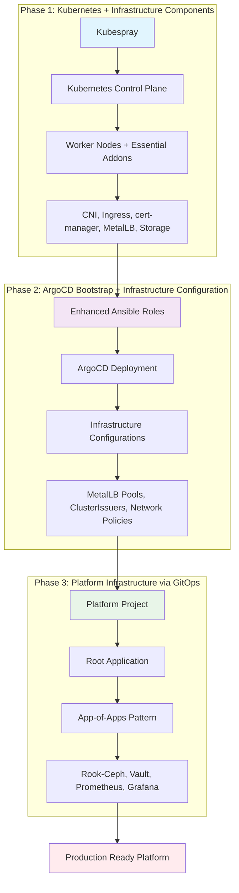
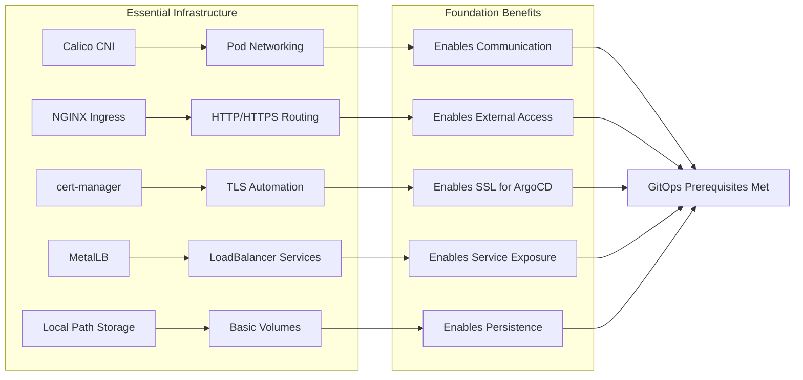
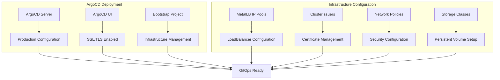
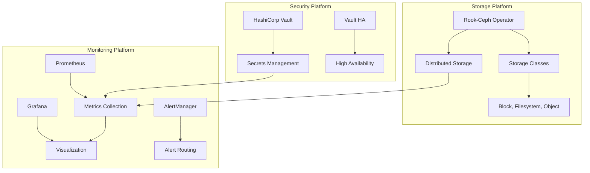
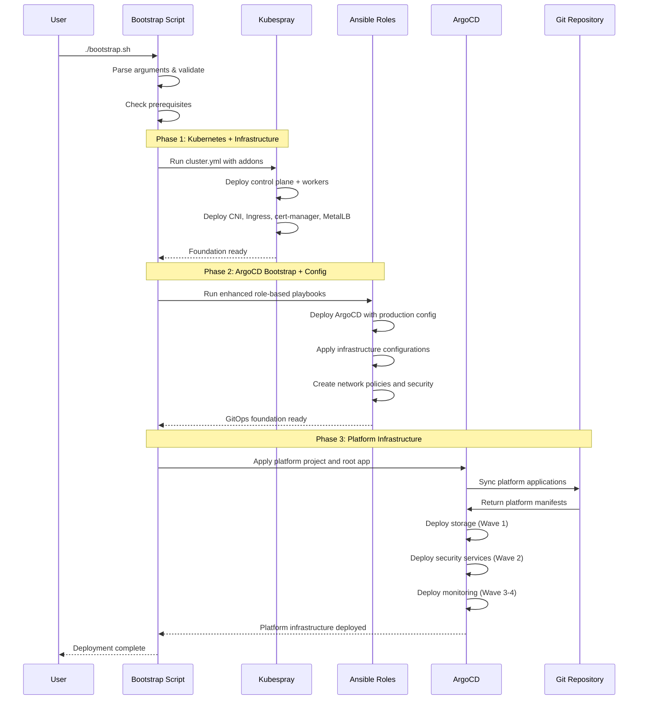
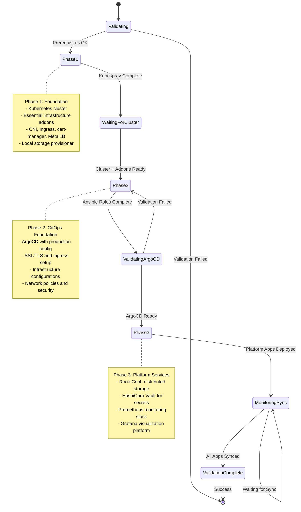
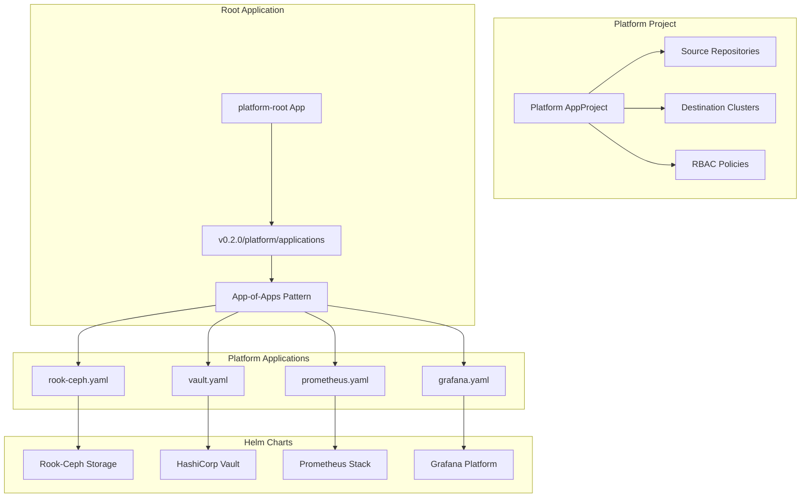

# Production Kubernetes Infrastructure Bootstrap

A comprehensive, production-grade Kubernetes cluster bootstrap system implementing **enhanced 3-phase architecture** with GitOps principles and proper separation of concerns. This system deploys a complete platform from bare cluster to production-ready infrastructure with monitoring, security, and storage.

## 🎯 System Overview

This bootstrap system solves the fundamental **chicken-and-egg problem** in Kubernetes infrastructure deployment while implementing enterprise-grade automation and validation. The **enhanced 3-phase architecture** consolidates the previous 4-phase system into a more efficient and maintainable structure.

### Enhanced 3-Phase Architecture



## 🏗️ Architecture Deep Dive

### Migration from 4-Phase to 3-Phase

The enhanced architecture consolidates phases for better efficiency:

| Previous 4-Phase | Enhanced 3-Phase | Benefits |
|------------------|------------------|----------|
| Phase 1: Naked Cluster | **Phase 1: Kubernetes + Infrastructure** | ✅ Single deployment with addons |
| Phase 2: Infrastructure | ↗ *Merged into Phase 1* | ✅ Leverages Kubespray addon system |
| Phase 3: ArgoCD | **Phase 2: ArgoCD Bootstrap + Config** | ✅ Combines deployment with configuration |
| Phase 4: GitOps Apps | **Phase 3: Platform Infrastructure** | ✅ App-of-apps pattern with platform focus |

### System Components

#### Phase 1: Foundation Layer (Kubespray-Managed)


#### Phase 2: GitOps Foundation (Ansible-Managed)


#### Phase 3: Platform Services (GitOps-Managed)


## 🚀 Quick Start

### Prerequisites

```bash
# Install required tools
sudo apt update
sudo apt install -y ansible python3-pip kubectl helm git

# Install Ansible collections
ansible-galaxy collection install kubernetes.core

# Install Python dependencies
pip3 install kubernetes PyYAML
```

### Configuration Checklist

Before deployment, complete the [Configuration Checklist](bootstrap/CONFIGURATION_CHECKLIST.md):

- [ ] **Repository Configuration**: Git repository URL and branch
- [ ] **Domain Configuration**: Cluster domain and ArgoCD hostname
- [ ] **Network Configuration**: MetalLB IP range and DNS
- [ ] **Storage Configuration**: Block devices for Rook-Ceph
- [ ] **Resource Requirements**: Sufficient CPU, memory, storage

### Deployment

#### Full Bootstrap (All 3 Phases)
```bash
cd bootstrap/scripts
./bootstrap.sh
```

#### Advanced Usage
```bash
# Use specific inventory with verbose output
./bootstrap.sh -i pn-production -v

# Start from ArgoCD bootstrap phase
./bootstrap.sh -s 2

# Use configuration file with debug mode
./bootstrap.sh -c production-config.yml -d

# Skip confirmations for automation
./bootstrap.sh -y

# Pass extra variables
./bootstrap.sh -e "cluster_domain=prod.example.com"

# Deep reset cluster
./bootstrap.sh --reset
```

## 📋 Enhanced Bootstrap Flow

### Bootstrap Sequence Diagram



### State Machine Diagram



## 📚 Enhanced Ansible Architecture

### Role-Based Structure

The enhanced architecture implements **Playbooks → Roles → Tasks** pattern with **validate → deploy → verify → reset** lifecycle:

```
phase-2-argo-bootstrap/ansible/
├── playbooks/
│   ├── deploy-argocd.yml          # Main deployment orchestration
│   └── reset-argocd.yml           # Complete cleanup and reset
├── roles/
│   ├── common/                    # Shared validation and utilities
│   │   ├── tasks/
│   │   │   ├── validate.yml       # Common prerequisites
│   │   │   ├── verify.yml         # Common health checks
│   │   │   └── reset.yml          # Common cleanup
│   │   └── defaults/main.yml      # Common variables
│   ├── argocd-deployment/         # ArgoCD deployment role
│   │   ├── tasks/
│   │   │   ├── validate.yml       # ArgoCD prerequisites
│   │   │   ├── deploy.yml         # ArgoCD deployment
│   │   │   ├── verify.yml         # ArgoCD health checks
│   │   │   └── reset.yml          # ArgoCD cleanup
│   │   ├── templates/             # ArgoCD configuration templates
│   │   └── defaults/main.yml      # ArgoCD variables
│   └── infrastructure-config/     # Infrastructure configuration role
│       ├── tasks/
│       │   ├── validate.yml       # Configuration prerequisites
│       │   ├── deploy.yml         # Configuration deployment
│       │   ├── verify.yml         # Configuration verification
│       │   └── reset.yml          # Configuration cleanup
│       └── defaults/main.yml      # Configuration variables
├── inventory/                     # Copied from Kubespray
└── ansible.cfg                    # Ansible configuration
```

### 6-Layer Validation Framework

The enhanced architecture implements comprehensive validation:

#### Layer 1: Control Node Validation
- Ansible collections and Python dependencies
- Kubectl configuration and cluster access
- Git repository connectivity and authentication

#### Layer 2: Cluster Connectivity
- Kubernetes API accessibility
- Node status and readiness verification
- Core component health checks

#### Layer 3: Helm Repository Validation
- Repository accessibility from cluster nodes
- Chart availability and version compatibility
- Network connectivity to Helm repositories

#### Layer 4: Variable Validation
- Required configuration variables presence
- Domain name format and DNS resolution
- Git repository URL validation and access

#### Layer 5: Prerequisites Validation
- Phase 1 component verification (CNI, Ingress, etc.)
- Namespace existence and RBAC permissions
- Resource availability and capacity checks

#### Layer 6: Resource Validation
- Available cluster resources (CPU, memory, storage)
- Storage device availability for Ceph
- Network policy compatibility and firewall rules

### Enhanced Error Handling

```yaml
# Example from deploy-argocd.yml
rescue:
  - name: Phase 2 deployment failed
    debug:
      msg: |
        ❌ PHASE 2 DEPLOYMENT FAILED
        Error: {{ ansible_failed_result.msg | default('Unknown error') }}
        Task: {{ ansible_failed_task.name | default('Unknown task') }}
        
        🔧 Troubleshooting Steps:
        1. Check cluster connectivity: kubectl cluster-info
        2. Verify prerequisites: kubectl get nodes
        3. Check logs: kubectl logs -n argocd -l app.kubernetes.io/name=argocd
        4. Reset deployment: ansible-playbook reset/reset-phase-2.yml

  - name: Set deployment failure marker
    kubernetes.core.k8s:
      definition:
        apiVersion: v1
        kind: ConfigMap
        metadata:
          name: phase2-deployment-failure
          namespace: default
        data:
          failure-timestamp: "{{ ansible_date_time.iso8601 }}"
          failure-task: "{{ ansible_failed_task.name | default('Unknown') }}"
```

## 🔄 GitOps Platform Architecture

### App-of-Apps Pattern

Phase 3 uses the **App-of-Apps pattern** for platform service management:



### Application Sync Waves

Platform applications deploy in carefully orchestrated waves:

```mermaid
gantt
    title Platform Infrastructure Deployment Timeline
    dateFormat X
    axisFormat %s
    
    section Wave 1: Storage
    Rook-Ceph         :w1, 0, 120
    
    section Wave 2: Security  
    Vault HA          :w2, after w1, 90
    
    section Wave 3: Monitoring
    Prometheus        :w3, after w2, 60
    
    section Wave 4: Visualization
    Grafana           :w4, after w3, 30
```



### Sync Wave Configuration

```yaml
# Wave ordering for platform applications
apiVersion: argoproj.io/v1alpha1
kind: Application
metadata:
  name: rook-ceph
  annotations:
    argocd.argoproj.io/sync-wave: "1"  # Storage foundation

---
apiVersion: argoproj.io/v1alpha1
kind: Application
metadata:
  name: vault
  annotations:
    argocd.argoproj.io/sync-wave: "2"  # Security services

---
apiVersion: argoproj.io/v1alpha1
kind: Application
metadata:
  name: prometheus
  annotations:
    argocd.argoproj.io/sync-wave: "3"  # Monitoring foundation
```

## 🔧 Phase Documentation

Each phase includes comprehensive documentation and validation:

### Phase 1: Kubernetes + Infrastructure Components
- **Location**: [phase-1-k8s/README.md](bootstrap/phase-1-k8s/README.md)
- **Focus**: Kubespray deployment with essential addons
- **Components**: CNI, Ingress, cert-manager, MetalLB, storage
- **Validation**: Node readiness, addon health, network connectivity

### Phase 2: ArgoCD Bootstrap + Infrastructure Configuration
- **Location**: [phase-2-argo-bootstrap/README.md](bootstrap/phase-2-argo-bootstrap/README.md)
- **Focus**: ArgoCD deployment and infrastructure configuration
- **Components**: ArgoCD, MetalLB pools, ClusterIssuers, network policies
- **Validation**: ArgoCD health, configuration sync, security policies

### Phase 3: Platform Infrastructure via GitOps
- **Location**: [phase-3-platform-infra/README.md](bootstrap/phase-3-platform-infra/README.md)
- **Focus**: Platform services via GitOps workflows
- **Components**: Rook-Ceph, Vault, Prometheus, Grafana
- **Validation**: Platform health, storage readiness, monitoring metrics

## 🔍 Troubleshooting Guide

### Common Issues and Solutions

#### 1. Phase 1: Kubespray Addon Issues
```bash
# Check addon status
kubectl get pods -n kube-system
kubectl get pods -n ingress-nginx
kubectl get pods -n cert-manager
kubectl get pods -n metallb-system

# Verify addon configuration
kubectl get ingressclass
kubectl get clusterissuers
kubectl get ipaddresspools -n metallb-system
```

#### 2. Phase 2: ArgoCD Bootstrap Issues
```bash
# Check ArgoCD deployment
kubectl get pods -n argocd
kubectl get applications -n argocd

# Check role deployment logs
cd phase-2-argo-bootstrap/ansible
tail -f ansible.log

# Reset Phase 2 if needed
ansible-playbook playbooks/reset-argocd.yml
```

#### 3. Phase 3: Platform Application Issues
```bash
# Check platform applications
kubectl get applications -n argocd -l managed-by=argocd
argocd app list

# Check specific application status
argocd app get rook-ceph
kubectl describe application vault -n argocd

# Check platform services
kubectl get pods -n rook-ceph
kubectl get pods -n vault
kubectl get pods -n monitoring
```

### Recovery Procedures

#### Phase-Specific Reset
```bash
# Reset specific phase
./bootstrap.sh --start 2  # Restart from Phase 2
./bootstrap.sh --start 3  # Restart from Phase 3

# Or use phase-specific reset
cd phase-2-argo-bootstrap/ansible
ansible-playbook playbooks/reset-argocd.yml
```

#### Complete Cluster Reset
```bash
# Full infrastructure reset
./bootstrap.sh --reset

# Manual Kubespray reset
cd kubespray
ansible-playbook -i inventory/pn-production/inventory.ini reset.yml
```

## 📊 Monitoring and Observability

### Access Information

#### ArgoCD Access
```bash
# ArgoCD UI access
kubectl port-forward -n argocd svc/argocd-server 8080:80
# Access: http://localhost:8080

# Get admin password
kubectl -n argocd get secret argocd-initial-admin-secret \
  -o jsonpath='{.data.password}' | base64 -d
```

#### Platform Services Access
```bash
# Grafana (monitoring visualization)
kubectl port-forward -n monitoring svc/prometheus-grafana 3000:80
# Default: admin / (check secret)

# Prometheus (metrics collection)
kubectl port-forward -n monitoring svc/prometheus-kube-prometheus-prometheus 9090:9090

# Vault (secrets management)
kubectl port-forward -n vault svc/vault-ui 8200:8200
# Initialize: kubectl exec -n vault vault-0 -- vault operator init
```

### Key Metrics to Monitor

1. **Cluster Health**:
   - Node status and resource utilization
   - Pod restart rates and failure patterns
   - Network connectivity and performance

2. **ArgoCD Health**:
   - Application sync status and frequency
   - Sync failure rates and error patterns
   - Git repository connectivity and performance

3. **Storage Health**:
   - Ceph cluster status and performance
   - PV/PVC usage patterns and capacity
   - Storage I/O performance metrics

4. **Platform Services**:
   - Vault seal status and performance
   - Prometheus metrics collection rates
   - Grafana dashboard access and performance

## 🎯 Production Readiness

### Configuration Checklist

Before production deployment, complete the comprehensive [Configuration Checklist](bootstrap/CONFIGURATION_CHECKLIST.md):

- [ ] **Pre-Deployment**: Repository, domain, network, storage, resources
- [ ] **Phase-Specific**: Phase 1, 2, and 3 configurations
- [ ] **Security**: SSL/TLS, RBAC, network policies, pod security
- [ ] **Validation**: Pre-deployment checks and verification commands
- [ ] **Backup**: Recovery planning and reset procedures

### Security Hardening
- [ ] Configure RBAC policies for all services
- [ ] Enable network policies for service isolation
- [ ] Set up pod security standards and restrictions
- [ ] Configure image scanning and vulnerability management
- [ ] Enable comprehensive audit logging

### Backup and Disaster Recovery
- [ ] Set up Velero for cluster and application backups
- [ ] Configure etcd backup automation
- [ ] Document disaster recovery procedures
- [ ] Test backup restoration procedures regularly

### Monitoring and Alerting
- [ ] Configure alerting rules for all platform services
- [ ] Set up notification channels (Slack, email, PagerDuty)
- [ ] Create operational runbooks for common scenarios
- [ ] Establish SLA/SLO metrics and monitoring

## 🚀 Next Steps

### Immediate Post-Deployment

1. **Initialize Platform Services**:
   ```bash
   # Initialize Vault (one-time setup)
   kubectl exec -n vault vault-0 -- vault operator init
   kubectl exec -n vault vault-0 -- vault operator unseal <key1>
   kubectl exec -n vault vault-0 -- vault operator unseal <key2>
   kubectl exec -n vault vault-0 -- vault operator unseal <key3>
   ```

2. **Configure ArgoCD RBAC**:
   - Set up user groups and permissions
   - Configure OIDC authentication if needed
   - Create additional projects for applications

3. **Verify Platform Health**:
   ```bash
   # Check all phase deployments
   kubectl get nodes
   kubectl get applications -n argocd
   kubectl get cephcluster -n rook-ceph
   kubectl exec -n vault vault-0 -- vault status
   ```

### Advanced Configuration

1. **Deploy Your Applications**:
   - Create additional ArgoCD projects
   - Add application manifests to Git repository
   - Configure application-specific sync policies

2. **Enhance Security**:
   - Implement zero-trust networking
   - Set up secrets management workflows with Vault
   - Configure compliance scanning and reporting

3. **Optimize Performance**:
   - Tune resource allocation for workloads
   - Optimize storage performance for applications
   - Configure autoscaling and resource management

## 📈 Benefits of Enhanced 3-Phase Architecture

### Simplified Operations
- ✅ **Reduced Complexity**: 3 phases instead of 4 reduces operational overhead
- ✅ **Consolidated Phases**: Logical grouping of related components
- ✅ **Clearer Dependencies**: Simplified dependency chain and validation
- ✅ **Faster Deployment**: Optimized phase ordering reduces total deployment time

### Enhanced Reliability
- ✅ **Comprehensive Validation**: 6-layer validation framework with fail-fast approach
- ✅ **Role-Based Architecture**: Structured Ansible roles with lifecycle management
- ✅ **Production Configuration**: Enterprise-grade settings and security hardening
- ✅ **Complete Rollback**: Phase-specific and complete cluster reset capabilities

### GitOps Excellence
- ✅ **Native ArgoCD Integration**: Platform services managed via GitOps from deployment
- ✅ **App-of-Apps Pattern**: Scalable application management with sync wave orchestration
- ✅ **Self-Management**: ArgoCD manages its own configuration and upgrades
- ✅ **Declarative Infrastructure**: All configurations stored in Git with proper versioning

### Enterprise Ready
- ✅ **High Availability**: HA configurations for all critical services
- ✅ **Security First**: Comprehensive security policies and network isolation
- ✅ **Observability**: Full monitoring stack with Prometheus and Grafana
- ✅ **Secrets Management**: Enterprise-grade secrets handling with Vault
- ✅ **Storage Platform**: Distributed storage with Rook-Ceph for production workloads

### Zero-Surprise Deployment
- ✅ **Fail Fast**: Issues detected before partial deployments cause problems
- ✅ **Comprehensive Logging**: Detailed logs and error reporting for troubleshooting
- ✅ **Health Validation**: Continuous health checks throughout deployment process
- ✅ **Recovery Procedures**: Well-defined rollback and recovery procedures
- ✅ **Documentation**: Complete documentation for all components and procedures

---

This enhanced 3-phase bootstrap solution provides a **zero-surprise, production-ready foundation** that eliminates common pitfalls in Kubernetes infrastructure deployment while enabling full GitOps workflows with comprehensive validation and monitoring. The streamlined architecture reduces complexity while maintaining enterprise-grade reliability and security standards.