# Production Kubernetes Infrastructure Bootstrap

A comprehensive, production-grade Kubernetes cluster bootstrap system that implements GitOps principles with proper separation of concerns. This system deploys a naked cluster, sets up critical infrastructure, and enables GitOps-based application deployment through ArgoCD.

## 🎯 System Overview

This bootstrap system solves the fundamental **chicken-and-egg problem** in Kubernetes infrastructure deployment:
- ArgoCD needs networking, storage, and certificates to function
- These components can't be deployed via ArgoCD if ArgoCD isn't running yet
- Manual deployment is error-prone and not reproducible

### Solution: Phased Bootstrap Architecture


## 🏗️ Architecture Deep Dive

### System Components

#### Bootstrap Infrastructure (Ansible-Managed)


#### GitOps Infrastructure (ArgoCD-Managed)


## 🚀 Quick Start

### Prerequisites

```bash
# Install required tools
sudo apt update
sudo apt install -y ansible python3-pip kubectl helm git

# Install Ansible collections
ansible-galaxy collection install kubernetes.core
ansible-galaxy collection install helm.helm

# Install Python dependencies
pip3 install kubernetes pyyaml
```

### Configuration

1. **Update Inventory** for your environment:
   ```bash
   vim bootstrap/kubespray/inventory/pn-production/inventory.ini
   ```

2. **Set Environment Variables** (optional):
   ```bash
   export PN_CLUSTER_DOMAIN="your-domain.com"
   export PN_GIT_REPO="https://github.com/your-org/pn-infra.git"
   export PN_GIT_BRANCH="main"
   ```

### Deployment

#### Full Bootstrap
```bash
cd bootstrap/scripts
./bootstrap.sh
```

#### Advanced Usage
```bash
# Use staging inventory with verbose output
./bootstrap.sh -i staging -v

# Start from infrastructure phase with config file
./bootstrap.sh -s 2 -c production-config.yml

# Debug mode with custom log directory
./bootstrap.sh -d -l /var/log/bootstrap

# Skip confirmations for CI/CD
./bootstrap.sh -y

# Pass extra variables
./bootstrap.sh -e "cluster_name=prod-east"

# Deep reset cluster
./bootstrap.sh --reset
```

## 📋 Detailed System Flow

### Bootstrap Sequence Diagram


### State Machine Diagram


## 📚 Ansible Playbooks Deep Dive

### 1. `post-install-infrastructure.yml`

**Purpose**: Deploy critical infrastructure components that ArgoCD depends on.

**What it does**:
- **Cilium CNI**: Enables pod networking and communication
- **Multus CNI**: Provides multi-networking capabilities  
- **NGINX Ingress**: HTTP/HTTPS traffic routing and load balancing
- **Cert-Manager**: Automated TLS certificate provisioning and renewal
- **Local Path Provisioner**: Basic persistent volume support
- **Vault HA**: Secrets management with high availability

**Why Ansible and not ArgoCD**:
- These components are **prerequisites** for ArgoCD to function
- ArgoCD needs networking, ingress, and certificates to operate
- Bootstrapping problem: can't use ArgoCD to deploy ArgoCD's dependencies

**Key Tasks**:
```yaml
# 1. Deploy Cilium CNI
- name: Deploy Cilium CNI via Helm
  kubernetes.core.helm:
    name: cilium
    chart_ref: cilium/cilium
    namespace: kube-system
    values:
      cluster:
        name: "{{ cluster_name }}"
      hubble:
        enabled: true

# 2. Deploy NGINX Ingress
- name: Deploy NGINX Ingress Controller
  kubernetes.core.helm:
    name: ingress-nginx
    chart_ref: ingress-nginx/ingress-nginx
    namespace: ingress-nginx
    
# 3. Deploy Cert-Manager with cluster issuer
# 4. Deploy Local Path Provisioner for basic storage
# 5. Deploy Vault with HA configuration
```

**Health Checks**:
- Verifies all pods are running
- Tests network connectivity
- Validates ingress functionality
- Confirms certificate provisioning

### 2. `bootstrap-argocd-production.yml`

**Purpose**: Deploy ArgoCD with production-grade configuration.

**What it does**:
- **ArgoCD Installation**: Uses official Helm chart with custom values
- **SSL/TLS Configuration**: Integrates with cert-manager for automatic certificates
- **Ingress Setup**: Configures NGINX ingress for external access
- **High Availability**: Multiple replicas for server and application controller
- **Resource Limits**: Production-appropriate CPU and memory limits
- **Projects Creation**: Sets up infrastructure project with proper RBAC
- **Self-Management**: Configures ArgoCD to manage itself via GitOps

**Key Configuration**:
```yaml
# ArgoCD Helm values
argocd:
  server:
    replicas: 2
    ingress:
      enabled: true
      ingressClassName: nginx
      annotations:
        cert-manager.io/cluster-issuer: letsencrypt-production
    resources:
      requests:
        cpu: 200m
        memory: 256Mi
      limits:
        cpu: 500m
        memory: 512Mi
        
  controller:
    replicas: 1
    resources:
      requests:
        cpu: 500m
        memory: 512Mi
      limits:
        cpu: 1000m
        memory: 1Gi
```

**Security Configuration**:
- RBAC roles and bindings
- Network policies (if enabled)
- Pod security contexts
- Resource quotas and limits

### 3. `deploy-infrastructure-apps.yml`

**Purpose**: Deploy infrastructure applications using GitOps patterns.

**What it does**:
- **Applies Entrypoint Manifests**: Uses the entrypoint/manifests system
- **Creates Infrastructure Project**: ArgoCD project with proper source repos
- **Deploys Root Application**: App-of-apps pattern for infrastructure
- **Monitors Sync Status**: Waits for applications to sync and become healthy
- **Health Reporting**: Provides detailed status of all deployed applications

**GitOps Flow**:
```yaml
# 1. Apply entrypoint manifests
- name: Apply infrastructure entrypoint manifests
  kubernetes.core.k8s:
    state: present
    src: "{{ entrypoint_path }}/kustomization.yaml"

# 2. Wait for root application sync
- name: Wait for infrastructure root application to sync
  kubernetes.core.k8s_info:
    api_version: argoproj.io/v1alpha1
    kind: Application
    name: infrastructure-root
    namespace: argocd
  until: root_app.resources[0].status.sync.status == 'Synced'
  
# 3. Monitor individual applications
- name: Wait for storage applications (Wave 1)
  # Monitors rook-ceph-operator, rook-ceph-cluster
  
- name: Wait for monitoring applications (Wave 2-3)  
  # Monitors prometheus-operator, grafana
```

**Application Monitoring**:
- Tracks sync status (OutOfSync, Synced, Unknown)
- Monitors health status (Healthy, Progressing, Degraded, Suspended, Missing, Unknown)
- Provides detailed reporting on deployment progress

### 4. `validate-infrastructure.yml`

**Purpose**: Comprehensive health validation of deployed infrastructure.

**What it does**:
- **Namespace Validation**: Ensures all required namespaces exist
- **Component Health Checks**: Validates each infrastructure component
- **Network Connectivity Tests**: Verifies pod-to-pod and external communication
- **Certificate Validation**: Checks TLS certificate provisioning
- **Storage Validation**: Tests persistent volume provisioning
- **ArgoCD Integration**: Validates ArgoCD connectivity and sync status

**Health Checks Include**:
```yaml
# Cilium health validation
- name: Verify Cilium DaemonSet status
- name: Test pod-to-pod connectivity via Cilium

# NGINX Ingress validation  
- name: Verify NGINX Ingress Controller deployment
- name: Test NGINX Ingress health endpoint

# Cert-Manager validation
- name: Verify Cert-Manager deployment
- name: Verify Cert-Manager webhook

# Vault validation
- name: Verify Vault StatefulSet
- name: Check Vault pod status

# ArgoCD validation
- name: Verify ArgoCD server deployment
- name: Verify ArgoCD application controller
```

## 🎭 ArgoCD Hooks Integration

### Enhanced GitOps with Native Validation

This system now includes **ArgoCD-native validation hooks** that complement the Ansible bootstrap process. These hooks provide comprehensive prerequisite checking and health validation using ArgoCD's built-in orchestration capabilities.

### Hook Types and Purpose

| Hook Type | Purpose | Examples |
|-----------|---------|----------|
| **PreSync** | Validate prerequisites before deployment | Infrastructure readiness, storage capacity, network connectivity |
| **PostSync** | Verify successful deployment | Health checks, API connectivity, cluster validation |
| **SyncFail** | Handle deployment failures | Notification, status reporting, troubleshooting info |

### Hook Workflow Integration

```mermaid
graph TD
    A[ArgoCD Sync Triggered] --> B[PreSync: Infrastructure Validation]
    B --> C{Prerequisites OK?}
    C -->|✅ Yes| D[Deploy Applications]
    C -->|❌ No| E[SyncFail: Send Notifications]
    D --> F[PostSync: Health Validation]
    F --> G[Deployment Complete]
    E --> H[Fix Issues & Retry]
```



### Available Hook Library

| Hook File | Purpose | Sync Wave |
|-----------|---------|-----------|
| `infrastructure-root-presync.yaml` | Master infrastructure validation | -10 |
| `infrastructure-presync-validation.yaml` | General prerequisite validation | -5 |
| `storage-presync-hook.yaml` | Storage-specific validation | 0 |
| `rook-ceph-health-check.yaml` | Ceph cluster health verification | 2 |
| `monitoring-postsync-hook.yaml` | Monitoring stack validation | 3 |
| `sync-failure-notification.yaml` | Failure handling and notification | N/A (SyncFail) |

### Validation Coverage

#### Infrastructure Validation (`sync-wave: -10`)
- ✅ ArgoCD health and external accessibility via ingress
- ✅ Cilium CNI operational status (pod networking enabled)
- ✅ NGINX Ingress Controller readiness and health endpoint
- ✅ Cert-Manager deployment and webhook validation
- ✅ Storage classes and basic PVC provisioning
- ✅ External Helm repository connectivity
- ✅ Cluster resource capacity assessment

#### Storage Validation (`sync-wave: 0`)
- ✅ Node storage capacity and availability
- ✅ Local path provisioner configuration
- ✅ Basic PVC provisioning functionality test
- ✅ Existing Ceph installation conflict detection

#### Ceph Health Check (`sync-wave: 2`)
- ✅ Rook-Ceph operator deployment verification
- ✅ Ceph cluster health and quorum establishment
- ✅ OSD, MON, and MGR pod validation
- ✅ Storage class creation verification
- ✅ Ceph tools integration and status reporting

#### Monitoring Validation (`sync-wave: 3`)
- ✅ Prometheus Operator readiness
- ✅ Grafana deployment and API accessibility
- ✅ AlertManager configuration validation
- ✅ ServiceMonitor resource validation
- ✅ Metrics collection verification

### Hook Integration Pattern

Applications can integrate hooks using ArgoCD's multi-source pattern:

```yaml
apiVersion: argoproj.io/v1alpha1
kind: Application
spec:
  sources:
    # Validation hooks
    - repoURL: "https://github.com/ProficientNowTech/pn-infra.git"
      path: v0.2.0/utils/hooks
      directory:
        include: "storage-presync-hook.yaml"
    # Main application
    - repoURL: https://charts.rook.io/release
      chart: rook-ceph
      targetRevision: v1.18.3
```

### Hook Monitoring and Debugging

```bash
# View hook job status
kubectl get jobs -n argocd -l argocd.argoproj.io/hook

# Check validation logs
kubectl logs -n argocd job/infrastructure-presync-validation

# Application sync status with hooks
argocd app get infrastructure-root --show-operation
```

## 🔄 GitOps Application Deployment

### Entrypoint System Architecture

The entrypoint system uses the **App-of-Apps pattern** to manage infrastructure applications:


### Application Sync Waves

Applications are deployed in carefully orchestrated waves to ensure proper dependencies:


### Sync Wave Configuration

```yaml
# Wave 1: Storage Infrastructure
metadata:
  annotations:
    argocd.argoproj.io/sync-wave: "1"
    
# Wave 2: Monitoring Operators
metadata:
  annotations:
    argocd.argoproj.io/sync-wave: "2"
    
# Wave 3: Monitoring Applications  
metadata:
  annotations:
    argocd.argoproj.io/sync-wave: "3"
```

## 🔧 Application Configuration Details

### Storage Applications

#### Rook-Ceph Operator
```yaml
# Helm chart configuration
source:
  repoURL: https://charts.rook.io/release
  chart: rook-ceph
  targetRevision: v1.18.3
  helm:
    values: |
      image:
        repository: rook/ceph
        tag: v1.18.3
      resources:
        requests:
          cpu: 200m
          memory: 256Mi
        limits:
          cpu: 500m
          memory: 512Mi
      csi:
        enableRbdDriver: true
        enableCephfsDriver: true
```

#### Rook-Ceph Cluster  
```yaml
# Cluster configuration
helm:
  values: |
    cephClusterSpec:
      cephVersion:
        image: quay.io/ceph/ceph:v18.2.4
      mon:
        count: 3
        allowMultiplePerNode: false
      mgr:
        count: 2
      dashboard:
        enabled: true
      storage:
        useAllNodes: true
        storageClassDeviceSets:
          - name: set1
            count: 3
            volumeClaimTemplates:
              - spec:
                  accessModes: ["ReadWriteOnce"]
                  resources:
                    requests:
                      storage: 50Gi
                  storageClassName: local-path
```

### Monitoring Applications

#### Prometheus Operator
```yaml
source:
  repoURL: https://prometheus-community.github.io/helm-charts
  chart: kube-prometheus-stack
  targetRevision: 65.1.1
  helm:
    values: |
      prometheus:
        prometheusSpec:
          retention: 15d
          storageSpec:
            volumeClaimTemplate:
              spec:
                resources:
                  requests:
                    storage: 50Gi
      grafana:
        enabled: true
        adminPassword: admin123
        persistence:
          enabled: true
          size: 10Gi
```

#### Grafana
```yaml
source:
  repoURL: https://grafana.github.io/helm-charts
  chart: grafana
  targetRevision: 8.5.2
  helm:
    values: |
      datasources:
        datasources.yaml:
          datasources:
            - name: Prometheus
              type: prometheus
              url: http://prometheus-operated:9090
      dashboards:
        default:
          kubernetes-cluster-monitoring:
            gnetId: 7249
```

## 🔍 Troubleshooting Guide

### Common Issues and Solutions

#### 1. Cilium Pods Not Starting
```bash
# Check Cilium DaemonSet status
kubectl get daemonset -n kube-system cilium

# Check Cilium logs
kubectl logs -n kube-system -l k8s-app=cilium

# Verify node resources
kubectl describe nodes
```

**Common Causes**:
- Insufficient node resources
- Kernel version incompatibility
- Network configuration conflicts

#### 2. ArgoCD Applications Stuck Syncing
```bash
# Check application status
kubectl describe application <app-name> -n argocd

# Check ArgoCD application controller logs
kubectl logs -n argocd -l app.kubernetes.io/name=argocd-application-controller

# Force refresh
argocd app sync <app-name> --force
```

**Common Causes**:
- Git repository access issues
- Helm chart value conflicts
- Resource quota limits
- Sync wave dependency failures

#### 3. Storage Issues
```bash
# Check storage classes
kubectl get storageclass

# Check persistent volumes
kubectl get pv,pvc -A

# Check Rook-Ceph operator logs  
kubectl logs -n rook-ceph -l app=rook-ceph-operator

# Check Ceph cluster status
kubectl exec -n rook-ceph deployment/rook-ceph-tools -- ceph status
```

#### 4. Monitoring Stack Issues
```bash
# Check Prometheus operator
kubectl get prometheuses.monitoring.coreos.com -A

# Check Grafana deployment
kubectl get deployment -n monitoring grafana

# Check ServiceMonitor resources
kubectl get servicemonitors -A
```

### Recovery Procedures

#### Reset Infrastructure Components
```bash
# Delete and redeploy specific components
helm delete vault -n vault
kubectl delete namespace vault

# Re-run infrastructure deployment
ansible-playbook -i inventory/production.yml playbooks/post-install-infrastructure.yml
```

#### Complete Cluster Reset
```bash
# Use built-in reset functionality
./bootstrap.sh --reset

# Or manual Kubespray reset
cd kubespray
ansible-playbook -i inventory/pn-production/inventory.ini reset.yml
```

## 📊 Monitoring and Observability

### Access Information

#### ArgoCD Access
```bash
# Get ArgoCD URL
kubectl get ingress argocd-server-ingress -n argocd

# Get admin password
kubectl -n argocd get secret argocd-initial-admin-secret -o jsonpath='{.data.password}' | base64 -d
```

#### Grafana Access
```bash
# Port forward to Grafana
kubectl port-forward -n monitoring svc/grafana 3000:80

# Default credentials: admin/admin123
```

#### Prometheus Access
```bash
# Port forward to Prometheus
kubectl port-forward -n monitoring svc/prometheus-operated 9090:9090
```

### Key Metrics to Monitor

1. **Cluster Health**:
   - Node status and resource utilization
   - Pod restart rates
   - Network connectivity

2. **ArgoCD Health**:
   - Application sync status
   - Sync failure rates
   - Git repository connectivity

3. **Storage Health**:
   - Ceph cluster status
   - PV/PVC usage
   - Storage performance metrics

4. **Application Health**:
   - Deployment status
   - Resource consumption
   - Error rates

## 🎯 Production Readiness Checklist

### Security Hardening
- [ ] Configure RBAC policies
- [ ] Enable network policies
- [ ] Set up pod security standards
- [ ] Configure image scanning
- [ ] Enable audit logging

### Backup and Disaster Recovery
- [ ] Set up Velero for cluster backups
- [ ] Configure etcd backups
- [ ] Document disaster recovery procedures
- [ ] Test backup restoration

### Monitoring and Alerting
- [ ] Configure alerting rules
- [ ] Set up notification channels
- [ ] Create operational runbooks
- [ ] Establish SLA/SLO metrics

### Operational Procedures
- [ ] Document upgrade procedures
- [ ] Create incident response playbooks
- [ ] Set up capacity planning
- [ ] Establish change management

## 🚀 Next Steps

### Immediate Tasks

1. **Initialize Vault**:
   ```bash
   kubectl exec vault-0 -n vault -- vault operator init
   kubectl exec vault-0 -n vault -- vault operator unseal
   ```

2. **Configure ArgoCD RBAC**:
   - Set up user groups
   - Configure project permissions
   - Enable OIDC authentication

3. **Deploy Your Applications**:
   - Create application projects
   - Add application manifests to Git
   - Configure sync policies

### Advanced Configuration

1. **Performance Tuning**:
   - Optimize resource allocation
   - Tune storage performance
   - Configure network optimization

2. **Security Enhancement**:
   - Implement zero-trust networking
   - Set up secrets management workflows
   - Configure compliance scanning

3. **Operational Excellence**:
   - Automate routine operations
   - Implement chaos engineering
   - Set up performance testing

## 📈 Benefits of This Architecture

### Predictable Deployment
- ✅ No circular dependencies between components
- ✅ Each phase validates before proceeding
- ✅ Comprehensive health checks at every step
- ✅ Deterministic ordering with sync waves

### Production Ready
- ✅ High availability configurations
- ✅ SSL/TLS automation with cert-manager
- ✅ Persistent storage with Rook-Ceph
- ✅ Comprehensive secrets management with Vault
- ✅ Full observability with Prometheus and Grafana

### GitOps Enabled
- ✅ ArgoCD self-management capabilities
- ✅ Infrastructure project with proper RBAC
- ✅ Sync wave orchestration for complex deployments
- ✅ Automated deployment pipelines

### Maintainable and Scalable
- ✅ Ansible automation for infrastructure
- ✅ Version-controlled configurations
- ✅ Comprehensive documentation and troubleshooting
- ✅ Clear separation between bootstrap and application layers

### Enhanced with ArgoCD Hooks
- ✅ **Fail Fast**: Issues detected before partial deployments
- ✅ **Native Validation**: ArgoCD-integrated prerequisite checking
- ✅ **Rich Reporting**: Detailed status information and troubleshooting
- ✅ **Self-Healing**: Automated failure detection and recovery workflows
- ✅ **Extensible**: Easy to add custom validation for new infrastructure components

---

This bootstrap solution provides a **zero-surprise, production-ready foundation** that eliminates common pitfalls in Kubernetes infrastructure deployment while enabling full GitOps workflows with comprehensive ArgoCD-native validation and monitoring. The hybrid Ansible + ArgoCD hooks approach ensures maximum reliability and operational excellence.