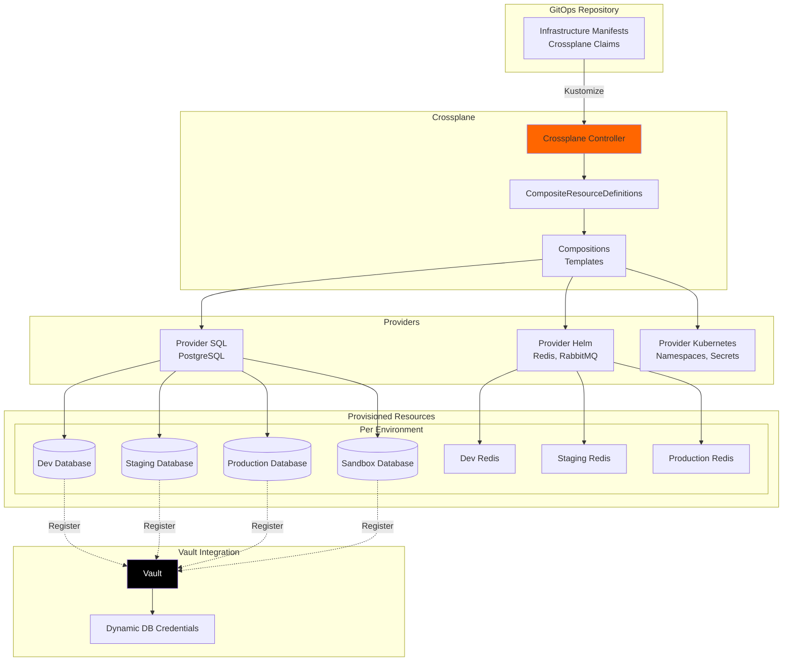

# Crossplane Infrastructure Provisioning

## Overview

Crossplane enables declarative infrastructure provisioning using Kubernetes CRDs. We'll use it to provision databases, storage, and other infrastructure per environment.

---

## Architecture Diagram



---

## 1. Crossplane Providers Setup

### Install Required Providers

```yaml
# crossplane/providers/provider-sql.yaml
apiVersion: pkg.crossplane.io/v1
kind: Provider
metadata:
  name: provider-sql
spec:
  package: xpkg.upbound.io/crossplane-contrib/provider-sql:v0.9.0
---
# crossplane/providers/provider-helm.yaml
apiVersion: pkg.crossplane.io/v1
kind: Provider
metadata:
  name: provider-helm
spec:
  package: xpkg.upbound.io/crossplane-contrib/provider-helm:v0.18.0
---
# crossplane/providers/provider-kubernetes.yaml
apiVersion: pkg.crossplane.io/v1
kind: Provider
metadata:
  name: provider-kubernetes
spec:
  package: xpkg.upbound.io/crossplane-contrib/provider-kubernetes:v0.13.0
```

### Configure Providers

```yaml
# crossplane/provider-configs/sql-config.yaml
apiVersion: postgresql.sql.crossplane.io/v1alpha1
kind: ProviderConfig
metadata:
  name: postgres-provider
spec:
  credentials:
    source: PostgreSQLConnectionSecret
    connectionSecretRef:
      namespace: crossplane-system
      name: postgres-admin-creds
  sslMode: require
---
# crossplane/provider-configs/helm-config.yaml
apiVersion: helm.crossplane.io/v1beta1
kind: ProviderConfig
metadata:
  name: helm-provider
spec:
  credentials:
    source: InjectedIdentity
---
# crossplane/provider-configs/k8s-config.yaml
apiVersion: kubernetes.crossplane.io/v1alpha1
kind: ProviderConfig
metadata:
  name: kubernetes-provider
spec:
  credentials:
    source: InjectedIdentity
```

---

## 2. Composite Resource Definitions (XRDs)

### Database XRD

```yaml
# crossplane/xrds/database-xrd.yaml
apiVersion: apiextensions.crossplane.io/v1
kind: CompositeResourceDefinition
metadata:
  name: xpostgresqlinstances.database.yourdomain.com
spec:
  group: database.yourdomain.com
  names:
    kind: XPostgreSQLInstance
    plural: xpostgresqlinstances
  claimNames:
    kind: PostgreSQLInstance
    plural: postgresqlinstances
  
  versions:
    - name: v1alpha1
      served: true
      referenceable: true
      schema:
        openAPIV3Schema:
          type: object
          properties:
            spec:
              type: object
              properties:
                parameters:
                  type: object
                  properties:
                    environment:
                      type: string
                      enum: [dev, staging, uat, production, sandbox]
                    size:
                      type: string
                      enum: [small, medium, large]
                      default: small
                    storageGB:
                      type: integer
                      default: 20
                    enableBackup:
                      type: boolean
                      default: true
                    vaultPath:
                      type: string
                      description: "Vault path to store credentials"
                  required:
                    - environment
                    - vaultPath
              required:
                - parameters
```

### Redis XRD

```yaml
# crossplane/xrds/redis-xrd.yaml
apiVersion: apiextensions.crossplane.io/v1
kind: CompositeResourceDefinition
metadata:
  name: xredisinstances.cache.yourdomain.com
spec:
  group: cache.yourdomain.com
  names:
    kind: XRedisInstance
    plural: xredisinstances
  claimNames:
    kind: RedisInstance
    plural: redisinstances
  
  versions:
    - name: v1alpha1
      served: true
      referenceable: true
      schema:
        openAPIV3Schema:
          type: object
          properties:
            spec:
              type: object
              properties:
                parameters:
                  type: object
                  properties:
                    environment:
                      type: string
                      enum: [dev, staging, uat, production, sandbox]
                    replicas:
                      type: integer
                      default: 1
                    memoryGB:
                      type: integer
                      default: 1
                  required:
                    - environment
              required:
                - parameters
```

---

## 3. Compositions (Infrastructure Templates)

### PostgreSQL Composition

```yaml
# crossplane/compositions/postgres-composition.yaml
apiVersion: apiextensions.crossplane.io/v1
kind: Composition
metadata:
  name: postgres-composition
  labels:
    crossplane.io/xrd: xpostgresqlinstances.database.yourdomain.com
spec:
  writeConnectionSecretsToNamespace: crossplane-system
  
  compositeTypeRef:
    apiVersion: database.yourdomain.com/v1alpha1
    kind: XPostgreSQLInstance
  
  resources:
    # Create Database
    - name: database
      base:
        apiVersion: postgresql.sql.crossplane.io/v1alpha1
        kind: Database
        spec:
          forProvider:
            encoding: UTF8
          providerConfigRef:
            name: postgres-provider
      patches:
        - fromFieldPath: spec.parameters.environment
          toFieldPath: metadata.name
          transforms:
            - type: string
              string:
                fmt: "%s-db"
    
    # Create Database User
    - name: user
      base:
        apiVersion: postgresql.sql.crossplane.io/v1alpha1
        kind: Role
        spec:
          forProvider:
            connectionLimit: -1
            inherit: true
            login: true
          providerConfigRef:
            name: postgres-provider
          writeConnectionSecretToRef:
            namespace: crossplane-system
      patches:
        - fromFieldPath: spec.parameters.environment
          toFieldPath: metadata.name
          transforms:
            - type: string
              string:
                fmt: "%s-user"
        - fromFieldPath: spec.parameters.environment
          toFieldPath: spec.writeConnectionSecretToRef.name
          transforms:
            - type: string
              string:
                fmt: "%s-db-credentials"
    
    # Grant Permissions
    - name: grant
      base:
        apiVersion: postgresql.sql.crossplane.io/v1alpha1
        kind: Grant
        spec:
          forProvider:
            privileges:
              - ALL
            withOption: false
          providerConfigRef:
            name: postgres-provider
      patches:
        - fromFieldPath: spec.parameters.environment
          toFieldPath: spec.forProvider.role
          transforms:
            - type: string
              string:
                fmt: "%s-user"
        - fromFieldPath: spec.parameters.environment
          toFieldPath: spec.forProvider.database
          transforms:
            - type: string
              string:
                fmt: "%s-db"
    
    # Create Kubernetes Secret
    - name: k8s-secret
      base:
        apiVersion: kubernetes.crossplane.io/v1alpha1
        kind: Object
        spec:
          forProvider:
            manifest:
              apiVersion: v1
              kind: Secret
              metadata:
                namespace: default
              type: Opaque
          providerConfigRef:
            name: kubernetes-provider
      patches:
        - fromFieldPath: spec.parameters.environment
          toFieldPath: spec.forProvider.manifest.metadata.name
          transforms:
            - type: string
              string:
                fmt: "%s-db-secret"
        - fromFieldPath: spec.parameters.environment
          toFieldPath: spec.forProvider.manifest.metadata.namespace
      connectionDetails:
        - fromConnectionSecretKey: username
        - fromConnectionSecretKey: password
        - fromConnectionSecretKey: endpoint
```

### Redis Composition

```yaml
# crossplane/compositions/redis-composition.yaml
apiVersion: apiextensions.crossplane.io/v1
kind: Composition
metadata:
  name: redis-composition
  labels:
    crossplane.io/xrd: xredisinstances.cache.yourdomain.com
spec:
  compositeTypeRef:
    apiVersion: cache.yourdomain.com/v1alpha1
    kind: XRedisInstance
  
  resources:
    # Deploy Redis via Helm
    - name: redis
      base:
        apiVersion: helm.crossplane.io/v1beta1
        kind: Release
        spec:
          forProvider:
            chart:
              name: redis
              repository: https://charts.bitnami.com/bitnami
              version: "19.0.0"
            values:
              auth:
                enabled: true
              master:
                persistence:
                  enabled: true
                  size: 8Gi
          providerConfigRef:
            name: helm-provider
      patches:
        - fromFieldPath: spec.parameters.environment
          toFieldPath: metadata.name
          transforms:
            - type: string
              string:
                fmt: "redis-%s"
        - fromFieldPath: spec.parameters.environment
          toFieldPath: spec.forProvider.namespace
        - fromFieldPath: spec.parameters.replicas
          toFieldPath: spec.forProvider.values.replica.replicaCount
        - fromFieldPath: spec.parameters.memoryGB
          toFieldPath: spec.forProvider.values.master.resources.limits.memory
          transforms:
            - type: string
              string:
                fmt: "%dGi"
```

---

## 4. Infrastructure Claims (Per Environment)

### Development Environment

```yaml
# overlays/dev/infrastructure/database.yaml
apiVersion: database.yourdomain.com/v1alpha1
kind: PostgreSQLInstance
metadata:
  name: dev-database
  namespace: dev
spec:
  parameters:
    environment: dev
    size: small
    storageGB: 20
    enableBackup: false
    vaultPath: secret/database/dev
  compositionSelector:
    matchLabels:
      crossplane.io/xrd: xpostgresqlinstances.database.yourdomain.com
  writeConnectionSecretToRef:
    name: postgres-connection
---
# overlays/dev/infrastructure/redis.yaml
apiVersion: cache.yourdomain.com/v1alpha1
kind: RedisInstance
metadata:
  name: dev-redis
  namespace: dev
spec:
  parameters:
    environment: dev
    replicas: 1
    memoryGB: 1
  compositionSelector:
    matchLabels:
      crossplane.io/xrd: xredisinstances.cache.yourdomain.com
```

### Staging Environment

```yaml
# overlays/staging/infrastructure/database.yaml
apiVersion: database.yourdomain.com/v1alpha1
kind: PostgreSQLInstance
metadata:
  name: staging-database
  namespace: staging
spec:
  parameters:
    environment: staging
    size: medium
    storageGB: 50
    enableBackup: true
    vaultPath: secret/database/staging
  compositionSelector:
    matchLabels:
      crossplane.io/xrd: xpostgresqlinstances.database.yourdomain.com
  writeConnectionSecretToRef:
    name: postgres-connection
---
# overlays/staging/infrastructure/redis.yaml
apiVersion: cache.yourdomain.com/v1alpha1
kind: RedisInstance
metadata:
  name: staging-redis
  namespace: staging
spec:
  parameters:
    environment: staging
    replicas: 2
    memoryGB: 2
  compositionSelector:
    matchLabels:
      crossplane.io/xrd: xredisinstances.cache.yourdomain.com
```

### Production Environment

```yaml
# overlays/production/infrastructure/database.yaml
apiVersion: database.yourdomain.com/v1alpha1
kind: PostgreSQLInstance
metadata:
  name: production-database
  namespace: production
spec:
  parameters:
    environment: production
    size: large
    storageGB: 200
    enableBackup: true
    vaultPath: secret/database/production
  compositionSelector:
    matchLabels:
      crossplane.io/xrd: xpostgresqlinstances.database.yourdomain.com
  writeConnectionSecretToRef:
    name: postgres-connection
---
# overlays/production/infrastructure/redis.yaml
apiVersion: cache.yourdomain.com/v1alpha1
kind: RedisInstance
metadata:
  name: production-redis
  namespace: production
spec:
  parameters:
    environment: production
    replicas: 3
    memoryGB: 8
  compositionSelector:
    matchLabels:
      crossplane.io/xrd: xredisinstances.cache.yourdomain.com
```

---

## 5. Vault Integration for Database Credentials

### Function to Register Database with Vault

```yaml
# crossplane/functions/vault-registration.yaml
apiVersion: kubernetes.crossplane.io/v1alpha1
kind: Object
metadata:
  name: vault-db-registration
spec:
  forProvider:
    manifest:
      apiVersion: batch/v1
      kind: Job
      metadata:
        name: register-db-vault
        namespace: crossplane-system
      spec:
        template:
          spec:
            serviceAccountName: crossplane-vault-sa
            containers:
              - name: vault-register
                image: vault:latest
                env:
                  - name: VAULT_ADDR
                    value: "http://vault.vault.svc:8200"
                  - name: DB_HOST
                    valueFrom:
                      secretKeyRef:
                        name: postgres-connection
                        key: endpoint
                  - name: DB_USER
                    valueFrom:
                      secretKeyRef:
                        name: postgres-connection
                        key: username
                  - name: DB_PASSWORD
                    valueFrom:
                      secretKeyRef:
                        name: postgres-connection
                        key: password
                  - name: ENVIRONMENT
                    value: "dev"
                command:
                  - /bin/sh
                  - -c
                  - |
                    # Authenticate with Vault
                    export VAULT_TOKEN=$(vault write -field=token \
                      auth/kubernetes/login \
                      role=crossplane \
                      jwt=@/var/run/secrets/kubernetes.io/serviceaccount/token)
                    
                    # Register database
                    vault write database/config/postgres-${ENVIRONMENT} \
                      plugin_name=postgresql-database-plugin \
                      connection_url="postgresql://{{username}}:{{password}}@${DB_HOST}:5432/${ENVIRONMENT}-db?sslmode=require" \
                      username="${DB_USER}" \
                      password="${DB_PASSWORD}" \
                      allowed_roles="${ENVIRONMENT}-*"
                    
                    # Create role for applications
                    vault write database/roles/${ENVIRONMENT}-readwrite \
                      db_name=postgres-${ENVIRONMENT} \
                      creation_statements="CREATE ROLE \"{{name}}\" WITH LOGIN PASSWORD '{{password}}' VALID UNTIL '{{expiration}}'; \
                        GRANT ALL PRIVILEGES ON DATABASE \"${ENVIRONMENT}-db\" TO \"{{name}}\";" \
                      default_ttl="1h" \
                      max_ttl="24h"
            restartPolicy: OnFailure
```

---

## 6. Dynamic Infrastructure for Preview Environments

### PR Preview Database Claim Template

```yaml
# crossplane/templates/pr-database-template.yaml
apiVersion: database.yourdomain.com/v1alpha1
kind: PostgreSQLInstance
metadata:
  name: pr-{{ PR_NUMBER }}-database
  namespace: pr-{{ PR_NUMBER }}
  annotations:
    crossplane.io/external-name: pr-{{ PR_NUMBER }}-db
    ttl: "168h"  # 7 days
spec:
  parameters:
    environment: pr-{{ PR_NUMBER }}
    size: small
    storageGB: 10
    enableBackup: false
    vaultPath: secret/database/pr-{{ PR_NUMBER }}
  compositionSelector:
    matchLabels:
      crossplane.io/xrd: xpostgresqlinstances.database.yourdomain.com
  writeConnectionSecretToRef:
    name: postgres-connection
```

### Tekton Task to Create PR Database

```yaml
# tekton/tasks/create-pr-infrastructure.yaml
apiVersion: tekton.dev/v1beta1
kind: Task
metadata:
  name: create-pr-infrastructure
spec:
  params:
    - name: pr-number
      type: string
  
  steps:
    - name: apply-infrastructure
      image: bitnami/kubectl
      script: |
        #!/bin/bash
        PR_NUM=$(params.pr-number)
        
        # Create namespace
        kubectl create namespace pr-${PR_NUM} || true
        
        # Apply database claim
        cat <<EOF | kubectl apply -f -
        apiVersion: database.yourdomain.com/v1alpha1
        kind: PostgreSQLInstance
        metadata:
          name: pr-${PR_NUM}-database
          namespace: pr-${PR_NUM}
        spec:
          parameters:
            environment: dev
            size: small
            storageGB: 10
            enableBackup: false
            vaultPath: secret/database/pr-${PR_NUM}
          writeConnectionSecretToRef:
            name: postgres-connection
        EOF
        
        # Wait for database to be ready
        kubectl wait --for=condition=Ready \
          postgresqlinstance/pr-${PR_NUM}-database \
          -n pr-${PR_NUM} \
          --timeout=300s
```

---

## 7. Sandbox Database (Production Clone)

### Sandbox Database Claim

```yaml
# overlays/sandbox/infrastructure/database.yaml
apiVersion: database.yourdomain.com/v1alpha1
kind: PostgreSQLInstance
metadata:
  name: sandbox-database
  namespace: sandbox
  annotations:
    crossplane.io/external-name: sandbox-db
    source: production-clone
spec:
  parameters:
    environment: sandbox
    size: large
    storageGB: 200
    enableBackup: false
    vaultPath: secret/database/sandbox
  compositionSelector:
    matchLabels:
      crossplane.io/xrd: xpostgresqlinstances.database.yourdomain.com
  writeConnectionSecretToRef:
    name: postgres-connection
```

### Sandbox Database Sync (Updated from sandbox-implementation.md)

```bash
#!/bin/bash
# Clone production database to sandbox

PROD_DB="postgresql://postgres.production.svc:5432/production-db"
SANDBOX_DB="postgresql://postgres.sandbox.svc:5432/sandbox-db"

# Dump production
pg_dump "$PROD_DB" \
    --no-owner \
    --no-privileges \
    --clean \
    > /tmp/prod-dump.sql

# Anonymize (as before)
python3 /scripts/anonymize-db.py /tmp/prod-dump.sql /tmp/sandbox-dump.sql

# Restore to sandbox
psql "$SANDBOX_DB" < /tmp/sandbox-dump.sql
```

---

## 8. Infrastructure Lifecycle Management

### Update Database Size

```bash
# Update dev database to medium size
kubectl patch postgresqlinstance dev-database \
  -n dev \
  --type=merge \
  -p '{"spec":{"parameters":{"size":"medium","storageGB":50}}}'
```

### Delete Infrastructure

```bash
# Delete dev database (will be cleaned up by Crossplane)
kubectl delete postgresqlinstance dev-database -n dev
```

### List All Databases

```bash
# List all PostgreSQL instances
kubectl get postgresqlinstance --all-namespaces

# Get detailed info
kubectl describe postgresqlinstance production-database -n production
```

---

## 9. Monitoring Crossplane Resources

### ServiceMonitor for Crossplane

```yaml
# crossplane/monitoring/servicemonitor.yaml
apiVersion: monitoring.coreos.com/v1
kind: ServiceMonitor
metadata:
  name: crossplane
  namespace: crossplane-system
spec:
  selector:
    matchLabels:
      app: crossplane
  endpoints:
    - port: metrics
```

### Alerts for Failed Provisions

```yaml
# crossplane/monitoring/prometheusrule.yaml
apiVersion: monitoring.coreos.com/v1
kind: PrometheusRule
metadata:
  name: crossplane-alerts
  namespace: crossplane-system
spec:
  groups:
    - name: crossplane
      interval: 30s
      rules:
        - alert: CrossplaneProvisionFailed
          expr: |
            crossplane_managed_resource_exists{condition_status="False",condition_type="Ready"} == 1
          for: 10m
          labels:
            severity: critical
          annotations:
            summary: "Crossplane resource failed to provision"
            description: "Resource {{ $labels.name }} in namespace {{ $labels.namespace }} has been in failed state for 10 minutes"
```

---

## 10. GitOps Integration

### Include Infrastructure in Overlays

```yaml
# overlays/dev/kustomization.yaml
apiVersion: kustomize.config.k8s.io/v1beta1
kind: Kustomization

namespace: dev

resources:
  # Application resources
  - ../../base/user-service
  
  # Infrastructure (Crossplane claims)
  - infrastructure/database.yaml
  - infrastructure/redis.yaml

# Application will reference the provisioned infrastructure
configMapGenerator:
  - name: user-service-config
    behavior: merge
    literals:
      - DATABASE_URL=postgresql://postgres.dev.svc:5432/dev-db
      - REDIS_URL=redis://redis-dev-master.dev.svc:6379
```

---

## Summary

This Crossplane integration provides:

✅ **Declarative Infrastructure** - All infrastructure as code  
✅ **Per-Environment Resources** - Databases, caches per environment  
✅ **Dynamic Provisioning** - Automatic infrastructure for PR previews  
✅ **Vault Integration** - Automatic credential registration  
✅ **GitOps Workflow** - Infrastructure in Git alongside apps  
✅ **Lifecycle Management** - Easy updates and deletions  
✅ **Resource Templates** - Reusable compositions  
✅ **Cost Optimization** - Right-sized resources per environment  
✅ **Self-Service** - Developers can request infrastructure via Git
