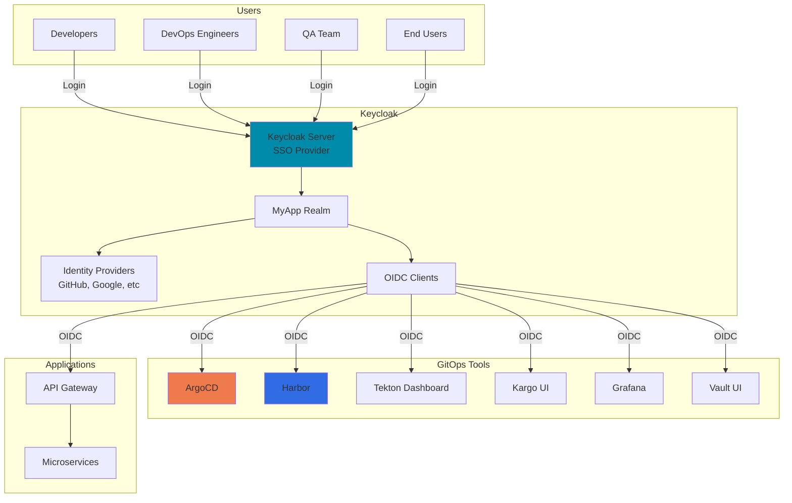

# Keycloak SSO & Authentication Integration

## Overview

Keycloak provides centralized authentication and SSO across all tools in the GitOps pipeline, plus OIDC for application authentication.

---

## Architecture Diagram



---

## 1. Keycloak Realm Configuration

### Create Realm

```bash
# Access Keycloak admin console
# https://keycloak.yourdomain.com/admin

# Create new realm: myapp
```

### Realm Settings

```json
{
  "realm": "myapp",
  "enabled": true,
  "sslRequired": "external",
  "registrationAllowed": false,
  "loginWithEmailAllowed": true,
  "duplicateEmailsAllowed": false,
  "resetPasswordAllowed": true,
  "editUsernameAllowed": false,
  "bruteForceProtected": true,
  "accessTokenLifespan": 300,
  "accessTokenLifespanForImplicitFlow": 900,
  "ssoSessionIdleTimeout": 1800,
  "ssoSessionMaxLifespan": 36000,
  "offlineSessionIdleTimeout": 2592000,
  "accessCodeLifespan": 60,
  "accessCodeLifespanUserAction": 300,
  "accessCodeLifespanLogin": 1800
}
```

---

## 2. Identity Providers Setup

### GitHub Identity Provider

```yaml
# Keycloak IDP configuration for GitHub
Name: github
Alias: github
Display Name: "Sign in with GitHub"
Enabled: true
Store Tokens: true
Stored Tokens Readable: false
Trust Email: true
Account Linking Only: false

# OAuth settings
Authorization URL: https://github.com/login/oauth/authorize
Token URL: https://github.com/login/oauth/access_token
User Info URL: https://api.github.com/user
Client ID: <your-github-oauth-app-client-id>
Client Secret: <your-github-oauth-app-client-secret>
Default Scopes: read:user user:email

# Mappers
- Attribute: username
  Claim: login
- Attribute: email
  Claim: email
- Attribute: firstName
  Claim: name
```

### Google Identity Provider

```yaml
Name: google
Alias: google
Display Name: "Sign in with Google"
Enabled: true

# OAuth settings
Client ID: <your-google-oauth-client-id>
Client Secret: <your-google-oauth-client-secret>
Default Scopes: openid profile email
```

---

## 3. Groups and Roles

### Create Groups

```bash
# In Keycloak Admin Console: Groups

Groups:
├── Developers
├── DevOps
├── QA
├── Product-Managers
└── Administrators
```

### Create Roles

```bash
# Realm Roles
- developer
- devops
- qa
- product-manager
- admin

# Client Roles (per client)
ArgoCD:
  - admin
  - deployer
  - viewer

Harbor:
  - project-admin
  - developer
  - guest

Tekton:
  - admin
  - viewer

Kargo:
  - admin
  - promoter
  - viewer
```

### Map Roles to Groups

```yaml
# Group-Role Mappings
Developers:
  - developer
  - ArgoCD/viewer
  - Harbor/developer
  - Tekton/viewer
  - Kargo/viewer

DevOps:
  - devops
  - ArgoCD/deployer
  - Harbor/project-admin
  - Tekton/admin
  - Kargo/promoter

Administrators:
  - admin
  - ArgoCD/admin
  - Harbor/project-admin
  - Tekton/admin
  - Kargo/admin
```

---

## 4. OIDC Clients Configuration

### ArgoCD Client

```yaml
# Keycloak Client Configuration
Client ID: argocd
Name: ArgoCD
Client Protocol: openid-connect
Access Type: confidential
Standard Flow Enabled: true
Direct Access Grants Enabled: false
Valid Redirect URIs:
  - https://argocd.yourdomain.com/*
  - https://argocd.yourdomain.com/auth/callback
Web Origins:
  - https://argocd.yourdomain.com
Base URL: https://argocd.yourdomain.com

# Mappers
- Name: groups
  Mapper Type: Group Membership
  Token Claim Name: groups
  Full group path: false
  Add to ID token: true
  Add to access token: true
  Add to userinfo: true
```

### ArgoCD Configuration

```yaml
# argocd/argocd-cm.yaml
apiVersion: v1
kind: ConfigMap
metadata:
  name: argocd-cm
  namespace: argocd
data:
  url: https://argocd.yourdomain.com
  
  oidc.config: |
    name: Keycloak
    issuer: https://keycloak.yourdomain.com/realms/myapp
    clientID: argocd
    clientSecret: $oidc.keycloak.clientSecret
    requestedScopes:
      - openid
      - profile
      - email
      - groups
---
# argocd/argocd-rbac-cm.yaml
apiVersion: v1
kind: ConfigMap
metadata:
  name: argocd-rbac-cm
  namespace: argocd
data:
  policy.default: role:readonly
  policy.csv: |
    # Administrators
    g, /Administrators, role:admin
    
    # DevOps
    g, /DevOps, role:deployer
    p, role:deployer, applications, *, */*, allow
    p, role:deployer, clusters, get, *, allow
    p, role:deployer, repositories, get, *, allow
    p, role:deployer, projects, get, *, allow
    
    # Developers
    g, /Developers, role:viewer
    p, role:viewer, applications, get, */*, allow
    p, role:viewer, logs, get, */*, allow
```

---

### Harbor Client

```yaml
# Keycloak Client Configuration
Client ID: harbor
Name: Harbor Registry
Client Protocol: openid-connect
Access Type: confidential
Standard Flow Enabled: true
Valid Redirect URIs:
  - https://harbor.yourdomain.com/*
  - https://harbor.yourdomain.com/c/oidc/callback
Web Origins:
  - https://harbor.yourdomain.com

# Mappers
- Name: username
  Mapper Type: User Property
  Property: username
  Token Claim Name: name
  
- Name: email
  Mapper Type: User Property
  Property: email
  Token Claim Name: email
  
- Name: groups
  Mapper Type: Group Membership
  Token Claim Name: groups
```

### Harbor Configuration

```yaml
# Harbor auth configuration (via Harbor UI)
Authentication Mode: OIDC
OIDC Provider Name: keycloak
OIDC Endpoint: https://keycloak.yourdomain.com/realms/myapp
OIDC Client ID: harbor
OIDC Client Secret: <client-secret>
OIDC Scope: openid,profile,email,groups
OIDC Verify Certificate: true
OIDC Auto Onboard: true
OIDC Username Claim: name
OIDC Group Claim: groups
```

---

### Tekton Dashboard Client

```yaml
# Keycloak Client Configuration
Client ID: tekton
Name: Tekton Dashboard
Client Protocol: openid-connect
Access Type: confidential
Standard Flow Enabled: true
Valid Redirect URIs:
  - https://tekton.yourdomain.com/*
Web Origins:
  - https://tekton.yourdomain.com

# Mappers (same as ArgoCD)
```

### Tekton Dashboard Configuration

```yaml
# tekton/tekton-dashboard-oauth.yaml
apiVersion: v1
kind: ConfigMap
metadata:
  name: tekton-dashboard-oauth
  namespace: tekton-pipelines
data:
  oauth.provider: keycloak
  oauth.issuer: https://keycloak.yourdomain.com/realms/myapp
  oauth.clientId: tekton
  oauth.redirectUrl: https://tekton.yourdomain.com/oauth/callback
  oauth.scopes: openid,profile,email
```

---

### Kargo Client

```yaml
# Keycloak Client Configuration
Client ID: kargo
Name: Kargo
Client Protocol: openid-connect
Access Type: confidential
Standard Flow Enabled: true
Valid Redirect URIs:
  - https://kargo.yourdomain.com/*
Web Origins:
  - https://kargo.yourdomain.com
```

### Kargo Configuration

```yaml
# kargo/kargo-values.yaml
api:
  oidc:
    enabled: true
    issuerURL: https://keycloak.yourdomain.com/realms/myapp
    clientID: kargo
    clientSecret: <client-secret>
    scopes:
      - openid
      - profile
      - email
      - groups
```

---

### Grafana Client

```yaml
# Keycloak Client Configuration
Client ID: grafana
Name: Grafana
Client Protocol: openid-connect
Access Type: confidential
Standard Flow Enabled: true
Valid Redirect URIs:
  - https://grafana.yourdomain.com/*
Web Origins:
  - https://grafana.yourdomain.com

# Mappers
- Name: role
  Mapper Type: User Client Role
  Client ID: grafana
  Token Claim Name: role
```

### Grafana Configuration

```ini
# grafana/grafana.ini
[auth.generic_oauth]
enabled = true
name = Keycloak
allow_sign_up = true
client_id = grafana
client_secret = <client-secret>
scopes = openid profile email groups
auth_url = https://keycloak.yourdomain.com/realms/myapp/protocol/openid-connect/auth
token_url = https://keycloak.yourdomain.com/realms/myapp/protocol/openid-connect/token
api_url = https://keycloak.yourdomain.com/realms/myapp/protocol/openid-connect/userinfo
role_attribute_path = contains(groups[*], 'Administrators') && 'Admin' || contains(groups[*], 'DevOps') && 'Editor' || 'Viewer'
```

---

### Vault UI Client

```yaml
# Keycloak Client Configuration
Client ID: vault
Name: Vault
Client Protocol: openid-connect
Access Type: confidential
Standard Flow Enabled: true
Valid Redirect URIs:
  - https://vault.yourdomain.com/*
  - https://vault.yourdomain.com/ui/vault/auth/oidc/oidc/callback
Web Origins:
  - https://vault.yourdomain.com
```

### Vault OIDC Configuration

```bash
# Enable OIDC auth method
vault auth enable oidc

# Configure OIDC
vault write auth/oidc/config \
    oidc_discovery_url="https://keycloak.yourdomain.com/realms/myapp" \
    oidc_client_id="vault" \
    oidc_client_secret="<client-secret>" \
    default_role="default"

# Create role
vault write auth/oidc/role/default \
    bound_audiences="vault" \
    allowed_redirect_uris="https://vault.yourdomain.com/ui/vault/auth/oidc/oidc/callback" \
    user_claim="sub" \
    groups_claim="groups" \
    policies="default"

# Map groups to policies
vault write identity/group name="Administrators" \
    policies="admin"

vault write identity/group-alias name="/Administrators" \
    mount_accessor="$(vault auth list -format=json | jq -r '.["oidc/"].accessor')" \
    canonical_id="<group-id>"
```

---

## 5. Application Authentication (API Gateway)

### API Gateway OIDC Client

```yaml
# Keycloak Client Configuration
Client ID: api-gateway
Name: API Gateway
Client Protocol: openid-connect
Access Type: confidential
Standard Flow Enabled: true
Implicit Flow Enabled: false
Direct Access Grants Enabled: true
Service Accounts Enabled: true

Valid Redirect URIs:
  - https://api.yourdomain.com/*
Web Origins:
  - https://yourdomain.com

# Mappers
- Name: audience
  Mapper Type: Audience
  Included Client Audience: api-gateway
  
- Name: roles
  Mapper Type: User Realm Role
  Token Claim Name: roles
```

### API Gateway Configuration (Node.js Example)

```javascript
// api-gateway/src/auth/keycloak.js
const Keycloak = require('keycloak-connect');
const session = require('express-session');

const keycloakConfig = {
  realm: 'myapp',
  'auth-server-url': 'https://keycloak.yourdomain.com',
  'ssl-required': 'external',
  resource: 'api-gateway',
  'confidential-port': 0,
  credentials: {
    secret: process.env.KEYCLOAK_CLIENT_SECRET
  }
};

const memoryStore = new session.MemoryStore();
const keycloak = new Keycloak({ store: memoryStore }, keycloakConfig);

// Protect routes
app.use(keycloak.middleware());

// Public routes
app.get('/health', (req, res) => {
  res.json({ status: 'ok' });
});

// Protected routes
app.use('/api', keycloak.protect(), apiRouter);

// Role-based protection
app.use('/api/admin', keycloak.protect('admin'), adminRouter);
app.use('/api/users', keycloak.protect('developer'), userRouter);
```

### Verify JWT Token (Microservices)

```javascript
// microservices/src/auth/jwt-verify.js
const jwt = require('jsonwebtoken');
const jwksClient = require('jwks-rsa');

const client = jwksClient({
  jwksUri: 'https://keycloak.yourdomain.com/realms/myapp/protocol/openid-connect/certs'
});

function getKey(header, callback) {
  client.getSigningKey(header.kid, (err, key) => {
    const signingKey = key.publicKey || key.rsaPublicKey;
    callback(null, signingKey);
  });
}

function verifyToken(token) {
  return new Promise((resolve, reject) => {
    jwt.verify(token, getKey, {
      audience: 'api-gateway',
      issuer: 'https://keycloak.yourdomain.com/realms/myapp',
      algorithms: ['RS256']
    }, (err, decoded) => {
      if (err) {
        reject(err);
      } else {
        resolve(decoded);
      }
    });
  });
}

// Middleware
async function authenticate(req, res, next) {
  const token = req.headers.authorization?.split(' ')[1];
  
  if (!token) {
    return res.status(401).json({ error: 'No token provided' });
  }
  
  try {
    const decoded = await verifyToken(token);
    req.user = decoded;
    next();
  } catch (err) {
    return res.status(401).json({ error: 'Invalid token' });
  }
}

module.exports = { authenticate };
```

---

## 6. Frontend Application Configuration

### React Application

```typescript
// frontend/src/auth/keycloak.ts
import Keycloak from 'keycloak-js';

const keycloak = new Keycloak({
  url: 'https://keycloak.yourdomain.com',
  realm: 'myapp',
  clientId: 'frontend-app'
});

export const initKeycloak = async () => {
  try {
    const authenticated = await keycloak.init({
      onLoad: 'login-required',
      checkLoginIframe: false,
      pkceMethod: 'S256'
    });
    
    if (authenticated) {
      console.log('User authenticated');
      
      // Refresh token periodically
      setInterval(() => {
        keycloak.updateToken(70).catch(() => {
          console.log('Failed to refresh token');
        });
      }, 60000);
    }
  } catch (error) {
    console.error('Failed to initialize Keycloak', error);
  }
};

export const getToken = () => keycloak.token;
export const getUserInfo = () => keycloak.tokenParsed;
export const hasRole = (role: string) => keycloak.hasRealmRole(role);
export const logout = () => keycloak.logout();

export default keycloak;
```

### Add Token to API Requests

```typescript
// frontend/src/api/client.ts
import axios from 'axios';
import { getToken } from '../auth/keycloak';

const apiClient = axios.create({
  baseURL: 'https://api.yourdomain.com'
});

apiClient.interceptors.request.use(
  (config) => {
    const token = getToken();
    if (token) {
      config.headers.Authorization = `Bearer ${token}`;
    }
    return config;
  },
  (error) => {
    return Promise.reject(error);
  }
);

export default apiClient;
```

---

## 7. Service-to-Service Authentication

### Client Credentials Flow

```bash
# Create service account client in Keycloak
Client ID: service-user-to-payment
Access Type: confidential
Service Accounts Enabled: true
Authorization Enabled: false

# Assign roles
Service Account Roles:
  - payment-service/read
  - payment-service/write
```

### Get Token (Service Account)

```javascript
// services/user-service/src/clients/payment-client.js
const axios = require('axios');

async function getServiceToken() {
  const response = await axios.post(
    'https://keycloak.yourdomain.com/realms/myapp/protocol/openid-connect/token',
    new URLSearchParams({
      grant_type: 'client_credentials',
      client_id: 'service-user-to-payment',
      client_secret: process.env.SERVICE_CLIENT_SECRET
    }),
    {
      headers: {
        'Content-Type': 'application/x-www-form-urlencoded'
      }
    }
  );
  
  return response.data.access_token;
}

async function callPaymentService(data) {
  const token = await getServiceToken();
  
  const response = await axios.post(
    'https://payment-service.production.svc/api/payments',
    data,
    {
      headers: {
        'Authorization': `Bearer ${token}`
      }
    }
  );
  
  return response.data;
}
```

---

## 8. User Management

### Create Users via Keycloak API

```bash
#!/bin/bash
# scripts/create-user.sh

KEYCLOAK_URL="https://keycloak.yourdomain.com"
REALM="myapp"
ADMIN_TOKEN="<admin-access-token>"

curl -X POST "${KEYCLOAK_URL}/admin/realms/${REALM}/users" \
  -H "Authorization: Bearer ${ADMIN_TOKEN}" \
  -H "Content-Type: application/json" \
  -d '{
    "username": "john.doe",
    "email": "john.doe@example.com",
    "firstName": "John",
    "lastName": "Doe",
    "enabled": true,
    "emailVerified": true,
    "credentials": [{
      "type": "password",
      "value": "password123",
      "temporary": true
    }],
    "groups": ["/Developers"]
  }'
```

### Bulk User Import

```json
// users/import.json
{
  "users": [
    {
      "username": "developer1",
      "email": "dev1@example.com",
      "firstName": "Dev",
      "lastName": "One",
      "enabled": true,
      "groups": ["/Developers"]
    },
    {
      "username": "devops1",
      "email": "devops1@example.com",
      "firstName": "DevOps",
      "lastName": "One",
      "enabled": true,
      "groups": ["/DevOps"]
    }
  ]
}
```

```bash
# Import users
docker exec -it keycloak-0 \
  /opt/keycloak/bin/kc.sh import \
  --file /tmp/import.json \
  --realm myapp
```

---

## 9. Monitoring & Logging

### Enable Keycloak Metrics

```yaml
# keycloak/keycloak-values.yaml
metrics:
  enabled: true
  service:
    port: 9990
---
# keycloak/servicemonitor.yaml
apiVersion: monitoring.coreos.com/v1
kind: ServiceMonitor
metadata:
  name: keycloak
  namespace: keycloak
spec:
  selector:
    matchLabels:
      app: keycloak
  endpoints:
    - port: metrics
      path: /metrics
```

### Alert Rules

```yaml
# keycloak/prometheusrule.yaml
apiVersion: monitoring.coreos.com/v1
kind: PrometheusRule
metadata:
  name: keycloak-alerts
  namespace: keycloak
spec:
  groups:
    - name: keycloak
      interval: 30s
      rules:
        - alert: KeycloakHighFailedLogins
          expr: rate(keycloak_failed_login_attempts[5m]) > 10
          for: 5m
          labels:
            severity: warning
          annotations:
            summary: "High number of failed login attempts"
        
        - alert: KeycloakDown
          expr: up{job="keycloak"} == 0
          for: 2m
          labels:
            severity: critical
          annotations:
            summary: "Keycloak is down"
```

---

## 10. Backup & Disaster Recovery

### Backup Keycloak Database

```bash
#!/bin/bash
# scripts/backup-keycloak.sh

TIMESTAMP=$(date +%Y%m%d_%H%M%S)
BACKUP_DIR="/backups/keycloak"

# Backup PostgreSQL database
kubectl exec -n keycloak keycloak-postgresql-0 -- \
  pg_dump -U keycloak keycloak > "${BACKUP_DIR}/keycloak_${TIMESTAMP}.sql"

# Backup realm configuration
kubectl exec -n keycloak keycloak-0 -- \
  /opt/keycloak/bin/kc.sh export \
  --file /tmp/realm-export.json \
  --realm myapp

kubectl cp keycloak/keycloak-0:/tmp/realm-export.json \
  "${BACKUP_DIR}/realm_${TIMESTAMP}.json"
```

---

## Summary

This Keycloak integration provides:

✅ **Centralized SSO** - Single sign-on across all tools  
✅ **Identity Providers** - GitHub, Google integration  
✅ **RBAC** - Role-based access control  
✅ **API Authentication** - JWT tokens for APIs  
✅ **Service Accounts** - Service-to-service auth  
✅ **Group Management** - Organize users by teams  
✅ **Frontend Integration** - React/Angular support  
✅ **Monitoring** - Prometheus metrics and alerts  
✅ **Audit Trail** - Complete authentication logging  
✅ **Multi-tenant** - Realm per environment if needed
