# Platform Key-Value Store (platform-kv)

## Overview

The **platform-kv** Redis cluster is a highly available, production-grade key-value store designed to serve critical platform infrastructure services. This cluster provides fast, reliable caching and session management for services like Infisical (secrets management), and other platform components that require low-latency data access.

### Use Cases

This Redis cluster is used for:

- **Infisical**: Session storage, rate limiting, and caching for secrets management
- **Platform Services**: Shared cache for microservices requiring fast data access
- **Session Management**: User session storage with automatic failover
- **Rate Limiting**: Distributed rate limiting across platform services
- **Pub/Sub**: Event distribution for platform-wide notifications

### Key Characteristics

- **High Availability**: Master-replica replication with automatic failover via Sentinel
- **Fault Tolerant**: Survives node failures without data loss
- **Production-Ready**: Resource limits, health checks, and monitoring
- **Persistent**: Data backed by Ceph distributed storage
- **Secure**: Pod security contexts, network policies, and optional TLS

---

## Architecture

### High-Level Architecture


### Kubernetes Resource Topology


---

## Component Details

### 1. RedisReplication (platform-kv)

**Purpose**: Provides the actual Redis data store with master-replica replication for high availability.

**Configuration File**: `platform-kv-replication.yaml`

#### Key Settings Rationale

| Setting | Value | Rationale |
|---------|-------|-----------|
| **clusterSize** | `3` | 1 master + 2 replicas provides N+2 redundancy. Can tolerate 2 replica failures while maintaining read availability |
| **image** | `quay.io/opstree/redis:7.0.15` | Latest stable Redis 7.x with security patches. Redis 7 offers improved performance and ACL features |
| **CPU requests** | `200m` | Baseline for steady-state operation. Allows burst to 1 CPU for heavy workloads |
| **Memory requests** | `512Mi` | Adequate for typical key-value workloads. Limit at 1Gi prevents OOM on host |
| **maxmemory** | `896mb` | ~90% of memory limit (1Gi), leaving headroom for Redis overhead and buffers |
| **maxmemory-policy** | `allkeys-lru` | Evict least recently used keys when memory full. Best for cache workloads |
| **save 900 1** | RDB snapshot | Snapshot after 15 min if 1+ keys changed. Balances durability with performance |
| **appendonly** | `yes` | AOF enabled for better durability. Logs every write operation |
| **appendfsync** | `everysec` | Sync AOF every second. Good balance between durability and performance |
| **repl-diskless-sync** | `yes` | Master sends RDB directly to replicas without disk. Faster replication |
| **storage** | `10Gi` | Accommodates RDB snapshots, AOF logs, and working data with growth room |
| **storageClassName** | `ceph-block` | Distributed block storage with replication. See Storage Architecture below |

#### Pod Anti-Affinity

```yaml
affinity:
  podAntiAffinity:
    preferredDuringSchedulingIgnoredDuringExecution:
    - weight: 100
      topologyKey: kubernetes.io/hostname
```

**Rationale**: Spreads Redis pods across different Kubernetes nodes. If one node fails, other Redis pods remain available on other nodes. Uses "preferred" (soft) rather than "required" (hard) to allow scheduling in resource-constrained environments.

#### Health Checks

- **Liveness Probe**: Checks if Redis process is alive. Restarts pod if it becomes unresponsive
- **Readiness Probe**: Checks if Redis can serve traffic. Removes from service endpoints if not ready
- **Initial Delay**: 30s for liveness, 10s for readiness. Allows time for Redis initialization

#### Security Context

- **runAsNonRoot**: Redis runs as user 1000, not root. Reduces blast radius if compromised
- **readOnlyRootFilesystem**: `false` - Redis needs write access for RDB/AOF persistence
- **capabilities.drop.ALL**: Removes all Linux capabilities. Minimizes attack surface

---

### 2. RedisSentinel (platform-kv-sentinel)

**Purpose**: Monitors Redis master and replicas, automatically promotes a replica to master if master fails.

**Configuration File**: `platform-kv-sentinel.yaml`

#### Key Settings Rationale

| Setting | Value | Rationale |
|---------|-------|-----------|
| **clusterSize** | `3` | Minimum odd number for quorum-based decisions. Tolerates 1 sentinel failure |
| **quorum** | `2` | 2 out of 3 sentinels must agree for failover. Prevents split-brain scenarios |
| **downAfterMilliseconds** | `5000` | Sentinel considers master down after 5s. Balance between false positives and fast failover |
| **failoverTimeout** | `10000` | 10s timeout for failover. If failover takes longer, it's considered failed |
| **parallelSyncs** | `1` | 1 replica syncs with new master at a time. Prevents overwhelming new master during failover |
| **masterGroupName** | `platform-kv-master` | Logical name for the master. Used by clients to discover current master |
| **redisReplicationName** | `platform-kv` | References the RedisReplication resource to monitor |

#### Failover Process


**Timeline**:
1. **0-5s**: Master becomes unresponsive, sentinels detect failure
2. **5-6s**: Sentinels reach quorum (2/3 agree master is down)
3. **6-8s**: Leader sentinel promotes best replica to master
4. **8-10s**: Remaining replicas reconfigured to new master
5. **10s+**: Clients discover new master via sentinel

---

## Storage Architecture

### Why Ceph Block Storage (RBD)?

```mermaid
graph TD
    subgraph "Storage Requirements Analysis"
        A[Redis Storage Needs]
        A --> B[Per-Pod Isolated Storage]
        A --> C[Block-Level Performance]
        A --> D[Data Durability]
        A --> E[Snapshot Support]
    end

    subgraph "Storage Options"
        F[ceph-block RBD]
        G[ceph-filesystem CephFS]
        H[local-storage]
    end

    subgraph "Decision Matrix"
        I[Access Mode: RWO ✓]
        J[Random I/O: Excellent ✓]
        K[Replication: 3x ✓]
        L[Network Storage: Yes ✓]
    end

    B --> I
    C --> J
    D --> K
    E --> K

    F --> I
    F --> J
    F --> K
    F --> L

    I --> Decision{Best Fit?}
    J --> Decision
    K --> Decision
    L --> Decision

    Decision -->|Yes| Selected[ceph-block RBD]

    style Selected fill:#4ecdc4
    style F fill:#4ecdc4
```



### Ceph Block Storage Characteristics

| Characteristic | Ceph Block (RBD) | Why Important for Redis |
|----------------|------------------|-------------------------|
| **Access Mode** | ReadWriteOnce (RWO) | Each Redis pod needs its own exclusive volume. No sharing needed |
| **Performance** | Low latency, high IOPS | Critical for Redis persistence (RDB/AOF writes) |
| **Replication** | 3x replicated | Data survives disk/node failures. Matches Redis replication strategy |
| **Snapshots** | Supported | Enables backup/restore without downtime |
| **Provisioning** | Dynamic | Volumes created automatically via PVC |
| **Expansion** | Supported | Can grow volumes if needed without recreation |

### Storage Flow


### Data Durability Layers

1. **Redis AOF** (Application Layer): Logs every write operation to disk
2. **Ceph Replication** (Storage Layer): Data replicated 3x across OSDs
3. **Redis Replication** (Application Layer): Master-replica replication
4. **Sentinel Failover** (Orchestration Layer): Automatic recovery

Result: **Multi-layered protection against data loss**

---

## Deployment

### Prerequisites

1. **Redis Operator**: Must be installed in `redis-operator` namespace
2. **Ceph Cluster**: Must be healthy with `ceph-block` StorageClass available
3. **Namespace**: Create `platform-kv-redis-cluster` namespace

### Deployment Steps

```bash
# 1. Create namespace
kubectl create namespace platform-kv-redis-cluster

# 2. Deploy RedisReplication
kubectl apply -f platform-kv-replication.yaml

# 3. Wait for Redis pods to be ready
kubectl wait --for=condition=ready pod -l app.kubernetes.io/name=platform-kv \
  -n platform-kv-redis-cluster --timeout=300s

# 4. Deploy RedisSentinel
kubectl apply -f platform-kv-sentinel.yaml

# 5. Verify sentinel monitors Redis
kubectl wait --for=condition=ready pod -l app.kubernetes.io/name=platform-kv-sentinel \
  -n platform-kv-redis-cluster --timeout=300s

# 6. Check cluster health
kubectl get redisreplication,redissentinel -n platform-kv-redis-cluster
```

### Verification

```bash
# Check Redis pods
kubectl get pods -n platform-kv-redis-cluster -l app.kubernetes.io/name=platform-kv

# Expected output:
# NAME            READY   STATUS    RESTARTS   AGE
# platform-kv-0   2/2     Running   0          5m
# platform-kv-1   2/2     Running   0          5m
# platform-kv-2   2/2     Running   0          5m

# Check Sentinel pods
kubectl get pods -n platform-kv-redis-cluster -l app.kubernetes.io/name=platform-kv-sentinel

# Expected output:
# NAME                      READY   STATUS    RESTARTS   AGE
# platform-kv-sentinel-0    1/1     Running   0          3m
# platform-kv-sentinel-1    1/1     Running   0          3m
# platform-kv-sentinel-2    1/1     Running   0          3m

# Check PVCs
kubectl get pvc -n platform-kv-redis-cluster

# Expected output: 3 PVCs, all Bound to ceph-block volumes

# Verify Redis replication
kubectl exec -n platform-kv-redis-cluster platform-kv-0 -c redis -- \
  redis-cli INFO replication
```

---

## Client Connection

### Service Exposure

The Redis cluster is exposed via **LoadBalancer service** with external DNS:

- **External Domain**: `platform-kv.pnats.cloud:6379`
- **Internal DNS** (within cluster): `platform-kv.platform-kv-redis-cluster.svc.cluster.local:6379`

Both resolve to the same LoadBalancer IP assigned by MetalLB. External-DNS automatically creates the DNS record.

### Connection Patterns

#### Pattern 1: Direct Connection via External Domain (Simple)

**Use Case**: External services or simplified internal services

```yaml
# Application connection config
REDIS_HOST: platform-kv.pnats.cloud
REDIS_PORT: 6379
```

**Pros**:
- Works from anywhere (inside or outside cluster)
- Simple configuration
- No service mesh or internal DNS required

**Cons**:
- No automatic failover - requires connection retry
- External DNS dependency

#### Pattern 2: Direct Connection via Internal DNS (Cluster-only)

**Use Case**: Internal services without failover needs

```yaml
# Application connection config
REDIS_HOST: platform-kv.platform-kv-redis-cluster.svc.cluster.local
REDIS_PORT: 6379
```

**Pros**: Simple configuration, no external dependencies
**Cons**: Only works within cluster, no automatic failover

#### Pattern 3: Sentinel-Aware Connection (Recommended for Production)

**Use Case**: Production applications requiring automatic failover

```yaml
# Application connection config
REDIS_SENTINEL_HOSTS: platform-kv-sentinel.platform-kv-redis-cluster.svc.cluster.local:26379
REDIS_MASTER_NAME: platform-kv-master
```

**Pros**:
- Automatic failover within 5-10 seconds
- Client discovers new master via sentinel
- Best for HA applications

**Cons**:
- Requires sentinel-aware Redis client library
- Sentinel service only accessible within cluster

### Language-Specific Examples

#### Python (redis-py)

```python
from redis.sentinel import Sentinel

# Sentinel connection
sentinel = Sentinel([
    ('platform-kv-sentinel.platform-kv-redis-cluster.svc.cluster.local', 26379)
], socket_timeout=0.1)

# Get master for writes
master = sentinel.master_for(
    'platform-kv-master',
    socket_timeout=0.1,
    password=None,  # Add if password-protected
    db=0
)

# Get replica for reads (optional)
replica = sentinel.slave_for(
    'platform-kv-master',
    socket_timeout=0.1
)

# Use Redis
master.set('key', 'value')
value = replica.get('key')
```

#### Node.js (ioredis)

```javascript
const Redis = require('ioredis');

// Sentinel connection
const redis = new Redis({
  sentinels: [
    { host: 'platform-kv-sentinel.platform-kv-redis-cluster.svc.cluster.local', port: 26379 }
  ],
  name: 'platform-kv-master',
  // password: 'your-password',  // Add if password-protected
});

// Use Redis
await redis.set('key', 'value');
const value = await redis.get('key');
```

#### Go (go-redis)

```go
import (
    "github.com/go-redis/redis/v8"
)

// Sentinel connection
rdb := redis.NewFailoverClient(&redis.FailoverOptions{
    MasterName:    "platform-kv-master",
    SentinelAddrs: []string{
        "platform-kv-sentinel.platform-kv-redis-cluster.svc.cluster.local:26379",
    },
})

// Use Redis
ctx := context.Background()
err := rdb.Set(ctx, "key", "value", 0).Err()
val, err := rdb.Get(ctx, "key").Result()
```

---

## Operations

### Monitoring

#### Metrics Export

Redis Exporter is enabled on all Redis pods, exposing metrics on port 9121:

```yaml
annotations:
  prometheus.io/scrape: "true"
  prometheus.io/port: "9121"
```

#### Key Metrics to Monitor

| Metric | Description | Alert Threshold |
|--------|-------------|-----------------|
| `redis_up` | Redis instance availability | < 1 (critical) |
| `redis_connected_clients` | Number of connected clients | > 180 (90% of max_connections=200) |
| `redis_used_memory_bytes` | Memory usage | > 850MB (95% of maxmemory) |
| `redis_evicted_keys_total` | Keys evicted due to memory pressure | Increasing trend |
| `redis_master_repl_offset` | Replication offset | Large delta between master/replica |
| `redis_connected_slaves` | Number of replicas connected | < 2 (one replica missing) |

### Backup and Restore

#### Backup Strategy

Redis uses two persistence mechanisms:

1. **RDB Snapshots**: Point-in-time snapshots (configured via `save` directives)
2. **AOF Logs**: Append-only log of all write operations

**Backup Locations**:
- **RDB**: `/data/dump.rdb` on each pod's PVC
- **AOF**: `/data/appendonly.aof` on each pod's PVC

#### Manual Backup

```bash
# Trigger RDB snapshot on master
kubectl exec -n platform-kv-redis-cluster platform-kv-0 -c redis -- \
  redis-cli BGSAVE

# Verify snapshot created
kubectl exec -n platform-kv-redis-cluster platform-kv-0 -c redis -- \
  redis-cli LASTSAVE

# Copy RDB file from pod (for external backup)
kubectl cp platform-kv-redis-cluster/platform-kv-0:/data/dump.rdb \
  ./backup-$(date +%Y%m%d-%H%M%S).rdb -c redis
```

#### Volume Snapshots (Recommended)

```bash
# Create VolumeSnapshot of master's PVC
kubectl create volumesnapshot platform-kv-backup \
  --source-pvc=platform-kv-platform-kv-0 \
  --snapshot-class=ceph-block \
  -n platform-kv-redis-cluster
```

### Scaling

#### Vertical Scaling (Resources)

Edit `platform-kv-replication.yaml` and update resources:

```yaml
resources:
  requests:
    cpu: 500m      # Increase from 200m
    memory: 1Gi    # Increase from 512Mi
  limits:
    cpu: 2000m     # Increase from 1000m
    memory: 2Gi    # Increase from 1Gi
```

Then apply:
```bash
kubectl apply -f platform-kv-replication.yaml
```

**Note**: Update `maxmemory` in `redisConfig` to ~90% of new memory limit.

#### Horizontal Scaling (More Replicas)

Edit `platform-kv-replication.yaml`:

```yaml
clusterSize: 5  # Increase from 3 (1 master + 4 replicas)
```

Apply and wait for new pods:
```bash
kubectl apply -f platform-kv-replication.yaml
kubectl wait --for=condition=ready pod platform-kv-3 platform-kv-4 \
  -n platform-kv-redis-cluster --timeout=300s
```

### Troubleshooting

#### Check Replication Status

```bash
# On master (platform-kv-0)
kubectl exec -n platform-kv-redis-cluster platform-kv-0 -c redis -- \
  redis-cli INFO replication

# Expected output:
# role:master
# connected_slaves:2
# slave0:ip=10.x.x.x,port=6379,state=online,offset=123456,lag=0
# slave1:ip=10.x.x.x,port=6379,state=online,offset=123456,lag=1
```

#### Check Sentinel Status

```bash
# Query sentinel for master info
kubectl exec -n platform-kv-redis-cluster platform-kv-sentinel-0 -- \
  redis-cli -p 26379 SENTINEL master platform-kv-master

# Check sentinel's view of replicas
kubectl exec -n platform-kv-redis-cluster platform-kv-sentinel-0 -- \
  redis-cli -p 26379 SENTINEL replicas platform-kv-master

# Check which sentinels are monitoring
kubectl exec -n platform-kv-redis-cluster platform-kv-sentinel-0 -- \
  redis-cli -p 26379 SENTINEL sentinels platform-kv-master
```

#### Test Failover (Manually)

```bash
# Trigger manual failover via sentinel
kubectl exec -n platform-kv-redis-cluster platform-kv-sentinel-0 -- \
  redis-cli -p 26379 SENTINEL failover platform-kv-master

# Watch failover progress
kubectl get pods -n platform-kv-redis-cluster -w

# Verify new master
kubectl exec -n platform-kv-redis-cluster platform-kv-1 -c redis -- \
  redis-cli INFO replication | grep role
# Should show: role:master
```

#### Common Issues

**Issue**: Pods stuck in `Pending` state
**Cause**: PVC cannot be provisioned (Ceph cluster unhealthy or out of space)
**Solution**: Check Ceph cluster health: `kubectl get cephcluster -n rook-ceph`

**Issue**: Replicas show `master_link_status:down`
**Cause**: Network issues or master overloaded
**Solution**: Check network policies, increase master resources

**Issue**: Sentinel shows `+sdown` (subjectively down)
**Cause**: Master not responding to pings
**Solution**: Check master pod logs, resource usage

---

## Security Considerations

### Current Security Posture

- ✅ **Non-root execution**: Redis runs as UID 1000
- ✅ **Capability dropping**: All Linux capabilities removed
- ✅ **Resource limits**: CPU and memory limits prevent resource exhaustion
- ✅ **Network isolation**: ClusterIP services, only accessible within cluster
- ✅ **Pod disruption budgets**: Prevents simultaneous pod evictions

### Future Enhancements

- 🔲 **TLS Encryption**: Encrypt client-server and replication traffic
- 🔲 **ACL Authentication**: Redis ACL for user/password authentication
- 🔲 **Network Policies**: Restrict which pods can connect to Redis
- 🔲 **Secret Management**: Store passwords in Infisical/Vault

---

## Performance Tuning

### Memory Management

Current configuration uses **LRU eviction** (`allkeys-lru`):
- When memory reaches `maxmemory` (896MB), Redis evicts least recently used keys
- Suitable for cache workloads where eviction is acceptable

**Alternative policies**:
- `noeviction`: Reject writes when memory full (use for session storage)
- `allkeys-lfu`: Evict least frequently used (better for long-term cache)
- `volatile-ttl`: Evict keys with shortest TTL (requires expiry on keys)

### Persistence Trade-offs

| Mode | Durability | Performance | Use Case |
|------|-----------|-------------|----------|
| **RDB only** | Low | High | Acceptable data loss (pure cache) |
| **AOF only** | High | Lower | Critical data, can tolerate slower writes |
| **RDB + AOF** (current) | High | Medium | Balance durability and performance |
| **None** | None | Highest | Ephemeral data, no persistence needed |

Current config: `appendfsync everysec` provides good balance. For critical data, use `appendfsync always` (but slower).

### Connection Pooling

Redis can handle **200 concurrent connections** (`max_connections: 200`).

**Client-side best practices**:
- Use connection pooling in application
- Reuse connections, don't create per-request
- Monitor `redis_connected_clients` metric

---

## Cost Optimization

### Resource Utilization

**Per-Pod Resources**:
- Redis Pod: 200m CPU, 512Mi memory (can burst to 1 CPU, 1Gi)
- Sentinel Pod: 100m CPU, 128Mi memory (can burst to 500m, 256Mi)

**Total Cluster**:
- **Redis**: 3 pods × (200m CPU + 512Mi RAM) = 600m CPU, 1.5Gi RAM
- **Sentinel**: 3 pods × (100m CPU + 128Mi RAM) = 300m CPU, 384Mi RAM
- **Storage**: 3 × 10Gi = 30Gi (thin-provisioned, only uses actual data size)

### Right-Sizing

Monitor actual usage and adjust:

```bash
# Check actual memory usage
kubectl top pods -n platform-kv-redis-cluster

# Check storage usage
kubectl exec -n platform-kv-redis-cluster platform-kv-0 -c redis -- \
  du -sh /data
```

If consistently under-utilized, reduce requests to save costs.

---

## References

### Documentation

- [Redis Official Documentation](https://redis.io/docs/)
- [Redis Sentinel Documentation](https://redis.io/docs/latest/operate/oss_and_stack/management/sentinel/)
- [OT Redis Operator GitHub](https://github.com/OT-CONTAINER-KIT/redis-operator)
- [Rook Ceph Storage](https://rook.io/docs/rook/latest/Storage-Configuration/Block-Storage-RBD/block-storage/)

### Configuration Files

- `platform-kv-replication.yaml`: RedisReplication custom resource
- `platform-kv-sentinel.yaml`: RedisSentinel custom resource

### Service Endpoints

| Service | DNS Name | Port | Purpose |
|---------|----------|------|---------|
| **Redis Master (External)** | `platform-kv.pnats.cloud` | 6379 | Read/Write operations (accessible anywhere) |
| **Redis Master (Internal)** | `platform-kv.platform-kv-redis-cluster.svc.cluster.local` | 6379 | Read/Write operations (cluster-only) |
| **Redis Sentinel** | `platform-kv-sentinel.platform-kv-redis-cluster.svc.cluster.local` | 26379 | Failover discovery (cluster-only) |
| **Metrics** | `<pod-name>.platform-kv-redis-cluster.svc.cluster.local` | 9121 | Prometheus metrics (cluster-only) |

---

## Change Log

| Date | Change | Author |
|------|--------|--------|
| 2025-11-05 | Initial deployment - 3-node replication with sentinel | Shaik Noorullah |

---

## Support

For issues or questions:
1. Check pod logs: `kubectl logs -n platform-kv-redis-cluster <pod-name> -c redis`
2. Check sentinel logs: `kubectl logs -n platform-kv-redis-cluster <sentinel-pod-name>`
3. Review Ceph health: `kubectl get cephcluster -n rook-ceph`
4. Escalate to infrastructure team if unresolved
